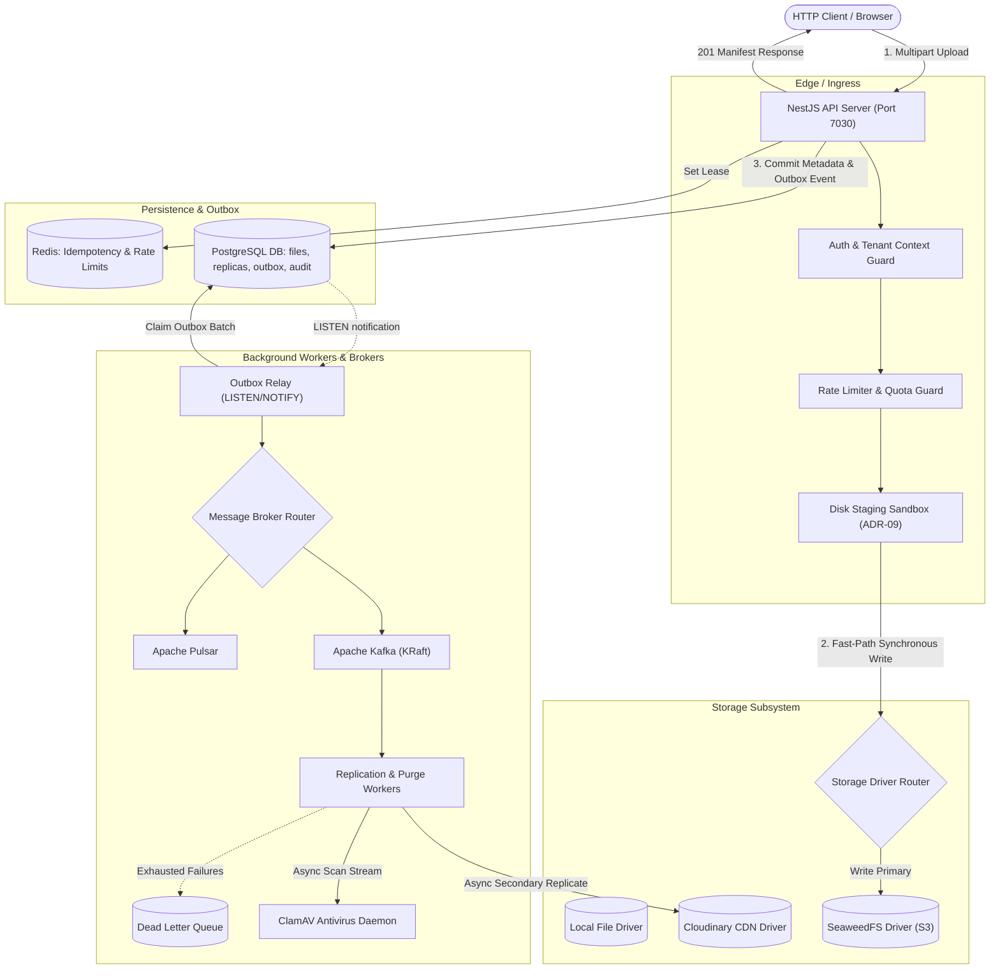

# ESMA Upload Service v2 (GUS: Generic Upload Service)

[]()
[]()
[]()
[]()
[]()

> High-throughput, multi-tenant file ingestion, pluggable storage replication, transactional event outbox, antivirus scanning, and distributed event streaming engine for the ESMA ecosystem.

---

## 📑 Table of Contents

- [1. Overview & Architecture](#1-overview--architecture)
- [2. Quick Start (< 30 Minutes to Full Stack)](#2-quick-start--30-minutes-to-full-stack)
- [3. Configuration & Environment Variables](#3-configuration--environment-variables)
- [4. API Specifications & Usage](#4-api-specifications--usage)
- [5. Operational CLI Tools](#5-operational-cli-tools)
- [6. Testing Strategy & Test Tiers](#6-testing-strategy--test-tiers)
- [7. Multi-Tenancy & Namespace Architecture](#7-multi-tenancy--namespace-architecture)
- [8. Observability, Healthchecks & Runbooks](#8-observability-healthchecks--runbooks)

---

## 1. Overview & Architecture

ESMA Upload Service v2 is an enterprise-grade Generic Upload Service built on **NestJS 10** and Node.js 22. It decouples file storage and event processing from individual business domain entities (`schoolId`, `branchId`), unifying all operations under a scoped `RequestContext` and policy-driven `Namespace`.

### Core Architectural Pillars

- **System of Record in PostgreSQL:** Single source of truth for file metadata, multi-driver replica states, transactional outbox events, and immutable audit logs.
- **Zero-RAM Disk Staging (ADR-09):** File streams are buffered directly to a controlled private disk staging sandbox. This enables rewindable MIME sniffing, parallel SHA-256 chunked hashing, and size validation with zero Node event loop or heap starvation.
- **Pluggable Storage Abstraction (`IStorageDriver`):** Supports `local`, `seaweedfs` (S3-compatible distributed blob store), and `cloudinary` (CDN). Supports a `hybrid` replication topology where files are committed synchronously to a primary store, while background workers replicate copies to secondary stores.
- **Transactional Outbox & Event Pipeline (`IMessageBroker`):** State changes produce outbox rows in the same DB transaction. A high-performance PostgreSQL `LISTEN/NOTIFY` worker immediately claims batches, publishing events to pluggable message backends (`kafka`, `pulsar`, or `memory`).
- **Resilient Background Processing:** Dead-letter queues (DLQ) with exponential backoff, automated tombstone purging, asynchronous ClamAV virus scanning, and automated keyset-paginated storage reconciliation.
- **Strict Security & Multi-Tenancy:** Every route enforces authentication (OIDC JWT from `https://api.esma.elsoft.ng/identity` or hashed API keys). Visibility model (`public`, `internal`, `tenant`, `restricted`) strictly isolates private assets from reaching public CDNs.

### Architecture Topology



---

## 2. Quick Start (< 30 Minutes to Full Stack)

### Prerequisites

- **Docker & Docker Compose v2.20+**
- **Node.js >= 22.0.0**
- **pnpm >= 9.0.0** (or npm >= 10.0.0)

### 1. Clone & Setup Environment

```bash
# Clone the repository
git clone https://github.com/elsoft/esma-upload-services.git
cd esma-upload-services/esma-upload-service-v2

# Copy example environment configuration
cp .env.example .env

# Install dependencies
pnpm install
```

### 2. Launch with Docker Compose Profiles

The stack provides fine-grained profiles in `docker-compose.yml`:

| Profile | Containers Started | Purpose |
| :--- | :--- | :--- |
| *(default)* | `postgres`, `redis`, `migrate`, `api`, `worker` | Core database, caching, migration, API, and worker |
| `seaweedfs` | `seaweedfs`, `seaweedfs-init` | SeaweedFS S3 gateway, filer, volume server & bucket init |
| `kafka` | `kafka` | Apache Kafka KRaft single-node broker |
| `pulsar` | `pulsar` | Apache Pulsar standalone broker |
| `scan` | `clamav` | ClamAV antivirus scanner service |
| `observability`| `prometheus`, `grafana` | Prometheus metrics scrape & Grafana dashboards |

```bash
# Option A: Core stack with SeaweedFS and Kafka (Recommended for Local Dev)
docker compose --profile seaweedfs --profile kafka up -d

# Option B: Complete Enterprise Stack (All services including ClamAV and Observability)
docker compose --profile seaweedfs --profile kafka --profile pulsar --profile scan --profile observability up -d

# Verify all containers are healthy
docker compose ps
```

### 3. Run Migrations & Smoke Test

```bash
# Run database migrations manually if running local Node outside Docker
pnpm run db:migrate

# Run end-to-end smoke test (verifies ingest, replication, download, and tombstone purging)
./scripts/smoke.sh
```

---

## 3. Configuration & Environment Variables

All settings are validated at startup with strict Zod runtime schemas (`src/config/schema.ts`).

### Core & Server

| Variable | Default | Description |
| :--- | :--- | :--- |
| `NODE_ENV` | `development` | Application environment (`development`, `test`, `production`) |
| `PORT` | `7030` | HTTP listener port |
| `BASE_URL` | `http://localhost:7030` | Canonical external URL for public downloads |
| `STAGING_DIR` | `/tmp/eus2-staging` | Local scratch directory for zero-RAM file streaming |
| `CLEANUP_STAGING_ON_BOOT` | `true` | Purges orphan temp files on startup |

### Storage Subsystem

| Variable | Default | Description |
| :--- | :--- | :--- |
| `STORAGE_DRIVER` | `local` | Active driver: `local`, `cloudinary`, `seaweedfs`, `hybrid` |
| `STORAGE_LOCAL_ROOT` | `./data/storage` | Local filesystem storage root path |
| `STORAGE_PRIMARY` | `seaweedfs` | Primary driver when `STORAGE_DRIVER=hybrid` |
| `STORAGE_REPLICAS` | `cloudinary` | Comma-separated secondary replica drivers |
| `SEAWEEDFS_S3_ENDPOINT`| `http://localhost:8333` | SeaweedFS S3 Gateway URL |
| `SEAWEEDFS_BUCKET` | `esma-files` | Target bucket name |
| `SEAWEEDFS_ACCESS_KEY` | `any` | S3 Access Key |
| `SEAWEEDFS_SECRET_KEY` | `any` | S3 Secret Key |
| `CLOUDINARY_CLOUD_NAME`| - | Cloudinary cloud identifier (for CDN image replication) |
| `CLOUDINARY_API_KEY` | - | Cloudinary API Key |
| `CLOUDINARY_API_SECRET`| - | Cloudinary API Secret |

### Message Brokers & Outbox

| Variable | Default | Description |
| :--- | :--- | :--- |
| `MESSAGE_BROKER` | `memory` | Active event broker: `memory`, `kafka`, `pulsar` |
| `KAFKA_BROKERS` | `localhost:9092`| Comma-separated Kafka broker addresses |
| `KAFKA_CLIENT_ID` | `esma-upload` | Client ID for Kafka consumer/producer |
| `PULSAR_SERVICE_URL` | `pulsar://localhost:6650` | Apache Pulsar service URL |
| `OUTBOX_POLL_INTERVAL_MS`| `1000` | Outbox fallback poll interval |
| `OUTBOX_BATCH_SIZE` | `50` | Outbox claims per batch (max 500) |
| `OUTBOX_LISTEN_NOTIFY` | `true` | PostgreSQL LISTEN/NOTIFY instantaneous trigger |

### Security & Authentication

| Variable | Default | Description |
| :--- | :--- | :--- |
| `AUTH_JWKS_URI` | `https://api.esma.elsoft.ng/identity/.well-known/jwks.json` | OIDC JWKS URI |
| `AUTH_ISSUER` | `https://api.esma.elsoft.ng/identity` | Expected JWT issuer claim |
| `AUTH_AUDIENCE` | `esma-upload-service` | Expected JWT audience claim |
| `ADMIN_AUTH_MODE` | `enforce` | Mode for admin routes: `enforce` or `report` |

---

## 4. API Specifications & Usage

Interactive OpenAPI documentation is hosted at `http://localhost:7030/docs` (JSON at `/docs-json`).

### 1. Ingest File (`POST /api/v1/files/upload`)

**Headers:**
- `Authorization: Bearer <jwt>` or `x-api-key: <key>`
- `x-tenant-id: school-123` (tenant isolation scope)
- `x-namespace: esma-tenant` (domain profile)
- `Idempotency-Key: <uuid>` *(optional, prevents duplicate uploads)*

**Form-Data Body:**
- `file`: `[binary data]`
- `visibility`: `public` | `internal` | `tenant` | `restricted` *(default: `tenant`)*

**Response (`201 Created`):**
```json
{
  "fileId": "01J9A8B7C6D5E4F3G2H1J0K9L8",
  "filename": "annual-report.pdf",
  "mimeType": "application/pdf",
  "sizeBytes": 2048576,
  "contentHash": "e3b0c44298fc1c149afbf4c8996fb92427ae41e4649b934ca495991b7852b855",
  "visibility": "tenant",
  "canonicalUrl": "/api/v1/files/01J9A8B7C6D5E4F3G2H1J0K9L8",
  "downloadUrl": "http://localhost:7030/api/v1/files/01J9A8B7C6D5E4F3G2H1J0K9L8/download",
  "scanStatus": "clean",
  "replicas": [
    { "driver": "seaweedfs", "status": "synced", "isPrimary": true }
  ],
  "createdAt": "2026-10-02T22:00:00.000Z"
}
```

### 2. Stream / Download File (`GET /api/v1/files/:fileId/download`)

Supports HTTP `Range: bytes=0-1048575` requests with `206 Partial Content` streaming, `ETag`, and `Cache-Control`.

### 3. Get File Metadata Manifest (`GET /api/v1/files/:fileId`)

Returns the current multi-replica health, antivirus verdict, derivative URLs (thumbnails), and audit state.

### 4. Delete File (`DELETE /api/v1/files/:fileId`)

Soft-deletes the file, marks status as `DELETED`, and dispatches asynchronous `file.deleted` outbox events. The physical blobs remain accessible until the retention purge window expires.

### 5. Permanently Purge / Hard Delete (`DELETE /api/v1/files/:fileId/permanent`)

Immediately and irreversibly purges the physical file across all storage drivers (`seaweedfs`, `cloudinary`, `local`), deletes database records (`files`, `file_replicas`), enqueues a `file.erased` outbox event, and immediately releases tenant storage quota.

### 6. Force Cross-Storage Replication (`POST /api/v1/files/:fileId/replicate`)

Enqueues asynchronous replication jobs to ensure the file is synchronized to secondary providers (e.g. `cloudinary` or `seaweedfs`).
```json
{
  "targetProviders": ["cloudinary", "seaweedfs"]
}
```

### 7. Search, Filter & List Files (`GET /api/v1/files`)

Search and paginate files with rich filtering options:
- `status`: `ACTIVE`, `DELETED`, `DELETING`, `PENDING_UPLOAD`, `QUARANTINED`
- `folder`: subfolder path
- `visibility`: `public`, `internal`, `tenant`, `restricted`
- `tag`: tag filter
- `search`: filename search
- `mimetype`: MIME filter
- `cursor` & `limit`: Keyset pagination

### 8. Admin Storage Quota Governance

Platform admins can query, update, and reconcile storage quotas:
- `GET /api/v1/admin/tenants/:tenantId/quota?namespace=generic`
- `PATCH /api/v1/admin/tenants/:tenantId/quota`:
  ```json
  {
    "namespace": "generic",
    "maxBytes": 107374182400,
    "maxFiles": 5000
  }
  ```
- `POST /api/v1/admin/tenants/:tenantId/reconcile?namespace=generic`

---

## 5. Operational CLI Tools

The service includes production-grade CLI tools for day-to-day operations and incident response:

### Hard Delete CLI
```bash
# Permanently purge a file and all its replicas across storage backends
pnpm run file:hard-delete -- --fileId "01J9A8B7C6D5E4F3G2H1J0K9L8" --reason "GDPR Right to be Forgotten"
```

### API Key Management

```bash
# Create an API key scoped to a specific tenant
pnpm run apikey:create -- --name "accounting-service" --tenant "school-42" --role "tenant-service"

# Create a Platform Admin key with universal cross-tenant access
pnpm run apikey:create -- --name "ops-backoffice" --any-tenant --role "PLATFORM_ADMIN"

# List all active keys (masked secrets)
pnpm run apikey:list

# Revoke an API key by prefix
pnpm run apikey:revoke -- --prefix "eus2_7f9a"
```

### Dead-Letter Queue (DLQ) Management

```bash
# Inspect dead-letter messages and failure reasons
pnpm run dlq:stats
pnpm run dlq:list -- --status OPEN

# Redrive dead-letter messages back to the active queue
pnpm run dlq:redrive -- --max 100 --topic "files.replicate"

# Discard a poisoned event
pnpm run dlq:discard -- --id "dlq_uuid"
```

### Storage Reconciler & Promotion

```bash
# Audit storage replicas and detect desynchronized states
pnpm run reconcile:orphans -- --dryRun true

# Promote a secondary storage driver to primary with zero downtime
pnpm run storage:promote -- --fileId "01J9A8B7C6..." --provider seaweedfs
```

---

## 6. Testing Strategy & Test Tiers

The project adheres to a strict multi-tier testing pyramid using both **Vitest** (for multi-tier unit, integration, and security suites) and **Jest** (for guard and end-to-end specifications):

| Tier | Script | Focus |
| :--- | :--- | :--- |
| **Typecheck** | `pnpm run typecheck` | Strict TypeScript validation (`tsc --noEmit`) |
| **Unit** | `pnpm run test:unit` | Pure logic, auth matrix, hashers, parsers, and config schemas |
| **Integration** | `pnpm run test:integration` | Real PostgreSQL, Redis, and storage driver interactions |
| **Contracts** | `pnpm run test:contract` | Behavioral verification of `IStorageDriver` and `IMessageBroker` |
| **Security** | `pnpm run test:security` | 100% route auth audits, abuse payloads, path traversal, leak tests |
| **Performance**| `pnpm run test:perf` | Automated throughput benchmarks, staging overhead profiling, k6 suites |
| **Chaos** | `pnpm run test:chaos` | Process crash recovery, broker disconnects, lock leaks, desync drills |
| **Jest Guards**| `npx jest test/auth-guard.spec.ts` | Guard, token claims, and permission resolution tests |
| **Full Suite** | `pnpm run test:all` | Executes unit, contract, integration, and security suites |

```bash
# Run typechecking
pnpm run typecheck

# Execute unit tests
pnpm run test:unit

# Execute Jest guard and platform admin tests
npx jest test/auth-guard.spec.ts test/global-permissions-and-platform-admin.spec.ts

# Execute security verification suite (31 attack vector tests)
pnpm run test:security
```

---

## 7. Multi-Tenancy & Namespace Architecture

### Adding a New Namespace

Namespaces configure tenant boundary policies, quota limits, allowed MIME types, and storage rules. To register a new namespace:

1. Open `src/config/namespaces.ts`.
2. Add a new namespace definition implementing `INamespaceConfig`:
   ```typescript
   export const LibraryNamespace: INamespaceConfig = {
     name: 'esma-library',
     allowedMimeTypes: ['application/pdf', 'application/epub+zip', 'image/jpeg'],
     maxFileSize: 100 * 1024 * 1024, // 100 MB
     allowedVisibilities: ['tenant', 'public'],
     defaultVisibility: 'tenant',
     rateLimit: { points: 200, duration: 60 },
     storagePolicy: {
       primary: 'seaweedfs',
       replicas: ['local'],
     },
   };
   ```
3. Register the namespace in `NamespaceRegistryModule`.
4. Clients supply the `x-namespace: esma-library` header in API requests.

---

## 8. Observability, Healthchecks & Runbooks

### Prometheus Metrics Endpoint

Metrics are scraped at `GET /metrics` in standard Prometheus format:
- `eus2_http_requests_total{method, route, status}`: Request count counter
- `eus2_http_request_duration_seconds{method, route, status}`: Latency histogram
- `eus2_upload_bytes_total{tenant, namespace, mime_type}`: Volume counter
- `eus2_dedup_hashes_detected_total{tenant}`: Duplicate content hash deduplication counter
- `eus2_storage_driver_operation_seconds{driver, operation, status}`: Driver latency
- `eus2_outbox_lag_seconds`: Event publishing delay
- `eus2_dlq_messages_count{topic}`: Dead-letter queue depth gauge

### Health & Readiness Probes

- **Liveness Probe (`GET /healthz`):** Verifies the Node process is running and accepting event loop ticks. Returns `200 OK`.
- **Readiness Probe (`GET /readyz`):** Verifies active connectivity to PostgreSQL and Redis. If DB or Redis is unreachable, returns `503 Service Unavailable`.

### Operational Runbooks

Comprehensive disaster recovery and troubleshooting runbooks are available in [`docs/runbooks/`](file:///c:/Users/PC/Documents/React%20and%20js/esma-upload-services/esma-upload-service-v2/docs/runbooks/):
- [`storage-promotion.md`](file:///c:/Users/PC/Documents/React%20and%20js/esma-upload-services/esma-upload-service-v2/docs/runbooks/storage-promotion.md): Online promotion of storage drivers during incidents
- [`disaster-recovery.md`](file:///c:/Users/PC/Documents/React%20and%20js/esma-upload-services/esma-upload-service-v2/docs/runbooks/disaster-recovery.md): PostgreSQL and SeaweedFS backup and restore drills
- [`dlq-triage.md`](file:///c:/Users/PC/Documents/React%20and%20js/esma-upload-services/esma-upload-service-v2/docs/runbooks/dlq-triage.md): Triage and resolution of failed replication events

---

## 📄 License & Maintainers

Proprietary software developed for Elsoft / ESMA. Maintained by the ESMA Engineering Team.
