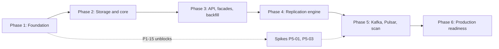

# ESMA Upload Service: Backend Task List

> Version 2.0, 2026-09-22. Rewritten: `esma-upload-service` (legacy Express) is now frozen. It receives no further changes and is not a source for new code. All work targets a ground-up rewrite at `esma-upload-service-v2` (NestJS), built from the functional/business requirements in `ARCHITECTURE_AND_ROADMAP.md`. The legacy app is consulted only as a behavioral reference — to confirm what a route is expected to do — never copied, ported or imported. Phase 0 ("stabilize the legacy app") is removed; there is no work item that patches `esma-upload-service`. Every requirement that used to live in Phase 0 (secret hygiene, auth-before-parsing, tenant-scope correctness, validation hardening, HTTP/platform hardening) is now a day-one design requirement of the v2 build in Phase 1, not a fix applied later.
> **Workspace layout:** `esma-upload-services/esma-upload-service/` is the frozen legacy Express v1 app (reference only — do not edit). `esma-upload-services/esma-upload-service-v2/` is where all work happens, starting from Phase 1. `esma-upload-services/docs/` contains all documentation (moved out of the service folder). See `CURRENT_ARCHITECTURE_AND_IMPLEMENTATION (1).md` section 3 for the full directory tree.
> Version 1.0, 2026-09-21. Executable work breakdown for engineers and AI agents.
> Read first: `ARCHITECTURE_AND_ROADMAP.md` (target design and contracts), `CURRENT_ARCHITECTURE_AND_IMPLEMENTATION (1).md` (as-is behavior of the frozen legacy app, used as a functional reference only), `REVIEW_FINDINGS_AND_DECISIONS.md` (why the plan looks like this).
> References: `ARCH §x` is a section of the architecture document, `F-nn` a finding, `ADR-nn` a decision, `Q-n` an open question, `A-nn` an assumption to verify.

---

## 1. How to Use This Document

### 1.1 Picking a task

1. Choose the lowest-numbered task whose status is `TODO` and whose dependencies are all `DONE`. Tasks inside a phase with no dependency between them can run in parallel (see section 5).
2. Set its status to `IN PROGRESS` in the index (section 4) in the same commit as your first change.
3. Do the **Verify first** step if the task has one. If reality differs from this document, stop and record the difference in the PR description. If it changes the design, update the affected document in the same PR.
4. Implement exactly what the task lists. Do not add features. If you see a needed follow-up, add it to the "Follow-ups" list at the end of your PR description.
5. Meet every acceptance criterion and every required test. Then set the status to `DONE`.

### 1.2 Task format

```
### Pn-nn · Title
> Size | Priority | Depends on | Refs
Goal            what and why, in one paragraph
Verify first    assumptions to check against the code (when relevant)
Steps           ordered implementation steps
Files           created (+) or changed (~)
Acceptance      observable, testable criteria
Tests           required automated tests
Notes           pitfalls, rollout, rollback
```

Sizes: **XS** under half a day, **S** up to a day, **M** two to three days, **L** four to five days, **XL** more than five (split before starting). Estimates assume one developer or agent and existing context.

### 1.3 Definition of Done (every task)

- [ ] All acceptance criteria met, each demonstrated by a test or a documented manual check.
- [ ] `npm run typecheck`, `npm run lint`, `npm test` pass locally and in CI. From P1-04 onward `npm run test:integration` passes too.
- [ ] The behavior-reference tests (P1-14) still pass unless the task explicitly changes the documented target behavior, in which case the fixtures are updated in the same PR and the change is called out.
- [ ] No secret, token, API key or real customer data in code, tests, logs, fixtures or docs.
- [ ] New configuration is in the config schema and `.env.example`.
- [ ] Public behavior changes are reflected in OpenAPI annotations and the architecture document.
- [ ] Logging added for new failure paths with `correlationId`. No `console.log`.
- [ ] Rollback is possible (flag, revert, or forward-only migration with a documented reversal).
- [ ] PR description lists: what changed, how it was tested, risks, follow-ups.

### 1.4 Rules for AI agents

1. **Do not weaken tests to make them pass.** If a test is wrong, explain why in the PR and fix the test with a reviewer-visible change.
2. **Match the documented target behavior** for `/api/tenant/upload/*` and `/api/admin/upload/*` (ARCH §9.4, the legacy contract doc from P1-14) unless a task says otherwise. The behavior-reference fixtures are the contract — they describe *what a route must do*, not code to reuse. Never open, copy, or import files from `esma-upload-service/`.
3. **Stay in scope.** One task per branch and PR. No drive-by refactors.
4. **Dependencies:** the libraries in ADR-16 are pre-approved. Anything else needs a one-line justification in the PR (maintenance status, license, size, native code).
5. **When the documents disagree with observed legacy behavior**, the legacy app is a reference for intent, not an authority on the target design; the architecture document defines the target. Record the discrepancy. Do not silently pick one, and never resolve it by copying the legacy implementation.
6. **When blocked** (missing credential, unanswered open question, external dependency), stop, write a `BLOCKED:` note in the PR and the index, and move to another task. Do not invent credentials or guess an unanswered question that changes behavior. Use the documented default if one exists.
7. **Security first:** deny by default, validate at boundaries, never trust client-supplied tenant or path data, never log secrets. These are day-one requirements of every module, not later hardening passes.
8. **Commands you may assume** (created in P1-13): `npm run typecheck`, `npm run lint`, `npm test` (unit), `npm run test:integration`, `npm run test:reference` (behavior-reference tests against the documented legacy contract), `npm run build`. Run all of these from `esma-upload-services/esma-upload-service-v2/`.
9. **Style:** TypeScript strict, ES modules with `.js` suffix in relative imports, no `any` (use `unknown` plus narrowing), no default exports except where a framework requires one, errors as typed classes, small pure functions where possible.

### 1.5 Git and PR conventions

- Branch: `task/P1-10-authorization-engine`.
- Commits: Conventional Commits with the task id, for example `feat(authz): table-driven authorization engine [P1-10]`.
- One PR per task. Title: `[P1-10] Authorization engine`.
- **All work is done inside `esma-upload-service-v2/`.** Nothing in `esma-upload-service/` is ever touched by a task.

### 1.6 Kickoff prompt template (paste into an agent)

```
You are implementing task <ID> for the esma-upload-service-v2 rewrite.
Read docs/BACKEND_TASKS.md sections 1 to 3 and the task <ID>, then the sections of
docs/ARCHITECTURE_AND_ROADMAP.md that the task references. Do the "Verify first" step before coding
— this means confirming expected behavior against the documented legacy contract, never reading or
copying code from esma-upload-service/.

Workspace layout:
  esma-upload-services/
    docs/                        ← all docs live here
    esma-upload-service/         ← frozen legacy Express app; reference only, never edited or imported
    esma-upload-service-v2/      ← NestJS rewrite; all work happens here

Implement only this task, written from the functional requirements, not ported from legacy code.
Meet every acceptance criterion and write every required test. Follow the Definition of Done.
When finished, output: summary of changes, test evidence, discrepancies found, follow-ups.
If blocked, stop and say exactly what you need.
```

### 1.7 Framework: NestJS

The service is built from scratch on **NestJS, on the Express platform adapter** (`@nestjs/platform-express`) (ADR-21, ARCH §2.0) — not migrated, not wrapped around legacy Express middleware. The NestJS scaffold exists at `esma-upload-services/esma-upload-service-v2/` (generated via `nest new .`). The initial scaffold files (`src/app.module.ts`, `src/app.controller.ts`, `src/app.service.ts`, `src/main.ts`) are placeholders to be replaced in P1-01 with real modules implementing the functional requirements directly.

Every task is written against the Nest structure described in P1-01 and ARCH §2.0. Read the concept-mapping table there once; it is not repeated in every task. In short: a "route" is a controller method, "middleware" is a guard or an interceptor depending on what it does, "validation" is a pipe backed by the same `zod` schema the architecture document already defines, and "error handling" is an exception filter. A driver, repository or broker is a Nest **provider**, injected by constructor, which is what makes `Test.createTestingModule({...}).overrideProvider(...)` the standard way to substitute `FakeStorageDriver` or `MemoryBroker` in tests.

`supertest` keeps its role for HTTP-level tests: Nest's own testing guide uses `supertest` against the HTTP server obtained from a `TestingModule`, so the existing test tier names (`unit`, `integration`, `reference`, `contract`) do not change, only what sits inside `app.getHttpServer()`.

---

## 2. Global Conventions

| Topic | Convention |
| :--- | :--- |
| Errors | Throw typed errors (`AppError` subclasses from P1-03) with a stable `code`. Rendered by a global `ExceptionFilter`, never inside a controller. Handlers never leak stack traces or provider messages to clients. |
| Structure | NestJS from Phase 1 onward (§1.7, ADR-21). One feature = one `@Module()` (`StorageModule`, `EventsModule`, `FilesModule`, ...) wiring its own controllers and providers; cross-cutting code is a guard, interceptor, pipe or filter, never ad hoc logic pasted into a controller. |
| DI | Constructor injection only. No service-locator pattern, no importing a concrete driver or repository directly outside its own module's provider registration. |
| Time | UTC everywhere. ISO 8601 strings at the edges, `timestamptz` in the DB. |
| IDs | UUIDv7 for files and events. |
| Validation | `zod` at every boundary (HTTP, env, events, driver metadata). |
| DB access | Only through repositories (P1-06). No SQL outside `src/db/`. |
| Transactions | State change and outbox rows always in the same transaction. |
| Idempotency | Every event handler and every driver `delete` is idempotent. |
| Logging | `pino` structured JSON. Fields: `correlationId`, `namespace`, `tenantId`, `fileId`, `actorId`. Redact `authorization`, `x-api-key`, cookies, any key containing `secret` or `token`. |
| Config | Only `src/config` reads `process.env`, exposed to the rest of the app as an injectable `ConfigService`-like provider (built in P1-02, not `@nestjs/config`'s own module, so the single `zod` schema stays the source of truth). |
| Filesystem | Never build a path from user input. Use `KeyService` (P1-07) and `resolveInside(root, relative)`. |
| Tests | Unit tests are hermetic and construct a minimal `TestingModule` (or plain `new Service(...)` for pure classes) rather than booting the whole `AppModule`. Integration tests use Testcontainers (Postgres, Redis, SeaweedFS, Kafka, Pulsar) with `AppModule` and `overrideProvider` for anything not under test. Real third-party accounts are used only in opt-in tests (`test:contract:cloudinary`). |
| Docs | A behavior change updates OpenAPI and the architecture document in the same PR. |

---

## 3. Assumption Register (verify before relying on)

These are read-only checks against the frozen legacy app or its documentation, done to confirm what v2 is expected to do. None of them authorize reading legacy code for anything beyond confirming behavior, and none block on patching the legacy app (it is never patched).

| ID | Assumption | Verify with | Blocks |
| :--- | :--- | :--- | :--- |
| A-01 | Historical secret leak in the legacy docs is already compromised and must not reappear in v2 artifacts | Grep v2 config/docs/tests for the retired values; confirm rotation happened at the infra level | P1-02 |
| A-02 | Legacy tokens without `exp` may have been accepted (a bug not to reproduce) | Ask the token issuer whether all issued tokens carry `exp` | P1-09 |
| A-03 | Legacy tenant auth composed token check plus school/branch header check | Read the documented behavior in `CURRENT_ARCHITECTURE_AND_IMPLEMENTATION (1).md` §6.2 | P1-08 |
| A-04 | Legacy served a static `/uploads` path (a defect, not to reproduce) | Read the as-is document | P1-01 |
| A-05 | Exact MIME allowlist expected by existing clients | Read the as-is document's documented allowlist | P1-12 |
| A-06 | Exact request and response shapes, including errors, expected by existing clients | P1-14 behavior-reference fixtures, derived from the documented legacy contract | P3-02.. |
| A-07 | Tenant routes upload to the school or branch folder with no per-field subfolder | Read the as-is document's tenant route description | P3-02 |
| A-08 | SuperAdmin JWT claims and whether the dashboard sends tokens (Q1, Q2) | Ask the owner | P1-09 |
| A-09 | Dependency choices should be independent of legacy `package.json`, decided fresh for v2 | ADR-16 | P1-01 |
| A-10 | Cloudinary `folder:` search semantics (direct children or subfolders) | Scratch-folder probe script | P3-03, P3-04 |
| A-11 | Admin public_ids start with `admin/` and tenant public_ids with `uploads/schools/` | Sample Cloudinary listing | P3-04 |
| A-12 | Production is one arm64 host (Q5) | Ask the owner | P4-01 |


---

## 4. Task Index

Status values: `TODO`, `IN PROGRESS`, `BLOCKED`, `DONE`. Update this table in the same commit as the work. Priority: Critical, High, Medium, Low.


### Phase 1 Foundation

There is no Phase 0. The legacy app (`esma-upload-service`) is frozen and is never patched; it is read only as a behavioral reference. Everything that a "stabilize the legacy app" phase would have covered — secret hygiene, tooling/CI, auth-before-parsing, tenant-scope correctness, upload validation, JWT hardening, HTTP/platform hardening — is a native, day-one requirement of the v2 build below, folded into the task that owns that area (P1-13, P1-14 and P1-15 are new; the rest were already scoped to build things correctly from the start).

| ID | Title | Size | Priority | Depends on | Status |
| :--- | :--- | :--- | :--- | :--- | :--- |
| P1-01 | NestJS module structure and application bootstrap (built from scratch) | M | High | none | DONE |
| P1-02 | Typed configuration, fail-fast validation and secret hygiene | M | High | P1-01 | DONE |
| P1-03 | Logging, correlation IDs and the error model | M | High | P1-01, P1-02 | DONE |
| P1-04 | Local development stack and PostgreSQL access layer | M | High | P1-02 | DONE |
| P1-05 | Initial schema migrations | M | High | P1-04 | DONE |
| P1-06 | Repositories | L | High | P1-05 | DONE |
| P1-07 | Identifiers, hashing and storage key service | S | High | P1-01 | DONE |
| P1-08 | RequestContext and context resolvers | M | High | P1-03, P1-07 | DONE |
| P1-09 | Authentication: OIDC JWKS Integration & API keys | L | High | P1-06, P1-08 | DONE |
| P1-10 | Authorization engine | M | High | P1-08 | DONE |
| P1-11 | Upload policy registry | S | Medium | P1-02 | DONE |
| P1-12 | Ingestion module: staged files, validation, guaranteed disposal | L | High | P1-07, P1-10, P1-11 | DONE |
| P1-13 | Tooling, testing and CI quality gates for v2 | M | Critical | P1-01 | DONE |
| P1-14 | Behavior-reference tests derived from the documented legacy contract | L | Critical | P1-13 | DONE |
| P1-15 | HTTP and platform hardening (health, CORS, headers, Docker, runtime) | M | High | P1-01, P1-13 | DONE |

### Phase 2 Storage drivers and core services

| ID | Title | Size | Priority | Depends on | Status |
| :--- | :--- | :--- | :--- | :--- | :--- |
| P2-01 | Driver interface v2 and shared contract test suite | M | High | P1-07 | DONE |
| P2-02 | LocalStorageDriver | M | High | P2-01 | DONE |
| P2-03 | CloudinaryStorageDriver | L | High | P2-01 | DONE |
| P2-04 | SeaweedFSStorageDriver | L | High | P2-01, P1-04 | DONE |
| P2-05 | Driver registry, factory and health probes | M | High | P2-02, P2-03, P2-04 | DONE |
| P2-06 | UploadService (single-driver mode) | L | High | P2-05, P1-06, P1-10, P1-12 | DONE |
| P2-07 | FileReadService and content delivery | L | High | P2-06 | DONE |
| P2-08 | DeleteService and FileQueryService | M | High | P2-06 | DONE |
| P2-09 | Direct-to-storage presigned upload flow (NEWLY ADDED) | M | High | P2-04, P2-06 | DONE |

### Phase 3 Generic API, cutover, OpenAPI

| ID | Title | Size | Priority | Depends on | Status |
| :--- | :--- | :--- | :--- | :--- | :--- |
| P3-01 | Generic v1 HTTP API (`/api/v1/files/*`) | L | High | P2-07, P2-08, P1-09, P1-03 | DONE |
| P3-02 | Legacy tenant facade | - | - | - | RETIRED (2026-09-23) |
| P3-03 | Legacy admin facade | - | - | - | RETIRED (2026-09-23) |
| P3-04 | Legacy identifier resolution and backfill | - | - | - | RETIRED (2026-09-23) |
| P3-05 | Cutover controls, shadow comparison and deployment verification | - | - | - | RETIRED (2026-09-23) |
| P3-06 | OpenAPI regeneration and contract tests | M | Medium | P3-01 | DONE |

### Phase 4 Replication engine and broker abstraction

| ID | Title | Size | Priority | Depends on | Status |
| :--- | :--- | :--- | :--- | :--- | :--- |
| P4-01 | Storage topology and placement planner | M | High | P2-05, P1-11 | DONE |
| P4-02 | Replication state machine and aggregate derivation | M | High | P1-06 | DONE |
| P4-03 | Event catalog, envelope and `IMessageBroker` v2 with the memory broker | L | High | P1-07 | DONE |
| P4-04 | Transactional outbox writer, relay and retention | L | Critical | P4-03, P1-06 | DONE |
| P4-05 | Consumer framework: retries, backoff, DLQ, idempotency, shutdown | L | High | P4-03, P1-06 | DONE |
| P4-06 | Fast-path ingestion with primary failover (hybrid upload) | L | High | P4-01, P4-02, P4-04, P2-06 | DONE |
| P4-07 | Replication worker and worker process entrypoint | L | High | P4-05, P4-06, P2-05 | DONE |
| P4-08 | Read path: replica selection and fallback | M | High | P4-07, P2-07 | DONE |
| P4-09 | Delete propagation (`file.purge`) | M | High | P4-07, P2-08 | DONE |
| P4-10 | Reconciler, sweeper and operational commands | L | High | P4-07, P4-09 | DONE |

### Phase 5 Kafka, Pulsar, scanning, processing

| ID | Title | Size | Priority | Depends on | Status |
| :--- | :--- | :--- | :--- | :--- | :--- |
| P5-01 | Kafka client spike and decision | S | High | P1-15 | DONE |
| P5-02 | KafkaBrokerDriver | L | High | P5-01, P4-05 | DONE |
| P5-03 | Pulsar client spike (native library and arm64) | S | High | P1-15 | DONE |
| P5-04 | PulsarBrokerDriver | L | Medium | P5-03, P4-05 | DONE |
| P5-05 | Broker contract test suite and resilience tests | M | High | P4-03 | DONE |
| P5-06 | Dead-letter persistence and operations tooling | M | Medium | P5-05, P4-10 | DONE |
| P5-07 | Asynchronous virus scanning with ClamAV | L | High | P4-07, P2-07 | DONE |
| P5-08 | Image derivatives (thumbnails, WebP) | M | Medium | P4-07 | DONE |
| P5-09 | OCR pipeline (deferred, design only) | S | Low | P5-08 | TODO |

### Phase 6 Production readiness

| ID | Title | Size | Priority | Depends on | Status |
| :--- | :--- | :--- | :--- | :--- | :--- |
| P6-01 | Audit logging | M | High | P1-10, P3-01 | DONE |
| P6-02 | Rate limiting and quotas | M | High | P1-04, P2-06 | DONE |
| P6-03 | Idempotency keys (and dedup detection) | M | Medium | P3-01 | DONE |
| P6-04 | Observability: metrics, tracing, dashboards, alerts | L | High | P4-07, P3-01 | DONE |
| P6-05 | Full-stack Docker Compose (development and production) | L | High | P5-02, P5-07, P2-04 | DONE |
| P6-06 | CI/CD overhaul and deployment | L | High | P1-13, P6-05 | DONE |
| P6-07 | Retention, purge, backup and disaster recovery | L | High | P4-10, P6-05 | DONE |
| P6-08 | Performance and resilience testing | L | Medium | P6-04, P6-05 | TODO |
| P6-09 | Security review and verification | L | High | P6-01, P6-02, P5-07 | TODO |
| P6-10 | Remove the legacy engine, finalize documentation | M | Medium | P3-05, P6-09 | TODO |

---

## 5. Dependencies and Parallel Work

### 5.1 Phase flow



### 5.2 Suggested tracks for three parallel agents

| Track | Focus | Task order (each waits for its listed dependencies) |
| :--- | :--- | :--- |
| A: Security and API | Auth, authz, HTTP, from-scratch | P1-13, P1-08, P1-09, P1-10, then P3-01, P3-02, P3-03, P6-01, P6-02, P6-09 |
| B: Platform and data | Tooling, config, DB, events | P1-01, P1-13, P1-02, P1-03, P1-04, P1-05, P1-06, P4-03, P4-04, P4-05, P5-05, P6-04, P6-06 |
| C: Storage and replication | Ingestion, drivers, replication | P1-07, P1-11, P1-12, P1-15, P2-01..P2-08, P3-04, P4-01, P4-02, P4-06..P4-10, P5-07, P5-08, P6-05, P6-07 |
| Spikes (anyone free) | Broker clients | P5-01, P5-03 after P1-15, then P5-02, P5-04 |

Tasks that touch the same modules must not run at the same time; merge them one after another in index order.

### 5.3 Longest dependency chain (about 43 working days)

`P1-01 -> P1-13 -> P1-02 -> P1-03 -> P1-08 -> P1-10 -> P1-12 -> P2-06 -> P4-06 -> P4-07 -> P5-07 -> P6-05 -> P6-06`

Anything on this chain that slips delays the whole roadmap. Start those tasks first and keep them small.

### 5.4 Cross-team coordination (not code)

| When | Who | What |
| :--- | :--- | :--- |
| Before P1-02 completes | Owner, infra | Confirm no secret from the legacy app's documentation is reused; issue fresh credentials for v2 |
| Before P1-09 rollout | SuperAdmin dashboard team | Confirm the dashboard sends a Bearer token with an allowed role (Q1, Q2) |
| Before P1-15 deploy | Infra | Confirm the legacy app's `/uploads/` path has no consumers v2 needs to replicate (v2 never serves one) |
| Before P1-09 | Token issuer | Confirm every token carries `exp` and the signing algorithm is HS256 |
| Before P3-05 production switch | All ESMA client teams | Announce the cutover window and rollback plan |
| Before P5-04 | Infra | Decide whether Pulsar is required in production (Q7) |
| Before P6-06 | Infra | Access to `~/server-setup/esma`, agree on the deploy script (Q11) |

---

# Phase 1: Foundation (structure, config, database, identity, policy, ingestion)

Goal: build everything the core engine needs except storage I/O, from the functional and security requirements in `ARCHITECTURE_AND_ROADMAP.md` and the findings in `REVIEW_FINDINGS_AND_DECISIONS.md`. The legacy app keeps serving its own traffic, untouched, on its own infrastructure — it is not part of this build. Exit: all foundation modules have tests, the database schema exists, and the behavior-reference tests (P1-14) pass against the documented legacy contract.

> **Working directory for all tasks: `esma-upload-services/esma-upload-service-v2/`.** The NestJS scaffold (`nest new .`) has already been run here. The scaffold entry point (`src/main.ts`) and stub files (`src/app.module.ts`, `src/app.controller.ts`, `src/app.service.ts`) are placeholders that P1-01 replaces with the target layout below. Nothing in `esma-upload-service/` is read except as a reference for expected behavior (route shapes, response fields, known defects to avoid repeating).

---

### P1-01 · NestJS module structure and application bootstrap (built from scratch)
> **Size:** L | **Priority:** High | **Depends on:** none | **Refs:** ADR-21, ARCH §2.0

**Goal.** Expand the NestJS scaffold at `esma-upload-service-v2/` into the full module layout described in ARCH §2.0. Every module is implemented fresh from the functional requirements in the architecture document — nothing is copied, ported or imported from `esma-upload-service/`. The legacy app's documented routes (`CURRENT_ARCHITECTURE_AND_IMPLEMENTATION (1).md` §8) describe *what the legacy facades must end up doing* (their contract), not *how to build v2*; treat them the same way you would treat a customer's functional spec, not a codebase to reuse.

**Steps.**
1. Install `@nestjs/core`, `@nestjs/common`, `@nestjs/platform-express`, `@nestjs/testing`, `@nestjs/swagger`, `reflect-metadata`, `rxjs`. `@nestjs/config` is **not** used for env parsing (P1-02 keeps `zod` as the single source of truth). Enable `experimentalDecorators` and `emitDecoratorMetadata` in `tsconfig`.
3. Target layout:
```
src/
  main.ts            NestFactory.create(AppModule), listens on PORT
  worker.ts          NestFactory.createApplicationContext(WorkerModule)
  app.module.ts      root module, imports feature modules
  config/            env schema, policies
  auth/              AuthModule: guards, strategies (OIDC JWKS & ApiKey)
  authz/             AuthorizationModule: authorize(), AuthorizationGuard, @RequireAction()
  core/              domain types, key service, manifest mapper (plain classes, framework-agnostic)
  files/             FilesModule: v1 controllers (/api/v1/files/*), UploadService, FileReadService, DeleteService, FileQueryService
  ingest/            IngestModule: multer option factories, staging, validation pipes
  storage/           StorageModule: driver interface, drivers, registry, placement (all providers)
  events/            EventsModule: envelope, catalog, brokers, outbox, consumer framework (providers)
  workers/           WorkerModule: replication, processing, sweeper handlers (no controllers)
  db/                DatabaseModule: pool, migrations, repositories (providers)
  observability/     ObservabilityModule: logger, metrics, tracing, interceptors
  common/            shared decorators, filters, interceptors, pipes not owned by one feature
tests/{unit,integration,contract,helpers,fixtures}
scripts/  docs/  ops/
```
3. `AppModule` imports: `ConfigModule` (the project's own, not `@nestjs/config`), `DatabaseModule`, `ObservabilityModule`, `AuthModule`, `AuthorizationModule`, `StorageModule`, `EventsModule`, `IngestModule`, `FilesModule`. `WorkerModule` imports only what workers need (`DatabaseModule`, `StorageModule`, `EventsModule`, `ObservabilityModule`) — no `FilesModule`, no HTTP-only pieces.
4. `FilesModule` (`FilesController`) implements the generic `/api/v1/files/*` routes directly — in this initial task, handlers return placeholder responses (e.g., 501 or health status) with standard RFC 9457 `problem+json` shape until Phase 2 fills in core domain services.
5. `main.ts`: `const app = await NestFactory.create<NestExpressApplication>(AppModule)`, apply `helmet()`, `app.set("trust proxy", ...)`, body size limits (finished in P1-15), then `app.listen(config.port)`.
6. `tsconfig`: `rootDir: src`, `outDir: dist`. Relative imports with `.js` suffix.
7. `package.json` scripts (`start` runs `dist/main.js`, `start:worker` runs `dist/worker.js`).
8. Establish standard controller → guard → service → response pattern with a `/health/live` endpoint.

**Acceptance.**
- [ ] `AppModule` boots with `Test.createTestingModule({ imports: [AppModule] }).compile()` in a smoke test, proving the DI graph has no missing providers or circular dependencies.
- [ ] `worker.ts` boots as an application context (no open HTTP port) and can resolve a sample provider from `DatabaseModule`.
- [ ] `docker build` and container start work; `dist/main.js` is the entry.
- [ ] Clean module layout matches ARCH §2.0 with no legacy baggage.

**Tests.** One new smoke test per bootstrap entry point (`main.ts`, `worker.ts`).

**Tests.** One new smoke test per bootstrap entry point (`main.ts`, `worker.ts`).

**Notes.** Later tasks (P1-03, P1-08, P1-09, P1-12, P3-01..P3-03) fill each module in with real logic, module by module, always written from the requirements — never by reading and translating legacy source line by line. When a behavior is ambiguous, consult the documented contract (P1-14) or ask the owner; do not open `esma-upload-service/` source files to resolve the ambiguity.

---

### P1-02 · Typed configuration, fail-fast validation and secret hygiene
> **Size:** M | **Priority:** High | **Depends on:** P1-01 | **Refs:** F-33, F-40, F-48, ARCH §10

**Goal.** One module reads `process.env`, validates it with `zod`, and exposes a frozen typed `config`. Secrets are handled correctly from the first commit: none checked in, none logged, fresh values issued for v2 rather than reused from anything documented about the legacy app.

**Verify first.** A JWT secret and Cloudinary credentials were printed in plain text in an earlier draft of the architecture documentation (F-40). Confirm with the owner that those specific values were rotated at the infrastructure level and are not the values used to configure v2; v2 must never be configured with a credential that appeared in a document.

**Steps.**
1. `src/config/schema.ts`: define every variable in ARCH §10 with type, default, and a `secret` flag. Required-ness depends on selected features (for example `SEAWEEDFS_*` required only when a topology includes seaweedfs; `KAFKA_BROKERS` only when `EVENT_BROKER=kafka`). Use `superRefine` for cross-field rules.
2. Startup guards (production): `NODE_ENV` must be lowercase and one of `development|test|production`; `JWT_SECRET` at least 32 chars; `SIGNED_URL_SECRET` differs from `JWT_SECRET`; `EVENT_BROKER=memory` needs `ALLOW_MEMORY_BROKER=true`; `ADMIN_AUTH_MODE!=off`; `SWAGGER_ENABLED=true` warns; `STORAGE_DRIVER=local` with `INSTANCE_COUNT_HINT>1` warns; `LOCAL_STORAGE_PATH` must not be inside `STAGING_DIR` or vice versa.
3. Collect **all** errors and print them in one message with variable names but never values of secret fields.
4. `config.toSafeObject()` returns a redacted copy for logging.
5. Generate `.env.example` (v2's own, with placeholders only — never a value from the legacy app or its docs) from the schema (`npm run env:example`). Add a CI check that fails if the committed file is out of date.
6. Replace all direct `process.env` reads (grep must return only `src/config`).
7. `.gitignore`/`.dockerignore`: `.env`, `.env.*`, `!.env.example`. Add secret scanning: `.gitleaks.toml`, a pre-commit hook config, and a CI job (wired into the pipeline built in P1-13).
8. Write `esma-upload-services/docs/runbooks/rotate-secrets.md` describing how v2's own secrets (JWT signing key ring per P1-09, Cloudinary, SeaweedFS, DB) are rotated. This is a new runbook for v2, not an update to a legacy one.

**Acceptance.**
- [x] Starting with missing required values prints every problem at once and exits non-zero.
- [x] `grep -rn "process.env" src | grep -v src/config` returns nothing.
- [x] `.env.example` is generated and in sync, and contains no real value.
- [x] Secret scan passes on HEAD and fails when a fake high-entropy key is added to a test fixture (demonstrate once, then remove).
- [x] Owner confirms in the PR that v2's credentials are freshly issued, not reused from anything that appeared in project documentation.

**Tests.** Table tests over valid and invalid environments; redaction test.

---

### P1-03 · Logging, correlation IDs and the error model
> **Size:** M | **Priority:** High | **Depends on:** P1-01, P1-02 | **Refs:** ARCH §9.3, §12

**Goal.** Structured logs, request tracing ids, typed errors, and two error renderers (legacy shape and problem+json).

**Steps.**
1. `nestjs-pino` (wraps `pino`) as the app-wide `LoggerModule`, with redaction paths (`req.headers.authorization`, `req.headers["x-api-key"]`, `*.secret`, `*.token`, `*.password`) and request logging (`correlationId`, route, status, duration, bytes). No body logging.
2. `CorrelationIdInterceptor implements NestInterceptor`, registered globally (`APP_INTERCEPTOR` in `ObservabilityModule`, runs first): accept `x-correlation-id` if it matches `^[A-Za-z0-9_-]{8,64}$`, else generate a UUIDv7. Store in `AsyncLocalStorage` so any provider can log with it regardless of Nest's request scope. Echo the header on the response.
3. `AppError` base class (`code`, `status`, `expose`, `cause`) and subclasses: `UnauthenticatedError`, `ForbiddenError`, `NotFoundError`, `ValidationError`, `PayloadTooLargeError`, `UnsupportedMediaTypeError`, `ConflictError`, `RateLimitedError`, `StorageUnavailableError`, plus `RetryableError` and `PermanentError` (used by workers). These are plain classes, not Nest-specific, so worker code (which has no HTTP context) can throw and catch them identically.
4. Two global `ExceptionFilter`s (`@Catch(AppError) implements ExceptionFilter`): `LegacyErrorFilter` reproduces the shapes recorded in the reference tests, bound only to `LegacyModule`'s controllers (`@UseFilters()` at the module/controller level); `ProblemJsonErrorFilter` follows ARCH §9.3, bound to `FilesModule`'s v1 controllers. Both delegate to the same `AppError` fields so there is one mapping table, not two.
5. Replace remaining `console.*` in `src/` (lint rule `no-console`); Nest's own `Logger` calls (used before `nestjs-pino` is wired) are replaced too.

**Acceptance.**
- [x] Every response has `x-correlation-id`; every log line for a request has the same id.
- [x] A log of a request with an `Authorization` header contains no token.
- [x] Legacy reference tests unchanged; v1-style errors validate against the problem schema.

**Tests.** Redaction test on captured log output; correlation propagation test across an async boundary.

---

### P1-04 · Local development stack and PostgreSQL access layer
> **Size:** M | **Priority:** High | **Depends on:** P1-02 | **Refs:** ADR-01, ADR-16, F-14

**Goal.** Postgres and Redis available in development and tests, with a migration runner.

**Steps.**
1. `docker-compose.dev.yml` (separate from the production compose): `postgres:17-alpine`, `redis:7-alpine`, healthchecks, named volumes. Update `README` quick start.
2. `src/db/pool.ts`: `pg.Pool` from `DATABASE_URL`, `DATABASE_POOL_MAX`, statement and idle timeouts, error listener that logs but does not crash, graceful `close()`.
3. `src/db/kysely.ts`: Kysely instance with generated table types (`src/db/types.ts`, hand-written from ARCH §5.1 until P1-05 finishes). Helper `withTransaction(fn)`.
4. Migration runner `src/db/migrate.ts` using Kysely's `Migrator` and `FileMigrationProvider`, forward-only, advisory-lock protected so two instances cannot migrate at once. Scripts: `db:migrate`, `db:status`.
5. Integration test helper using `@testcontainers/postgresql` that starts one container per test run, applies migrations, and gives each test file a clean schema (truncate or per-file database).
6. Readiness: `/health/ready` includes a `SELECT 1` once the DB is enabled (feature flag `DB_ENABLED`, default false until P2-06 so the legacy engine keeps running without a DB).

**Acceptance.**
- [x] `docker compose -f docker-compose.dev.yml up -d` gives working Postgres and Redis.
- [x] `npm run db:migrate` is idempotent and concurrency-safe.
- [x] Integration tests run against Testcontainers in CI (needs Docker-in-Docker or a service container; document the choice).

**Tests.** Concurrent migration test (two runners, one wins); transaction rollback test.

---

### P1-05 · Initial schema migrations
> **Size:** M | **Priority:** High | **Depends on:** P1-04 | **Refs:** ARCH §5.1

**Goal.** Create the tables and indexes in ARCH §5.1 exactly.

**Steps.**
1. Migrations in order: `001_files`, `002_file_replicas`, `003_outbox_and_processed_events`, `004_audit_log`, `005_api_clients`, `006_tenant_usage`. Each is atomic.
2. Audit privileges: a migration that, when `DB_APP_ROLE` is set, revokes `UPDATE`, `DELETE` and `TRUNCATE` on `audit_log` from that role and grants `INSERT`, `SELECT`. Document how production provisions the role.
3. `updated_at` trigger or app-level update on every mutation (choose one, document). Prefer a trigger to keep repositories simple.
4. Update `src/db/types.ts` to match exactly.

**Acceptance.**
- [x] Empty database migrates to the full schema; running again is a no-op.
- [x] Every CHECK constraint rejects a bad value in a test.
- [x] The partial unique indexes behave (two rows with the same `legacy_public_id` fail; many rows with NULL are fine).
- [x] With `DB_APP_ROLE` set, `UPDATE audit_log` fails as that role.

**Tests.** One integration test per table for constraints and indexes; audit privilege test.

---

### P1-06 · Repositories
> **Size:** L | **Priority:** High | **Depends on:** P1-05 | **Refs:** ARCH §5, §8.4

**Goal.** The only code that runs SQL.

**Steps.** Implement, each accepting an optional transaction handle and returning domain types (mapping rows to camelCase types in `src/core/types.ts`):
- `FileRepository`: `insert`, `findById`, `findByLegacyPublicId`, `list(filter, cursor, limit)` (keyset), `updateStatus` with `version` compare-and-set, `markDeleting`, `markDeleted`, `findByIdempotencyKey`.
- `ReplicaRepository`: `insertMany`, `listByFile`, `claim(fileId, provider)` (CAS `QUEUED -> IN_PROGRESS`, returns boolean), `markAvailable`, `markFailed`, `requeue`, `markDeleting`, `markDeleted`, `findStale(status, olderThan, limit)`.
- `OutboxRepository`: `enqueue`, `claimBatch(limit)` using `FOR UPDATE SKIP LOCKED`, `markPublished`, `markFailed(id, error, nextAvailableAt)`, `deletePublishedOlderThan`.
- `AuditRepository`: `insert`, `query(filter, cursor, limit)`.
- `ApiClientRepository`: `findByPrefix`, `create`, `revoke`, `touchLastUsed`.
- `UsageRepository`: `tryReserve(namespace, tenantId, bytes, files)` (single `UPDATE ... WHERE (max_bytes IS NULL OR bytes_used + $1 <= max_bytes) ... RETURNING`), `release`, `get`.
- `ProcessedEventsRepository`: `tryMark(consumer, eventId)` returns false if already processed.

**Acceptance.**
- [x] No SQL outside `src/db/`.
- [x] Keyset listing is stable under concurrent inserts (test with interleaved inserts).
- [x] 20 parallel `claim` calls for one replica: exactly one returns true.
- [x] Two parallel `claimBatch` calls never return the same row.
- [x] `tryReserve` never lets `bytes_used` exceed `max_bytes` under 50 parallel calls.

**Tests.** Testcontainers integration suite including the concurrency cases above.

---

### P1-07 · Identifiers, hashing and storage key service
> **Size:** S | **Priority:** High | **Depends on:** P1-01 | **Refs:** ADR-10, ARCH §3.3

**Steps.**
1. `newId()` returns a UUIDv7 (`uuid` package v7 generator).
2. `hashFile(path)` and `createHashingTransform()` return SHA-256 hex while streaming.
3. `KeyService.build(ctx, { folder, fieldname }, fileId, detectedMime)` implements the table in ARCH §3.3. `MIME_TO_EXT` map for the allowed set. Segment validator `assertSafeSegment`.
4. `resolveInside(root, relative)` for path-safe joins (used by the local driver).
5. `toLegacyPublicId(policy, key, resourceType)` per ARCH §3.3.

**Acceptance.**
- [x] Keys for the four rows of the ARCH §3.3 table match the specified format.
- [x] Hostile segments (`..`, `a/b`, empty, 200 chars, unicode tricks, null bytes) throw `ValidationError`.
- [x] `resolveInside` never returns a path outside `root`.

**Tests.** Unit tests plus `fast-check` fuzzing for traversal.

---

### P1-08 · RequestContext and context resolvers
> **Size:** M | **Priority:** High | **Depends on:** P1-03, P1-07 | **Refs:** F-25, F-32, ARCH §3.1, §3.2

**Steps.**
1. Types per ARCH §3.1 in `src/auth/context.ts`. Freeze the object.
2. `ContextResolver` interface: `resolve(req): Promise<RequestContext>`.
3. `EsmaTenantContextResolver`: from a verified school token plus headers. Enforce `x-school-id === token.schoolId` and `x-branch-id === token.branchId` when the token has one. `actor.id = token.userId ?? "token:" + schoolId`. Roles from `role` or `roles`.
4. `EsmaAdminContextResolver`: namespace `esma-admin`, `tenantId: "system"`, roles from token.
5. `GenericContextResolver`: takes an authenticated API client (P1-09). Namespace comes from the client. `x-tenant-id` may only select from `client.tenantIds` (or any tenant when `allowAnyTenant`); otherwise `TENANT_MISMATCH`. `x-namespace`, if present, must equal the client's namespace. `x-sub-tenant-id` optional, validated as a safe segment.
6. Parse `attributes` from a JSON field with limits (20 keys, 256 chars each, string values only).
7. `ContextGuard implements CanActivate`, parameterized by a `@Namespace('esma-tenant'|'esma-admin'|'generic')` decorator read via `Reflector`, picks the matching resolver, calls `resolve(request)` and attaches the result to `request.ctx` (Nest guards run before the handler and can still mutate the request object, same as Express middleware could; this keeps `request.ctx` as the one place downstream code reads from, whether it is a later guard, an interceptor or the controller). Applied per controller with `@UseGuards(ContextGuard)`.

**Acceptance.**
- [x] A client bound to tenant A sending `x-tenant-id: B` is rejected.
- [x] Missing `userId` in a school token still yields a deterministic `actor.id`.
- [x] `attributes` beyond limits are rejected.

**Tests.** Resolver unit tests, including hostile header values.

---

### P1-09 · Authentication: JWT key ring and API keys
> **Size:** L | **Priority:** High | **Depends on:** P1-06, P1-08 | **Refs:** F-25, F-44, ARCH §4.1

**Steps.**
1. `JwtVerifier` with a key ring: `JWT_KEYS` (JSON array `[{kid, secret, status: "active"|"verify-only"}]`) with `JWT_SECRET` as a fallback for a single unnamed key. Tokens with a `kid` use that key; tokens without one try active then verify-only keys. Pin `HS256`. This gives zero-downtime rotation from day one, per the runbook in P1-02.
2. `ApiKeyAuthenticator`: key format `gus_<prefix>_<secret>` (prefix 8 chars, secret 32 random bytes base64url). Look up by prefix, compare SHA-256 of the secret to `key_hash` with `crypto.timingSafeEqual`, check `status`, `expires_at`. Update `last_used_at` at most once per minute per client. In-memory cache with 30 s TTL (positive and negative).
3. CLI: `npm run apikey:create -- --name X --namespace N --tenants a,b|--any-tenant --scopes files:write,files:read` prints the key **once**. `apikey:revoke -- --prefix P`, `apikey:list`. The CLI resolves its providers with `NestFactory.createApplicationContext(AuthModule)` so it shares the exact `JwtVerifier`/`ApiKeyAuthenticator` code the running service uses, not a reimplementation.
4. `AuthGuard implements CanActivate`, parameterized by an `@Accept('school-jwt', 'admin-jwt', 'api-key')` decorator read via `Reflector` (mirrors the old `authenticate({ accept: [...] })` factory, now expressed as guard configuration instead of a middleware factory function). It tries each accepted credential type in order and attaches a typed principal to `request.principal`. Applied globally as the default (`APP_GUARD`) with routes opting out via `@Public()`, so a new route is authenticated unless someone deliberately marks it open — closing the class of bug in F-41 by construction rather than by discipline.
5. Rate-limit failed API-key attempts per IP (in-memory now, Redis later in P6-02), implemented inside `ApiKeyAuthenticator` so it applies regardless of which guard calls it.

**Acceptance.**
- [x] Rotation drill test: token signed with the old key verifies while the key is `verify-only`, and fails once removed.
- [x] Revoked and expired keys are rejected within the cache TTL.
- [x] The raw key is never persisted or logged. Grep of logs in tests finds no secret.
- [x] A school JWT is not accepted as an admin credential or as an API key.

**Tests.** Unit tests for parsing and timing-safe comparison; integration tests with the DB; CLI test.

---

### P1-10 · Authorization engine
> **Size:** M | **Priority:** High | **Depends on:** P1-08 | **Refs:** ARCH §4.2, F-42

**Steps.**
1. `src/authz/authorize.ts`: `authorize(ctx, action, resource): Decision` where `action` is one of `upload | read | list | delete | admin` and `resource` describes `{ namespace, tenantId, subTenantId, uploadedBy, visibility }`.
2. Encode the ARCH §4.2 matrix as a data table, not scattered `if`s. Decision includes a machine-readable `reason` for audit.
3. Rules: namespace must match; tenant must match; sub-tenant rule per token type; scopes for API keys; `private` visibility owner/admin rule; deny by default.
4. `@RequireAction('upload'|'read'|'list'|'delete'|'admin')` decorator plus `AuthorizationGuard implements CanActivate`, which reads the decorator via `Reflector`, loads the resource through an injected loader (a per-controller provider, e.g. `FileResourceLoader` for file-scoped routes, or a no-op loader for `upload`/`list` where there is no existing resource) and enforces the `authorize()` decision. Return 404 instead of 403 when the caller may not even learn that the resource exists (cross-tenant). Runs after `AuthGuard`/`ContextGuard` (Nest evaluates guards in registration order within a controller).
5. `AuditSink` interface with a no-op implementation for now (used by P6-01).

**Acceptance.**
- [x] Every cell of the ARCH §4.2 matrix has a generated test.
- [x] Property test: for any two distinct tenants, no action is ever allowed across them without `allowAnyTenant`.
- [x] Cross-tenant file id returns 404, not 403.

**Tests.** Table-driven tests generated from the same data table; property tests.

---

### P1-11 · Upload policy registry
> **Size:** S | **Priority:** Medium | **Depends on:** P1-02 | **Refs:** ARCH §3.4, F-51

**Steps.**
1. `src/config/policies.ts` typed per ARCH §3.4 with the initial `esma-tenant`, `esma-admin` and `generic-default` policies.
2. `PolicyRegistry.get(namespace)` with fallback and a startup validator (every MIME in the allowlist has an extension mapping; visibility defaults are in the allowed list).
3. Policy overrides from an optional JSON file (`POLICIES_FILE`) merged and validated, so new namespaces do not need a code change.
4. The multi-field definitions from legacy routes live in `fieldRules` (`avatar` 1, `gallery` 5, `documents` 10 for tenant; `profile_image` 1, `gallery_images` 5, `documents` 3 for admin).

**Acceptance.**
- [x] Invalid policies stop the process at startup with a clear message.
- [x] Policy lookup is O(1) and immutable.
- [x] Every MIME in the allowlist has an extension mapping in MIME_TO_EXT (preventing F-51 flaws).
- [x] Overrides from POLICIES_FILE merged and validated.

**Tests.** Validator tests; override-merge tests.

---

### P1-12 · Ingestion module: staged files, validation, guaranteed disposal
> **Size:** L | **Priority:** High | **Depends on:** P1-07, P1-10, P1-11 | **Refs:** ADR-09, ARCH §4.4

**Goal.** One module owns "bytes arrive, get staged, validated and hashed, and are always cleaned up", designed correctly from the start rather than assembled from fixes.

**Steps.**
1. `IngestedFile` type: `{ fieldName, originalName (sanitized), declaredMime, detectedMime, size, sha256, path, openReadStream(), dispose() }`.
2. `multerOptionsFactory(policy, shape)` returns a `MulterModuleOptions`-shaped config (limits, `storage: diskStorage({...})` pointed at `STAGING_DIR`) consumed by `@UseInterceptors(FileInterceptor('file', multerOptionsFactory(policy, 'single')))` / `FilesInterceptor` / `FileFieldsInterceptor` from `@nestjs/platform-express`. `shape` is `single(field) | array(field,max) | fields(specs)`, same as before, just expressed as an interceptor factory instead of an Express middleware factory, since Nest's file interceptors are themselves thin wrappers around Multer.
3. `IngestValidationPipe implements PipeTransform`, applied after the interceptor (`@UsePipes(IngestValidationPipe)` or invoked explicitly at the top of the handler on `request.file`/`request.files`): sniff the real type from magic bytes (`file-type`, never trust the declared MIME/extension), enforce the policy allowlist, compute SHA-256 and size, sanitize the name. On any failure dispose **all** staged files of the request and raise the matching typed error (`UnsupportedMediaTypeError`, `PayloadTooLargeError`, ...), caught by the `ExceptionFilter`s from P1-03.
4. Disposal on the response's `close` event (obtained via `@Res({ passthrough: false })` only where strictly needed, otherwise through a response-scoped cleanup provider registered in an interceptor's `finalize`/`tap` so most handlers do not need direct `Response` access) guarantees the staging directory is emptied on every path — success, validation failure, or client abort — and a `VirusScanner` hook interface (no-op; P5-07 implements it).
5. `AuthGuard` (P1-09) must run **before** the file interceptor. Nest evaluates guards before interceptors before pipes before the handler for a given request, so this ordering is the framework default as long as the file interceptor is not itself promoted to a guard — add a unit test that asserts `IngestModule`'s exported interceptors are never registered as global (`APP_INTERCEPTOR`) ahead of `AuthGuard` (`APP_GUARD`), and an integration test per upload route confirming a body is never read for an unauthenticated request.
6. Legacy routes can adopt this module in P3; do not rewire them now.

**Acceptance.**
- [x] Unit and integration tests show the staging directory empty after every path (success, validation error, size error, client abort).
- [x] A file whose bytes are a PDF but declared `image/png` is rejected with `MIME_MISMATCH`.
- [x] Per-policy limits are honored (test with a small custom policy).
- [x] `openReadStream()` can be called repeatedly and yields identical bytes (needed for retries and replication).
- [x] An unauthenticated multipart request to a route using this module never has its body parsed (staging directory stays empty, asserted directly, not inferred from the response code).

**Tests.** Integration tests using supertest with real multipart bodies against a `TestingModule`-backed Nest app.

---

### P1-13 · Tooling, testing and CI quality gates for v2
> **Size:** M | **Priority:** Critical | **Depends on:** P1-01 | **Refs:** F-50

**Goal.** Give v2 its own test harness, lint/type-check pipeline and CI quality gates from the start. This is a fresh setup for `esma-upload-service-v2`, not a port of the legacy app's tooling.

**Steps.**
1. Dev dependencies: `vitest`, `@vitest/coverage-v8`, `supertest`, `@types/supertest`, `eslint`, `typescript-eslint`, `prettier`. `tsconfig` starts with `strict: true` from commit one (v2 has no accumulated debt to grandfather in).
2. npm scripts: `typecheck` (`tsc --noEmit`), `lint`, `format:check`, `test` (unit), `test:integration`, `test:reference`, `build`.
3. Vitest config with projects: `unit` (`tests/unit`), `integration` (`tests/integration`, longer timeout), `reference` (`tests/reference`, the behavior-reference suite from P1-14).
4. Test helpers in `tests/helpers/`:
   - `signToken(payload, opts)` using a test secret; `tokens.school()`, `tokens.branch()`, `tokens.admin()`, `tokens.expired()`, `tokens.noExp()`.
   - `FakeStorageDriver` / `fakeCloudinary` test doubles, built as Nest providers substituted via `Test.createTestingModule({...}).overrideProvider(...)` (per §1.7) — not an Express-era module mock. Support failure injection (`failNext`).
   - `tmpUploadsDir()` that points the staging directory at a temp dir and lets tests assert it is empty.
   - `makeFile(kind)`: real magic-byte fixtures (tiny valid PNG, JPEG, GIF, PDF, DOCX, XLSX) plus a fake `.pdf` that is actually an executable header. Store binary fixtures under `tests/fixtures/`.
5. `esma-upload-service-v2/.gitlab-ci.yml`: a `verify` stage before `build-and-push` with jobs `typecheck`, `lint`, `unit`, `audit` (`npm audit --omit=dev --audit-level=high`). `build-and-push` and `deploy-to-server` `needs` the verify jobs. Deploy only from the default branch.
6. `package.json` `engines`: `>=22` (ADR-18; no reason to target Node 20 since this is a new project).

**Files.** All in `esma-upload-service-v2/`: `+ tests/**`, `+ vitest.config.ts`, `+ eslint.config.js`, `+ .prettierrc`, `~ package.json`, `~ tsconfig.json`, `~ .gitlab-ci.yml`.

**Acceptance.**
- [x] `npm run typecheck && npm run lint && npm test` pass on a clean clone.
- [x] CI runs the verify stage and blocks the build on failure.
- [x] A sample supertest against a `TestingModule`-backed app passes.
- [x] `FakeStorageDriver` failure injection works in a sample test.

**Tests.** The helpers themselves have unit tests (token signing, fixtures detected as expected by magic bytes).

---

### P1-14 · Behavior-reference tests derived from the documented legacy contract
> **Size:** L | **Priority:** Critical | **Depends on:** P1-13 | **Refs:** F-03, A-03, A-05, A-06, A-07, A-10

**Goal.** Write a reference suite that pins down what each of the 17 documented legacy route entries is expected to do, so the Phase 3 facades can be checked against a spec instead of guesswork. This suite is written from `CURRENT_ARCHITECTURE_AND_IMPLEMENTATION (1).md` §8 and the findings in `REVIEW_FINDINGS_AND_DECISIONS.md` — describing the intended contract, not by running or reading the legacy app's source. Where a finding says the legacy app currently misbehaves (F-04, F-40 through F-51), the reference suite encodes the **corrected** behavior directly; v2 never reproduces a documented defect.

**Steps.**
1. For each route entry in the as-is document §8, write reference tests for: the success path, missing or invalid token where auth applies, header mismatch (`x-school-id`, `x-branch-id`), wrong file type, oversize file, no file, and a storage-provider failure. Use `FakeStorageDriver`/`fakeCloudinary`.
2. Capture, for each response: status code, `Content-Type`, sorted list of top-level and nested body keys with value **types**, and selected exact values (for example `message` strings). Save as JSON under `tests/reference/fixtures/<route>.<case>.json`. Normalize dynamic values (`<ID>`, `<TS>`, `<URL>`).
3. Where the as-is document records a defect (unauthenticated admin access, the tenant temp-file leak, the multi-file `req.file` bug, the delete-prefix scope bug, and so on), the fixture encodes the **fixed** expectation directly — there is no "known defect" tag and no task that later flips it, because v2 is built correct the first time.
4. Write `docs/legacy-contract.md`: table per route with request shape, response shape, error shapes, and every documented quirk (field name differences, status codes, partial-failure behavior) that v2's legacy facades (P3-02, P3-03) must reproduce for compatibility.
5. Resolve the assumptions that depend on documented behavior: A-03 (auth composition), A-05 (MIME list and messages), A-07 (per-field subfolders on tenant routes) — from the as-is document, not from reading legacy source — and record the results in the doc.
6. A-10: add an opt-in script `scripts/probe-cloudinary-search.ts` that creates two nested scratch folders in a **test** Cloudinary account and reports whether `folder:x/*` returns subfolder assets. Run once if a test account is available, otherwise record "unverified".
7. `npm run test:reference` supports an `--update` mode guarded by an env flag, so fixtures change only deliberately.

**Files.** `+ tests/reference/**`, `+ docs/legacy-contract.md`, `+ scripts/probe-cloudinary-search.ts`.

**Acceptance.**
- [x] Every route entry has at least a success and one failure reference test.
- [x] Every documented legacy defect (F-04, F-40..F-51) is encoded as the corrected expectation, not the buggy one.
- [x] `docs/legacy-contract.md` covers all 17 route entries.

**Tests.** The suite itself is the deliverable; its fixtures are exercised by P3-02/P3-03.

---

### P1-15 · HTTP and platform hardening (health, CORS, headers, Docker, runtime)
> **Size:** M | **Priority:** High | **Depends on:** P1-01, P1-13 | **Refs:** F-31, F-46, F-49, ADR-18

**Goal.** Baseline production hygiene for the v2 service, built in from the start rather than patched on. This targets `main.ts` on the Nest `NestExpressApplication`.

**Steps.**
1. `helmet` with defaults. Allow the Swagger UI's needs only on the docs route.
2. CORS: `CORS_ALLOWED_ORIGINS` allowlist (comma separated). No wildcard in production. Handle preflight for the Bearer and custom `x-*` headers the API uses.
3. `app.set("trust proxy", TRUST_PROXY)`. Log `req.ip` correctly behind the reverse proxy. Document the value to use on the server.
4. Body size limits on `express.json()`/`urlencoded`, matched to the ingestion module's own limits (P1-12).
5. Global `ExceptionFilter`s never leak stack traces or provider messages to clients in production (P1-03 owns the mapping; this task wires them into `main.ts`).
6. Health endpoints: `GET /health/live` (process up) and `GET /health/ready` (staging directory writable, storage driver config present). `/api/test`-style trivial health checks are not carried over — `/health/*` is the only health surface v2 exposes.
7. `SWAGGER_ENABLED` (default true in development, false in production). If enabled in production it must be behind admin auth.
8. Server timeouts: `server.headersTimeout`, `requestTimeout`, `keepAliveTimeout` set explicitly. Graceful shutdown on `SIGTERM`: stop accepting connections, finish in-flight requests (max 25 s), exit.
9. Dockerfile: base `node:22-bookworm-slim` for both stages, `npm ci` (build) and `npm ci --omit=dev` (runtime), `USER node`, `HEALTHCHECK` hitting `/health/live`, `NODE_ENV=production`, no dev dependencies in the final image, staging dir created and owned by `node`. `esma-upload-service-v2/.gitlab-ci.yml` images updated. Compose runs with `init: true`.
10. Verify the image builds for `linux/arm64` and runs.

**Files.** All in `esma-upload-service-v2/`: `~ src/main.ts`, `+ src/observability/health.controller.ts`, `~ Dockerfile`, `~ docker-compose.yml`, `~ .gitlab-ci.yml`, `~ package.json`.

**Acceptance.**
- [x] `docker build` succeeds for arm64; the container runs as a non-root user and reports healthy.
- [x] `/health/ready` returns 503 when the staging dir is not writable.
- [x] A cross-origin request from a non-allowed origin gets no CORS headers.
- [x] SIGTERM during an in-flight upload lets it finish.
- [x] Production start with `SWAGGER_ENABLED=true` and no admin gate is refused.

**Tests.** Supertest for health, CORS, 404, error handler; a script test that builds the image and runs a smoke request (CI job, may be manual for arm64).

---

# Phase 2: Storage Drivers and Core Services

Goal: pluggable storage and the domain-agnostic services (upload, read, delete, query) in single-driver mode. Exit: the core engine can upload, read and delete through any one driver, verified by the shared contract suite.

---

### P2-01 · Driver interface v2 and shared contract test suite
> **Size:** M | **Priority:** High | **Depends on:** P1-07 | **Refs:** F-19, ARCH §6.1

**Steps.**
1. `src/storage/types.ts`: the interfaces from ARCH §6.1 verbatim (`ProviderRef`, `StorageUploadInput`, `DriverUploadResult`, `ReadOptions`, `StorageObjectStat`, `DirectUrlOptions`, `DriverCapabilities`, `DriverHealth`, `IStorageDriver`).
2. `FakeStorageDriver` (in-memory) with failure injection (`failNext(op, error)`, latency), used by unit tests everywhere.
3. `runDriverContract(name, factory)` in `tests/contract/driver.contract.ts` covering:
   - upload then `stat` returns the same size; `downloadStream` returns identical bytes (hash compare).
   - range reads (`start-end`, `start-`) return the exact slice and `size`.
   - `stat` of a missing key returns `null`; `downloadStream` of a missing key throws `NotFoundError`.
   - `delete` is idempotent: deleting twice and deleting a missing object both succeed.
   - upload to an existing key overwrites without error (keys are unique by file id, so this only guards retries).
   - the `source` factory is called again on a retry (inject one transient failure).
   - 50 MiB upload keeps process memory growth under a bound (streaming, not buffering).
   - `getDirectUrl` returns `null` where the driver cannot provide a client-reachable URL, and a URL otherwise.
   - errors are classified: network/5xx/429 become `RetryableError`, auth/4xx become `PermanentError`.
4. Document the classification table in `src/storage/README.md`.

**Acceptance.**
- [x] The suite runs green against `FakeStorageDriver`. It is parameterized so P2-02..P2-04 only supply a factory.
- [x] All 9 contract test cases pass (upload & stat, range reads, missing key handling, idempotent delete, overwrite on retry, retry source invocation, 50 MiB streaming with bounded memory, direct URLs, error classification).

---

### P2-02 · LocalStorageDriver
> **Size:** M | **Priority:** High | **Depends on:** P2-01 | **Refs:** ARCH §6.2, §6.4, F-08

**Steps.**
1. Write to `resolveInside(LOCAL_STORAGE_PATH, key)`. Create directories with mode `0750`, files `0640`.
2. Atomic write: stream to a temp file in the same directory (`.<name>.<rand>.tmp`), verify size (and SHA-256 when supplied), `fsync`, then `rename`. A crash leaves only temp files, which a janitor removes.
3. `downloadStream` with `fs.createReadStream({ start, end })`. `stat` via `fs.stat`. `delete` ignores `ENOENT` and removes empty parent directories up to the root.
4. `getDirectUrl` returns `null` (never a public path). `capabilities`: `rangeReads: true`, everything else false.
5. `healthCheck`: write, read and delete a probe file. `isConfigured`: path set, exists or creatable, writable.
6. Startup refuses a root inside the staging directory or any directory served by another route.

**Acceptance.**
- [x] Passes the driver contract suite.
- [x] A traversal attempt through a hostile key throws `ValidationError` before touching the disk.
- [x] Killing the process mid-write leaves no partial final file (atomic write via temp file + rename + sync).
- [x] Refuses startup if root directory and staging directory overlap.
- [x] Empty parent directories are cleanly pruned up to root upon deletion.

**Tests.** Contract suite; crash-simulation test (throw after the temp write); traversal fuzz test.

---

### P2-03 · CloudinaryStorageDriver
> **Size:** L | **Priority:** High | **Depends on:** P2-01 | **Refs:** F-02, F-19, F-26, F-53, ARCH §3.3, §6.2

**Steps.**
1. Wrap the existing `config/cloudinary.ts` singleton. `capabilities`: `publicCdn`, `imageTransforms`, `rangeReads` via CDN, `presignedUrls: false`, `privateDelivery: false` (until an authenticated-delivery task exists), `maxObjectBytes` from config.
2. `upload`: compute `public_id` from the key and the policy root folder (ARCH §3.3). Use `upload_stream` fed by `source()`, `resource_type: "auto"`, `overwrite: true`, `invalidate: true`, tags from input, `context` with tenant metadata (keep the legacy `school_id`, `branch_id`, `upload_timestamp` keys for tenant files). **Refuse** to upload when `visibility !== "public"` with `PolicyViolationError` (defense in depth, F-26).
3. Store in `ref.meta`: `resource_type`, `type`, `format`, `width`, `height`, `version`, `asset_id`. These feed legacy responses later (P3-03).
4. `delete`: `uploader.destroy(public_id, { resource_type, type, invalidate: true })`. Treat "not found" as success. Removes the three-way probing.
5. `downloadStream`: HTTP GET on the delivery URL with `Range` support (use `undici`). `stat`: `api.resource(public_id, { resource_type })`. `getDirectUrl` builds delivery URLs with optional transformation (`f_auto`, `q_auto`, width, height).
6. Timeouts (`timeout` option and `AbortSignal`), and error classification: 429 -> `RetryableError` with `retryAfterMs` from the rate-limit headers, 5xx and network -> `RetryableError`, 400/401/403/404 -> `PermanentError`.
7. `healthCheck`: `api.ping()`.

**Acceptance.**
- [x] Passes the contract suite (HTTP-mocked in CI; real-account variant behind `npm run test:contract:cloudinary`).
- [x] A `tenant` or `private` upload attempt throws `PolicyViolationError` (defense in depth, F-26).
- [x] The `public_id` for a tenant key equals `uploads/schools/...` exactly as legacy assets.
- [x] Delivery URLs build correct transformations and `Range` streaming is supported.
- [x] Idempotent deletion treats `not found` as success without multi-stage probing.

**Tests.** Contract suite with an HTTP mock (`msw` or `nock`); public_id mapping unit tests for all three namespaces; error classification tests.

---

### P2-04 · SeaweedFSStorageDriver
> **Size:** L | **Priority:** High | **Depends on:** P2-01, P1-04 | **Refs:** ARCH §6.2, F-33

**Steps.**
1. `S3Client` with `forcePathStyle: true`, endpoint and credentials from config, `requestHandler` with connection and socket timeouts, and retries disabled at the SDK level (the consumer framework owns retries; set `maxAttempts: 1`).
2. `upload`: `PutObject` with `ContentLength` from `input.size` and `Body: source()`. Above 100 MiB use `@aws-sdk/lib-storage` `Upload`. Set `ContentType`, `Metadata` (`sha256`, `file-id`), and `ChecksumSHA256` when supported by the gateway (verify against the deployed SeaweedFS version).
3. `downloadStream`: `GetObject` with `Range`. `stat`: `HeadObject`. `delete`: `DeleteObject` (S3 delete is idempotent). `list`: `ListObjectsV2` with continuation tokens.
4. `getDirectUrl`: presigned `GetObject` URL using `SEAWEEDFS_PUBLIC_ENDPOINT` when configured, otherwise `null` (internal endpoints are not client-reachable, F-24).
5. `healthCheck`: `HeadBucket`. Startup: verify the bucket exists; create it only if `SEAWEEDFS_AUTO_CREATE_BUCKET=true`.
6. Map errors: `NoSuchKey`/404 -> `NotFoundError`, throttling and 5xx and socket errors -> `RetryableError`, `AccessDenied`/`InvalidAccessKeyId` -> `PermanentError`.
7. Add SeaweedFS (master, volume, filer, S3) to `docker-compose.dev.yml` with an S3 identities file (`ops/seaweedfs/s3.json`) so tests use non-default credentials.

**Acceptance.**
- [x] Contract suite passes against SeaweedFS S3 interface with range reads and idempotent delete.
- [x] Presigned URL test generates client-reachable URLs when configured and returns null otherwise (F-24 defense).
- [x] Multipart upload path (>100 MiB) via `@aws-sdk/lib-storage` with bounded memory and metadata preservation.
- [x] Error mapping classifies 404/NoSuchKey to NotFoundError, 429/5xx to RetryableError, 403/AccessDenied to PermanentError.
- [x] Docker compose environment configured with S3 gateway, master, volume, filer, and dedicated identities file (`ops/seaweedfs/s3.json`).

**Tests.** Contract suite; multipart test; error mapping tests with a stubbed client.

---

### P2-05 · Driver registry, factory and health probes
> **Size:** M | **Priority:** High | **Depends on:** P2-02, P2-03, P2-04 | **Refs:** ARCH §6.3

**Steps.**
1. `StorageRegistry` builds only the drivers whose `isConfigured()` is true and that the selected mode needs.
2. Health loop every `DRIVER_HEALTH_INTERVAL_SECONDS` with cached results and a jittered start. `registry.health()` returns per-driver status. Feed `/health/ready` (the primary must be healthy) and `/health/drivers` (admin only).
3. `resolveTopology(config)` implementing `single` mode now (ARCH §6.3 table) with the types already shaped for `replicated` (implemented in P4-01).
4. Startup validation with clear errors (for example `STORAGE_DRIVER=seaweedfs` without an endpoint).

**Acceptance.**
- [x] Misconfiguration fails fast at startup with a precise, actionable error message.
- [x] Storage topology resolved for both single-driver and replicated (hybrid) modes (ARCH §6.3).
- [x] Periodic background health probe loop updates driver health status.
- [x] Readiness probe `/health/ready` requires the primary storage driver to be healthy.
- [x] Monitoring endpoint `/health/drivers` exposes active topology and per-driver probe latency/status.

**Tests.** Registry tests with `FakeStorageDriver`; health flapping test with fake timers.

---

### P2-06 · UploadService (single-driver mode)
> **Size:** L | **Priority:** High | **Depends on:** P2-05, P1-06, P1-10, P1-12 | **Refs:** ARCH §7.1, §9.2

**Goal.** The domain-agnostic upload orchestration. Replication and events arrive in Phase 4; the seams are in place now.

**Steps.**
1. `UploadService.upload(ctx, policy, files: IngestedFile[], options): Promise<UploadOutcome[]>`.
2. Per file: authorize (`upload`), check visibility is allowed by policy, reserve quota through a `QuotaGate` interface (no-op until P6-02), build the key, upload to the primary with up to 2 retries on `RetryableError`, then in **one transaction** insert `files`, the primary `file_replicas` row (`AVAILABLE`), and adjust `tenant_usage`. If `EVENTS_ENABLED=true` also insert the `file.uploaded` outbox row (default false until P4-04).
3. Compensation: if the transaction fails after the primary write, delete the primary object (best effort) and raise `StorageUnavailableError`; log the key if the compensation fails so the orphan scan (P4-10) can find it.
4. Batch behavior: `atomic: true` (legacy) compensates all earlier files of the request on any failure; `atomic: false` (v1) returns per-file outcomes.
5. Build the manifest DTO from ARCH §9.2 (mapper in `src/core/manifest.ts`). `canonicalUrl` uses `APP_BASE_URL`.
6. `legacy_public_id` computed for namespaces that need it (ARCH §3.3).

**Acceptance.**
- [x] With `FakeStorageDriver` and Postgres: happy path creates one `files` row and one replica row with the right key.
- [x] Driver failure -> no DB row, no orphan, typed error. DB failure after driver success -> object deleted.
- [x] `atomic` batch of 3 where the 3rd fails leaves nothing behind.
- [x] Manifest matches the schema in ARCH §9.2 (zod schema test).

**Tests.** Integration tests with Testcontainers Postgres and the fake driver; failure-injection matrix.

---

### P2-07 · FileReadService and content delivery
> **Size:** L | **Priority:** High | **Depends on:** P2-06 | **Refs:** F-24, ARCH §4.3, §4.5, §7.2

**Steps.**
1. `SignedUrlService.sign(fileId, expiresAt, disposition)` and `verify(query)` with HMAC-SHA256, `timingSafeEqual`, TTL cap, and constant-time failure. `SIGNED_URL_SECRET` is separate from `JWT_SECRET`.
2. `FileReadService.open(ctx | signature, fileId, { range, redirect, disposition, provider })`:
   - Load file and replicas. `404` unless `status = ACTIVE`. `409 FILE_NOT_READY` / `403 FILE_QUARANTINED` when scan gating applies (P5-07 wires the scan values).
   - Authorize per ARCH §4.3 (visibility, ownership, signature). Cross-tenant -> 404.
   - Choose the replica (only the primary exists at this stage; the selector interface is completed in P4-08).
   - Redirect only when `redirect` allows it and the driver returns a client-reachable URL, else stream through the service with `Range` support (`206`, `Content-Range`, `416` for invalid ranges; multi-range requests are answered as a full `200`).
3. Response headers per ARCH §4.5: `nosniff`, `Content-Disposition` (inline only for images and PDF), `Content-Type` from the stored detected type, `Cache-Control` by visibility, `ETag` = sha256 (weak fallback when null), `If-None-Match` -> `304`, `HEAD` supported, `Content-Security-Policy: sandbox`.
4. Abort the upstream stream when the client disconnects.

**Acceptance.**
- [x] Range requests return exact byte slices (test with a known payload).
- [x] Tampered, expired and replayed-for-another-file signatures are rejected.
- [x] `private` file without credentials -> 401/404; with the right signature -> 200.
- [x] Client disconnect closes the upstream stream (assert with a spy).

**Tests.** Supertest integration with the fake driver; signature unit tests including timing-safe comparison and tamper matrix.

---

### P2-08 · DeleteService and FileQueryService
> **Size:** M | **Priority:** High | **Depends on:** P2-06 | **Refs:** F-23, ARCH §7.3

**Steps.**
1. `DeleteService.delete(ctx, fileId)`: authorize; one transaction sets `files.status = DELETING`, replicas to `DELETING` (or `DELETED` if still `QUEUED`), decrements `tenant_usage`, and (if events are enabled) inserts `file.purge`. Idempotent for repeated calls.
2. Until the worker exists (P4-09), perform the purge inline after commit: delete each replica via its driver, mark `DELETED`, finalize the file. On failure leave `DELETING` and log. P4-09 and P4-10 complete this path.
3. `bulkDelete(ctx, ids[])` (max 100) returns per-id results.
4. `FileQueryService.list(ctx, filter, cursor, limit)` with keyset pagination and authorization scoping; `getMetadata(ctx, fileId)`.

**Acceptance.**
- [x] Deleting twice is safe. After delete the file is unreadable immediately.
- [x] Driver failure during inline purge leaves `DELETING`, and a later delete call finishes the work.
- [x] Listing never returns files of another tenant; cursor pages are stable under concurrent inserts.

**Tests.** Integration tests including the failure path and pagination stability.

---

### P2-09 · Direct-to-Storage Presigned Upload Flow (NEWLY ADDED)
> **Status:** DONE | **Size:** M | **Priority:** High | **Depends on:** P2-04, P2-06 | **Refs:** ARCH §9.1, §9.5

**Goal.** Support direct-to-storage presigned PUT uploads for massive files (video recordings, multi-GB archives) directly into SeaweedFS S3 without streaming payload bytes through the Node.js application server, while maintaining branch isolation, quota controls, and outbox replication.

**Steps.**
1. `PresignedUploadService.initiate(ctx, request: InitiateUploadDto)`:
   - Validate target `branchId` using `evaluateBranchAccess(ctx)`.
   - Validate MIME against upload policy allowlist.
   - Check and reserve tenant quota for `sizeBytes`.
   - Build deterministic storage key via `KeyService.build()`.
   - Insert row in `files` with status `PENDING_UPLOAD`, metadata, and `expiresAt` (default 900s TTL).
   - Use `@aws-sdk/s3-request-presigner` (`PutObjectCommand`) to mint presigned URL with `Content-Type`.
   - Return `{ fileId, uploadUrl, requiredHeaders, expiresAt }`.
2. `PresignedUploadService.complete(ctx, fileId, options)`:
   - Authorize caller against `files` row.
   - Execute `HeadObjectCommand` via SeaweedFS driver to confirm object existence and verify actual `ContentLength`.
   - In **one transaction**: update file status to `AVAILABLE`, insert primary `file_replicas` row (`AVAILABLE`), commit `tenant_usage` accounting, and enqueue `file.uploaded` outbox event.
   - Return standard file manifest.
3. Retention sweeper (integrated into worker):
   - Periodic query for `PENDING_UPLOAD` files where `expiresAt < NOW() - GRACE_PERIOD`.
   - Best-effort delete of uncommitted S3 key and soft-delete/purge of abandoned file record.

**Acceptance.**
- [x] Direct presigned PUT to SeaweedFS S3 succeeds and confirms via `complete`.
- [x] Initiating upload to unauthorized branch returns 403 Forbidden.
- [x] Exceeding available tenant quota rejects initiate with `QuotaExceededError`.
- [x] Calling complete on a non-existent S3 object raises `StorageUnavailableError` and does not commit usage.
- [x] Completed files trigger standard replication outbox event.

**Tests.** Unit tests with mocked S3 presigner; integration tests with SeaweedFS Testcontainer verifying full initiate -> S3 PUT -> complete -> manifest cycle.

---

# Phase 3: Generic API, Legacy Facades, Backfill, Cutover

Goal: serve the legacy routes from the core engine over the Cloudinary driver with identical reference results, and open `/api/v1`. Exit: milestone M1.

---

### P3-01 · Generic v1 HTTP API
> **Status:** DONE | **Size:** L | **Priority:** High | **Depends on:** P2-07, P2-08, P1-09, P1-03 | **Refs:** ARCH §9.1, §9.3

**Steps.**
1. Routes per ARCH §9.1: `POST /api/v1/files/upload`, `GET /api/v1/files`, `GET /api/v1/files/:fileId`, `GET .../metadata`, `POST .../signed-url`, `DELETE /api/v1/files/:fileId`, `POST /api/v1/files/bulk-delete`. (`replicate` and admin endpoints arrive with P4-10 and P5-06.)
2. `FilesController` (`@Controller('api/v1/files')`) with `@UseGuards(AuthGuard, ContextGuard, AuthorizationGuard)` and `@UseFilters(ProblemJsonErrorFilter)` at the controller level, so every method inherits the same order: `CorrelationIdInterceptor` (global) -> `AuthGuard` (`accept: ['api-key', ...]` via `@Accept()`) -> `ContextGuard` (`GenericContextResolver` via `@Namespace('generic')`) -> `AuthorizationGuard` (`@RequireAction()` per method) -> the file interceptor from P1-12 on the upload method only -> handler. This is the same ordering the old middleware chain expressed, now declared once at the controller and refined per method with decorators, rather than assembled by hand on each route.
3. `zod` schemas for query, params and JSON bodies, applied through a `ZodValidationPipe` (`@UsePipes(new ZodValidationPipe(schema))` per parameter or method). Problem+json error rendering via `ProblemJsonErrorFilter`.
4. Multi-file upload returns `201` if all succeed, `207` with per-file results otherwise.
5. Cross-tenant ids always answer 404.
6. `Idempotency-Key` is accepted and stored but not enforced yet (P6-03).
7. Full Swagger/OpenAPI decorator integration on all endpoints: `@ApiTags`, `@ApiBearerAuth`, `@ApiSecurity`, `@ApiOperation`, `@ApiParam`, `@ApiQuery`, `@ApiBody`, `@ApiResponse` with typed DTOs and `ProblemDetailsDto`.

**Acceptance.**
- [x] Tenant isolation suite: client A cannot list, read, sign, delete or learn the existence of tenant B's files (all 404).
- [x] A client cannot use `x-tenant-id` to reach a tenant outside its binding.
- [x] Every route has tests for 401, 403 and the happy path.
- [x] Responses validate against the OpenAPI schema (P3-06 finishes this gate).
- [x] All endpoints fully documented with Swagger / OpenAPI decorators and typed DTOs.

**Tests.** Supertest suites per route plus the tenant isolation suite (`tests/integration/files-v1-api.integration.spec.ts`).

---

### P3-02 · Legacy tenant facade
> **Size:** L | **Priority:** High | **Depends on:** P3-01, P1-14, P1-10 | **Refs:** F-03, ADR-13, ARCH §9.4, A-07

**Steps.**
1. New `TenantFacadeController` (`@Controller('api/tenant/upload')`) in `src/legacy/facade/`, registered in `LegacyModule` alongside the P1-01 `TenantUploadController` wrapper. Nest registers both controllers' routes at startup (it cannot conditionally register a controller at runtime), so a small `EngineGuard implements CanActivate` reads `LEGACY_ENGINE_TENANT` from config and returns `false` (a clean 404, not a 500) for whichever controller is not the active engine. This keeps the routing table static and the cutover a one-variable flip, matching ADR-19's rollback requirement.
2. Routes: `single`, `multiple`, `multiple-fields`, both `GET /files/...` forms, `DELETE /files/:publicId`. Same guard order as P3-01 (`AuthGuard` with `@Accept('school-jwt')` -> `ContextGuard` with `@Namespace('esma-tenant')` -> `AuthorizationGuard`), then the P1-12 file interceptor on upload routes. Context from `EsmaTenantContextResolver`; policy `esma-tenant`.
3. Response mappers reproduce every field in the reference fixtures (`public_id`, `secure_url`, `tenant`, `files`, `total`, ...). Extra fields (`fileId`, `canonicalUrl`) may be added. Nothing is removed or renamed. Error bodies reuse `LegacyErrorFilter` (P1-03).
4. `secure_url`: Cloudinary URL when public and available, otherwise `canonicalUrl` (ARCH §9.4 rule 2). For files that Cloudinary owns, take `width`, `height`, `format` and similar fields from `ref.meta`.
5. `:publicId` resolution: `legacy_public_id`, then id. Register both the encoded form and a wildcard controller route (`@Get('files/*publicId')`, join array segments with `/`) — Nest's Express adapter supports this unchanged (ARCH §2.0).
6. Enforce tenant scope through `authorize` (DB-backed: check the file's tenant and sub-tenant directly — never a string-prefix match on an id, which is how the legacy app's equivalent check could be tricked, F-42).
7. Multi-file uploads are all-or-nothing with compensation (ARCH §9.4 rule 6).
8. Lists come from the DB and depend on the backfill (P3-04) for historical files. Until P3-04 completes in an environment, keep `LEGACY_ENGINE_TENANT=legacy` there.

**Acceptance.**
- [ ] The whole reference suite passes with `LEGACY_ENGINE_TENANT=core` (run the suite for both engines in CI, parameterized).
- [ ] A file uploaded through the facade can be deleted with the returned `public_id`, in encoded and unencoded URL forms.
- [ ] Failure of the third file in a multi-upload leaves no stored object.

**Tests.** The reference suite x {legacy, core}; delete-by-public-id tests; compensation test.

---

### P3-03 · Legacy admin facade
> **Size:** L | **Priority:** High | **Depends on:** P3-01, P1-14, P1-09, P1-12 | **Refs:** F-03, F-52, F-53, ARCH §9.4, A-10

**Steps.**
1. `AdminFacadeController` (`@Controller('api/admin/upload')`) in `src/legacy/facade/`, gated by `EngineGuard` reading `LEGACY_ENGINE_ADMIN` (same pattern as P3-02). Guard order: `AuthGuard` with `@Accept('admin-jwt')` (admin role required on every admin route, by construction, unlike the legacy app which allowed unauthenticated admin access — F-04) -> `ContextGuard` with `@Namespace('esma-admin')` -> `AuthorizationGuard`, then the file interceptor on upload routes. Policy `esma-admin`; `tenantId = "system"`.
2. `?folder=` and `fieldname` through `sanitizePathSegment`. Keys follow ARCH §3.3 (`admin/{folder}[/{field}]/{fileId}{ext}`).
3. `GET /files`: list from the DB with the `folder` filter. Preserve response keys `files`, `total`, `next_cursor`, `rate_limit_allowed`. `next_cursor` is now our opaque cursor; `rate_limit_allowed` is a fixed documented value since Cloudinary limits no longer apply. Field content per file must match the reference fixture (fill from `ref.meta` and DB).
4. `GET /file/:publicId`: from the DB, with Cloudinary-derived fields from `ref.meta`. No provider probing.
5. `DELETE /file/:publicId`, `DELETE /files` (max 100, `successful`/`failed` arrays via per-id results).
6. Decide with the owner whether admin delete may target non-`admin/` ids and apply the same rule.

**Acceptance.** Reference suite green for admin routes with the core engine. Detail endpoint makes zero Cloudinary calls (assert with the mock). Bulk delete of 100 mixed valid and invalid ids returns correct partitions.

**Tests.** Reference suite x engines; call-count assertions.

---

### P3-04 · Legacy identifier resolution and Cloudinary backfill
> **Size:** L | **Priority:** High | **Depends on:** P2-03, P1-06 | **Refs:** F-02, F-03, A-10, A-11, Q4

**Goal.** Import every existing Cloudinary asset into PostgreSQL so listing, detail and delete work through the core engine for old files.

**Verify first (A-11).** Fetch a sample of public ids and confirm the two layouts (`uploads/schools/...` for tenant assets, `admin/...` for admin assets). Anything else goes to the unmapped report.

**Steps.**
1. Script `scripts/backfill-cloudinary.ts` with options `--dry-run`, `--prefix`, `--resource-type`, `--rate`, `--checkpoint <file>`, `--report <dir>`.
2. Enumerate with the Admin API (`resources_by_asset_folder` or `resources` with `prefix`) per resource type (`image`, `video`, `raw`) using `next_cursor`. Honor rate-limit headers: on 429 sleep until the reset time.
3. Map each asset:
   - `uploads/schools/{sid}/branches/{bid}/...` -> namespace `esma-tenant`, tenant `sid`, sub-tenant `bid`.
   - `uploads/schools/{sid}/...` -> `esma-tenant`, tenant `sid`, no sub-tenant.
   - `admin/{folder}/...` -> `esma-admin`, tenant `system`, folder from the path.
   - Otherwise -> `unmapped.csv`.
4. Insert idempotently (`ON CONFLICT (legacy_public_id) DO NOTHING`): `id` new UUIDv7, `storage_key` derived from the public_id minus the root folder, `mimetype` from resource type and format (map, fall back to `application/octet-stream` and flag), `size_bytes = bytes`, `sha256 = NULL`, `visibility = public`, `primary_provider = cloudinary`, `uploaded_by = "legacy-backfill"`, `correlation_id = "backfill-<runId>"`, `created_at` from Cloudinary, primary replica `AVAILABLE` with `provider_key = public_id` and `provider_meta` (`resource_type`, `type`, `format`, `width`, `height`, `version`, `asset_id`).
5. Update `tenant_usage` in bulk after the run (recompute from `files`).
6. Checkpointing: write the last cursor after each page. A rerun continues from the checkpoint and is safe to repeat.
7. Verification script `scripts/verify-backfill.ts`: compare per-prefix counts and total bytes between Cloudinary and the DB and print differences.

**Acceptance.**
- [ ] Dry-run prints counts per namespace and per tenant without writing.
- [ ] A rerun inserts zero new rows.
- [ ] Killing the script mid-run and restarting completes without duplicates.
- [ ] `verify-backfill` reports zero differences after a completed run in staging.
- [ ] Unmapped assets are listed, not imported.

**Tests.** Unit tests for the mapper against a corpus of real-looking ids (including odd ones); integration test with a mocked paged Cloudinary API and an interrupted run.

**Notes.** Run in staging first. In production, run before switching any router to `core`, and run once more right before the switch to catch new uploads (they exist in Cloudinary but not the DB until the core engine writes them).

---

### P3-05 · Cutover controls, shadow comparison and rollback
> **Size:** M | **Priority:** High | **Depends on:** P3-02, P3-03, P3-04 | **Refs:** ADR-19, ARCH §14

**Steps.**
1. `X-GUS-Engine: legacy|core` response header and an `engine` label on request metrics for A/B comparison.
2. Shadow mode for **read** routes (`SHADOW_COMPARE=true`): serve from the current engine, asynchronously run the other engine for the same request, compare normalized responses, log diffs (`shadow_diff` with route and the differing paths). Writes are never shadowed.
3. Rollout runbook `docs/runbooks/legacy-cutover.md`: staging soak with reference tests and shadow diffs at zero; production steps (backfill -> shadow on -> admin router to core -> observe 24 h -> tenant router to core -> observe one week); rollback = set both flags to `legacy` and restart; what data written by the core engine the legacy engine cannot see (files written by core are in Cloudinary, so legacy listing shows them too, as they share the same public_ids).
4. Dashboards or log queries for error rate by engine.

**Acceptance.** Flags can be flipped per router without redeploy of code. In staging, shadow diff count is zero across a scripted traffic replay. Rollback drill executed and timed (target under 5 minutes).

**Tests.** Shadow comparator unit tests (normalization, ignore lists); rollback drill recorded in the PR.

---

### P3-06 · OpenAPI regeneration and contract tests
> **Size:** M | **Priority:** Medium | **Depends on:** P3-01, P3-02, P3-03 | **Refs:** F-03

**Steps.**
1. `@nestjs/swagger`'s `SwaggerModule.setup()` in `main.ts`, gated by `SWAGGER_ENABLED` (P1-15). Annotate v1 and legacy controllers with `@ApiOperation`, `@ApiResponse`, `@ApiTags` (Swagger UI stays at `/` when enabled). Security schemes via `DocumentBuilder`: `bearerAuth` for legacy routes (now truthful), `apiKeyAuth` (`x-api-key` or `Authorization: ApiKey ...`, pick one and document it) for v1.
2. Components: `Manifest`, `ProblemDetails`, `Replica`, pagination cursor, examples for each route, expressed as DTO classes with `@ApiProperty()` where `@nestjs/swagger` needs them for the schema, kept in sync with the `zod` schemas that actually validate the request (the DTO classes are for documentation shape only; `ZodValidationPipe` remains the runtime source of truth, per ARCH §2.0's mapping table).
3. CI checks: the generated spec validates (`@apidevtools/swagger-parser`), and a contract test helper validates real supertest responses (against `app.getHttpServer()` from a `TestingModule`) against it for every documented route.
4. Publish the spec as a build artifact.

**Acceptance.** Undocumented routes fail a test that walks Nest's route table (`app.getHttpAdapter()`'s underlying Express instance exposes its router stack the same way it always did, since the platform adapter is Express — the walk itself is unchanged from the Express-era version of this check, only the app is now built by `NestFactory`). A response that drifts from the schema fails CI.

**Tests.** The router-walk test; contract validation on the existing route suites.

---

# Phase 4: Replication Engine and Broker Abstraction

Goal: multi-store replication with the fast path, driven by the transactional outbox and an in-process broker, with no external messaging infrastructure. Exit: milestone M2 (`STORAGE_DRIVER=hybrid` works end to end on the memory broker, including delete propagation and self-healing).

---

### P4-01 · Storage topology and placement planner
> **Size:** M | **Priority:** High | **Depends on:** P2-05, P1-11 | **Refs:** F-17, F-18, F-26, F-27, ADR-04, ADR-05, ARCH §6.3, A-12

**Steps.**
1. Extend `resolveTopology` for `hybrid`: `HYBRID_PRIMARY` (required), `HYBRID_PRIMARY_FAILOVER` (ordered list), `HYBRID_REPLICAS` (list or `auto`), `HYBRID_STRICT`.
2. Validation rules: every named driver must be configured; primary must not appear in replicas; `auto` = configured and healthy drivers minus the primary. With `HYBRID_STRICT=true` any problem aborts startup. With false, log an error and continue with what works.
3. `StoragePlacementService.plan(ctx, policy, file)` returns `{ primaryCandidates: ProviderName[], secondaries: ProviderName[] }`:
   - Primary candidates: primary, then failovers, filtered by current health and `maxObjectBytes`.
   - Secondaries: topology secondaries filtered by policy (`policy.storage` overrides), by `cloudinaryReplication` (`never`, `public-only` + visibility, `always`), and by driver capabilities (size limits, `privateDelivery`).
4. Never return `cloudinary` as a secondary or primary for non-public files unless a driver reports `privateDelivery`.
5. Multi-node warning for `local` (F-27).

**Acceptance.**
- [x] Truth-table tests for topology resolution (single modes, hybrid explicit, hybrid auto, misconfigurations).
- [x] Property test: for any policy, visibility and size, a `private` or `tenant` file never plans a public-CDN driver.
- [x] Strict mode aborts on a missing driver; non-strict continues and logs.

**Tests.** Table and property tests with `FakeStorageDriver`s of varying capabilities.

---

### P4-02 · Replication state machine and aggregate derivation
> **Size:** M | **Priority:** High | **Depends on:** P1-06 | **Refs:** F-10, ARCH §5.2

**Steps.**
1. Pure function `deriveReplicationStatus(replicas): ReplicationStatus` implementing the ARCH §5.2 table.
2. Pure `canTransition(from, to)` for replica status matching the diagram, used by repositories to reject illegal moves.
3. `ReplicaRepository` transitions as CAS updates returning whether they applied: `claim`, `complete`, `retry(requeue)`, `fail`, `redrive`, `markDeleting`, `markDeleted`. Each transition recomputes `files.replication_status` in the same transaction.
4. Stale lease definition: a replica `IN_PROGRESS` with `updated_at` older than `REPLICATION_LEASE_SECONDS` (default 600) may be reclaimed by the sweeper.

**Acceptance.**
- [x] Exhaustive truth-table test for the aggregate (every combination of up to 4 secondary statuses).
- [x] Illegal transitions are rejected.
- [x] Concurrent transitions leave a consistent aggregate.

**Tests.** Exhaustive unit tests; concurrency integration tests.

---

### P4-03 · Event catalog, envelope and `IMessageBroker` v2 with the memory broker
> **Size:** L | **Priority:** High | **Depends on:** P1-07 | **Refs:** F-09, F-22, ADR-08, ARCH §8.1, §8.2, §8.3, §8.5, §8.8

**Steps.**
1. `src/events/envelope.ts`: `EventEnvelope`, `createEnvelope()` filling `eventId` (UUIDv7), `timestamp`, `schemaVersion`, `attempt: 0` from a `RequestContext` or worker context.
2. `src/events/catalog.ts`: a `zod` schema per event type in ARCH §8.2. `parseEvent(type, json)` validates on consume. Unknown `schemaVersion` -> `PermanentError`.
3. `TopicMap`: logical `replication|processing|audit|dlq` to Kafka and Pulsar physical names.
4. `IMessageBroker` v2 exactly as ARCH §8.5 including `HandlerOutcome`, `PublishOptions.deliverAfterMs`, `Subscription.close()`.
5. `MemoryBroker`: consumer groups (each group receives each message once, competing consumers within a group), per-partition-key serial delivery, delayed redelivery honoring `retry.delayMs` and `deliverAfterMs`, in-memory DLQ topic, `disconnect()` that drains in-flight handlers, and a deterministic test clock hook.

**Acceptance.**
- [x] Every catalog schema has valid and invalid fixtures.
- [x] MemoryBroker passes the broker contract suite (P5-05 creates it; write the memory-specific tests now and move them).
- [x] Two messages with the same key never run concurrently in one group; different keys can.

**Tests.** Unit tests with fake timers.

---

### P4-04 · Transactional outbox writer, relay and retention
> **Status:** DONE | **Size:** L | **Priority:** Critical | **Depends on:** P4-03, P1-06 | **Refs:** F-20, ADR-06, ARCH §8.4

**Steps.**
1. `OutboxWriter.enqueue(tx, topic, envelope)` (partition key = `fileId`). Switch `EVENTS_ENABLED` on by default now, and make `UploadService` and `DeleteService` write `file.uploaded` and `file.purge` rows in their transactions.
2. `OutboxRelay` in the worker process: loop with adaptive polling (fast when work exists, backs off when idle up to `OUTBOX_POLL_MAX_MS`), `claimBatch(n)` with `SKIP LOCKED` inside a transaction, publish each event to the broker, then mark published in the same transaction; on publish error increment `attempts`, set `available_at` with backoff, keep going with other rows. Order is preserved per partition key within a batch.
3. Optional `LISTEN/NOTIFY` wake-up when rows are inserted (keep a polling fallback).
4. Retention job: delete published rows older than `OUTBOX_RETENTION_HOURS`.
5. Metrics: pending count, oldest pending age, publish failures.
6. Graceful stop: finish the current batch.

**Acceptance.**
- [x] Killing the process after publish but before the commit re-publishes the event (at-least-once, duplicate accepted).
- [x] Two relays running together never publish the same claimed row twice at the same time.
- [x] With the broker down, rows accumulate and drain after recovery; API uploads keep succeeding.
- [x] The state change and its outbox row commit or roll back together (test by forcing a failure after the insert).

**Tests.** Testcontainers Postgres integration tests with the memory broker, including crash simulation and concurrency.

---

### P4-05 · Consumer framework: retries, backoff, DLQ, idempotency, shutdown
> **Status:** DONE | **Size:** L | **Priority:** High | **Depends on:** P4-03, P1-06 | **Refs:** F-21, F-22, ADR-07, ADR-08, ARCH §8.5

**Steps.**
1. `defineConsumer({ name, topic, group, concurrency, maxAttempts, handler })` returns a runnable. `handler(event, ctx)` returns an outcome or throws `RetryableError` / `PermanentError` (other errors count as retryable with a cap, then dead-letter).
2. `computeBackoff(attempt, policy)`: base 10 s, factor 3, jitter plus or minus 20 percent, cap 30 minutes. Pure and injectable RNG. Honor `retryAfterMs` carried by an error when larger.
3. On exhaustion or permanent failure publish to the `dlq` topic with headers `x-original-topic`, `x-event-type`, `x-error`, `x-attempts`, `x-first-failed-at`, keeping the original envelope.
4. `withIdempotency(consumerName, handler)` wrapper using `processed_events` inside the handler's transaction for handlers that need it.
5. Per-message timeout (`HANDLER_TIMEOUT_MS`), abort signal passed to the handler.
6. Graceful shutdown: stop pulling, wait for in-flight handlers up to a limit, then nack the rest.
7. Metrics: processed, retried, dead-lettered, handler duration, lag where available.
8. Validate the payload with the catalog schema before the handler; invalid payloads dead-letter immediately with a clear reason.

**Acceptance.**
- [x] A handler failing 3 times then succeeding is invoked 4 times with increasing delays (fake clock).
- [x] Permanent error -> DLQ with all headers, no retries.
- [x] Duplicate delivery of the same event id is a no-op with `withIdempotency`.
- [x] Shutdown with 5 in-flight messages completes them and loses none.

**Tests.** MemoryBroker plus fake timers; backoff property tests (monotonic, capped, jitter bounds).

---

### P4-06 · Fast-path ingestion with primary failover (hybrid upload)
> **Size:** L | **Priority:** High | **Depends on:** P4-01, P4-02, P4-04, P2-06 | **Refs:** F-11, ARCH §7.1, §9.2

**Steps.**
1. Extend `UploadService`: call `placement.plan`. Try each primary candidate in order; a `RetryableError` moves to the next only after the per-driver retry budget (default 1 retry) is spent. Record `primary_provider` as the driver that actually stored the bytes.
2. In the **same transaction** as the `files` row: insert the primary replica (`AVAILABLE`), insert a secondary replica row per planned target (`QUEUED`, deterministic `provider_key` computed by the driver mapping), set `replication_status` via the derivation, insert one `file.replicate` outbox row per secondary plus `file.uploaded`.
3. Manifest: `replicas` includes planned targets as their stored status and targets excluded by policy as `SKIPPED_BY_POLICY` (response-only). `replicationStatus = QUEUED` when secondaries exist, `NOT_REQUIRED` otherwise. Message text depends on mode (no "queued for multi-store synchronization" in single mode).
4. Metrics: primary failovers, per-driver upload latency.

**Acceptance.**
- [x] Hybrid upload with three fake drivers returns after one driver write. Secondaries are `QUEUED` with outbox rows in the same commit.
- [x] Primary down -> the failover stores the file; `primary_provider` reflects it; a metric increments.
- [x] Private file: no Cloudinary replica row and `SKIPPED_BY_POLICY` in the response.
- [x] Latency of the response does not depend on secondary drivers (inject a 5 s delay into a secondary; upload stays fast).

**Tests.** Integration with fake drivers and Postgres; latency test with injected delays.

---

### P4-07 · Replication worker and worker process entrypoint
> **Size:** L | **Priority:** High | **Depends on:** P4-05, P4-06, P2-05 | **Refs:** F-21, F-23, ARCH §7.1, §8.5

**Steps.**
1. `src/worker.ts`: `NestFactory.createApplicationContext(WorkerModule)` (P1-01), then starts the roles listed in `WORKER_ROLES` (`relay`, `replication`, `processing`, `sweeper`) by resolving each role's consumer provider from the context and calling its `.start()`. A small plain `http.createServer` (not a Nest HTTP app — `WorkerModule` has no controllers) answers `WORKER_HEALTH_PORT` for liveness/readiness, reusing the same health-check logic as `HealthModule` via an injected provider. Handles `SIGTERM` by calling each running role's `.stop()` and then `app.close()`. Same image, command `node dist/worker.js`.
2. `file.replicate` handler:
   1. Load the file and the target replica. If the file is not `ACTIVE`, or the replica is not `QUEUED`, ack (nothing to do). Re-deliveries of finished work are no-ops.
   2. CAS claim `QUEUED -> IN_PROGRESS` (fail to claim means another worker has it, ack).
   3. Choose a source: the primary replica if `AVAILABLE`, else any `AVAILABLE` replica.
   4. `target.upload({ source: () => sourceDriver.downloadStream(ref).stream piped through a hashing transform })`. Compare the streamed SHA-256 with `files.sha256`; mismatch is a `PermanentError` and raises an alert metric (data corruption). If `sha256` is NULL (backfilled asset), store the computed hash.
   5. `stat` the new object, verify size equals `size_bytes`.
   6. **Re-check the file status.** If it is no longer `ACTIVE`, delete the object just written, mark the replica `DELETED`, ack (F-23).
   7. CAS `IN_PROGRESS -> AVAILABLE`, store `provider_key`, `provider_meta`, `etag`, `url`, `synced_at`; recompute the aggregate; insert `file.replicated` into the outbox.
3. Error handling: driver `RetryableError` -> replica back to `QUEUED` with `attempts + 1`, outcome `retry`; after `REPLICATION_MAX_ATTEMPTS` mark `FAILED`, insert `file.replication_failed`, dead-letter. `PermanentError` -> `FAILED` immediately.
4. Concurrency limit `REPLICATION_CONCURRENCY`; optional per-tenant cap so one tenant cannot starve others.

**Acceptance.**
- [x] End to end on the memory broker: upload -> outbox -> relay -> handler -> secondary `AVAILABLE` -> aggregate `SYNCED` -> `file.replicated` emitted.
- [x] Duplicate delivery is harmless. Two workers racing for one job: one processes, one acks.
- [x] Transient secondary outage: retries with backoff, eventually `AVAILABLE`. Permanent outage: `FAILED` after N attempts and a DLQ entry.
- [x] File deleted during a copy: no object remains on any driver afterwards.
- [x] Hash mismatch injection -> `FAILED`, alert metric, no `AVAILABLE`.

**Tests.** Integration tests with fake drivers, Postgres and the memory broker; failure injection for every step above.

---

### P4-08 · Read path: replica selection and fallback
> **Size:** M | **Priority:** High | **Depends on:** P4-07, P2-07 | **Refs:** F-24, ARCH §7.2

**Steps.**
1. `ReplicaSelector.choose(file, replicas, { preferredProvider, redirectAllowed })`: only `AVAILABLE` replicas of healthy drivers; for `public` files prefer a CDN replica (Cloudinary), otherwise the primary; for non-public prefer the primary, then other internal replicas.
2. `provider` query parameter honored only for `files:admin`; unavailable replica -> `409 REPLICA_NOT_AVAILABLE` with `Retry-After: 30`.
3. Mid-request fallback: if opening the chosen replica fails before headers are sent, try the next candidate. After headers are sent, abort the response.
4. Metrics: reads by provider, fallbacks.

**Acceptance.**
- [x] With the primary failing, reads succeed from a secondary.
- [x] `redirect=auto` for a public file goes to the CDN URL once that replica is `AVAILABLE` and streams from the primary before that.
- [x] `?provider=x` for admin: `409 REPLICA_NOT_AVAILABLE` with `Retry-After: 30` when replica is unavailable; rejects non-admin with `403`.
- [x] Mid-request fallback: if opening chosen replica fails before headers sent, tries next candidate. After headers sent, aborts response.
- [x] Metrics: reads by provider, fallbacks.

**Tests.** Selector table tests; integration test with fault injection per driver.

---

### P4-09 · Delete propagation (`file.purge`)
> **Size:** M | **Priority:** High | **Depends on:** P4-07, P2-08 | **Refs:** F-23, ARCH §7.3

**Steps.**
1. `file.purge` handler: for each replica not `DELETED`, call `driver.delete(ref)` (idempotent), CAS to `DELETED`; when all are `DELETED` set `files.status = DELETED`, `deleted_at`, insert `file.deleted`.
2. Replace the inline purge from P2-08: `DeleteService` now only commits the `DELETING` state and outbox row. Keep the inline path behind `PURGE_INLINE=true` for environments without a worker.
3. Handle replicas in `QUEUED` at delete time (marked `DELETED` without any I/O) and `IN_PROGRESS` (the replication handler's step 6 cleans up).
4. Bulk delete emits one purge per file.

**Acceptance.**
- [x] Delete during every replica state (`QUEUED`, `IN_PROGRESS`, `AVAILABLE`, `FAILED`) ends with no object on any driver and the file `DELETED`.
- [x] A driver that fails deletion is retried; the file remains `DELETING` and unreadable meanwhile.
- [x] Replaying `file.purge` is a no-op.

**Tests.** Race tests (delete while replicate is mid-copy, using controllable fake drivers); replay test.

---

### P4-10 · Reconciler, sweeper and operational commands
> **Size:** L | **Priority:** High | **Depends on:** P4-07, P4-09 | **Refs:** F-20, ARCH §8.4

**Steps.** Jobs run in the `sweeper` role, guarded by `pg_try_advisory_lock` so one instance leads. Each job has a dry-run mode, a batch limit, metrics and structured logs.
1. **Stuck queued:** replicas `QUEUED` for more than `SWEEP_QUEUED_AFTER_MINUTES` with no unpublished outbox row for that (file, target) -> re-enqueue `file.replicate`.
2. **Stale lease:** `IN_PROGRESS` with `updated_at` older than the lease -> back to `QUEUED` and re-enqueue.
3. **Stuck deleting:** files `DELETING` longer than the threshold -> re-enqueue `file.purge`.
4. **Auto-redrive:** `FAILED` replicas older than `REDRIVE_AFTER_HOURS` (default off) -> re-queue with attempts reset, capped by `REDRIVE_MAX_TIMES`.
5. **Orphan scan** (CLI `npm run reconcile:orphans -- --driver seaweedfs [--fix]`): list driver objects, find keys with no `file_replicas` row, report; `--fix` deletes objects older than 24 h. Also detect DB replicas whose object is missing (`stat` returns null) in a sampled drift check.
6. **Retention:** outbox rows, tombstones older than `TOMBSTONE_RETENTION_DAYS` (hard delete rows), staging janitor.
7. `POST /api/v1/files/:fileId/replicate` (admin) and `GET /api/v1/admin/replication` (counts by status, oldest queued age, outbox pending, DLQ depth).

**Acceptance.**
- [ ] Simulate a crash between commit and publish by deleting the outbox row: the sweeper recovers replication within its interval.
- [ ] Killing a worker mid-copy: the lease expires and the job completes on another worker.
- [ ] Orphan scan finds a planted orphan and `--fix` removes it, while a fresh object (under 24 h) is kept.
- [ ] Only one sweeper instance runs each job at a time.

**Tests.** Integration tests with time travel (`updated_at` manipulation) and the fake drivers.

---

# Phase 5: Kafka and Pulsar, Contract Tests, Scanning and Processing

Goal: real brokers behind `IMessageBroker`, with observable retry and dead-letter behavior identical to the memory broker, plus the first processing workloads. Exit: milestone M3. Tasks P5-01 and P5-03 (spikes) are independent of Phase 4 code and can start any time after P1-15.

---

### P5-01 · Kafka client spike and decision
> **Size:** S | **Priority:** High | **Depends on:** P1-15 | **Refs:** F-30, ARCH §8.6

**Goal.** Choose the Kafka client with evidence, since `kafkajs` may be unmaintained (verify).

**Steps.**
1. Timebox: 2 days. Candidates: `kafkajs`, `@confluentinc/kafka-javascript`, `@platformatic/kafka`, plus any newer maintained option found.
2. Criteria matrix: last release date and open critical issues, ESM and TypeScript support, Node 22 and arm64 support (prebuilt binaries?), idempotent producer, manual commits, pause/resume per partition, admin API for topic creation, image size, license.
3. Proof of concept for the top two: produce with `acks=all`, consume with manual commit, pause a partition until a timestamp (needed for retry tiers), create topics, survive a broker restart.
4. Write `docs/spikes/kafka-client.md` with the matrix, results and the recommendation, then update ARCH §8.6.

**Acceptance.** Decision recorded with evidence. If a native library is chosen, the arm64 Docker build is demonstrated.

- [x] Decision recorded: `@confluentinc/kafka-javascript` chosen. See [`docs/spikes/kafka-client.md`](./spikes/kafka-client.md).
- [x] Evaluation matrix completed for kafkajs, @confluentinc/kafka-javascript, @platformatic/kafka.
- [x] arm64 Docker build confirmed — prebuilt `librdkafka` binaries available for `linux/arm64/glibc`.
- [x] ARCH §8.6 update noted in spike doc.

---

### P5-02 · KafkaBrokerDriver
> **Size:** L | **Priority:** High | **Depends on:** P5-01, P4-05 | **Refs:** ARCH §8.3, §8.6

**Steps.**
1. Implement `IMessageBroker` for Kafka: producer (`acks=all`, idempotent, key = `partitionKey`, headers carry correlation id and trace context), consumers per group with manual commit after the outcome is handled.
2. Topics: main topics plus retry tiers `.retry.10s`, `.retry.1m`, `.retry.10m` and `esma.files.dlq`. `ensureTopics()` at startup in non-production, and `scripts/create-kafka-topics.sh` for production. Configurable partitions and replication factor.
3. Retry implementation: on `retry` outcome, publish to the tier closest to (and not below) the requested delay with header `x-not-before`; retry-tier consumers pause the partition until due. The main consumer never blocks on delayed messages.
4. DLQ publishing with the headers defined in P4-05.
5. Security config: `KAFKA_SSL`, `KAFKA_SASL_MECHANISM`, `KAFKA_SASL_USERNAME`, `KAFKA_SASL_PASSWORD` (secrets redacted in logs).
6. Health check (metadata request), reconnect behavior, graceful disconnect that drains handlers.

**Acceptance.** Passes the broker contract suite (P5-05) against a Testcontainers Kafka (KRaft). Delayed retries do not delay unrelated messages on the same partition.

- [x] Full `IMessageBroker` implementation (`KafkaBrokerDriver`) using `@confluentinc/kafka-javascript` (KafkaJS API).
- [x] Idempotent producer (`acks: -1`, `idempotent: true`), keyed by `partitionKey`, with correlation and tracing headers.
- [x] Consumers with manual commit (`commitOffsets`) after outcome is handled.
- [x] Retry tiers (`10s`, `1m`, `10m`) with `x-not-before` header and partition pause support.
- [x] DLQ routing with standard error and failure metadata headers.
- [x] Topic creation: `ensureTopics()` in non-prod and `scripts/create-kafka-topics.sh` for prod.
- [x] Security and SASL config (`KAFKA_SSL`, `KAFKA_SASL_MECHANISM`, `KAFKA_SASL_USERNAME`, `KAFKA_SASL_PASSWORD` with secret redaction).
- [x] Health check via admin topic listing, graceful disconnect with consumer draining.
- [x] Lazy-loading of `@confluentinc/kafka-javascript` for cross-platform safety.
- [x] Unit test suite (`tests/unit/kafka-broker-driver.spec.ts`) passing 22/22 tests.

**Tests.** Contract suite; retry tier unit tests for delay-to-tier mapping.

---

### P5-03 · Pulsar client spike (native library and arm64)
> **Size:** S | **Priority:** High | **Depends on:** P1-15 | **Refs:** F-30, ARCH §8.7

**Steps.**
1. Timebox: 2 days. Build `pulsar-client` inside the target image (`node:22-bookworm-slim` on `linux/arm64`, and `amd64`). Record whether prebuilt binaries are available, which system libraries are needed, and the resulting image size.
2. Proof of concept: `Key_Shared` subscription keyed by `fileId`, `negativeAck` with a redelivery delay, dead-letter policy with a max redelivery count, producer with `sendTimeout`, message deduplication. Note whether `reconsumeLater` or a retry letter topic is exposed by the Node client.
3. Write `docs/spikes/pulsar-client.md` with the findings and a go/no-go. If the arm64 build is not viable, document the alternatives (build the C++ client in a builder stage, run workers on amd64, or defer Pulsar) and raise it with the owner.

**Acceptance.** A working arm64 build, or a documented blocker and recommendation.

- [x] Prebuilt N-API binaries verified for `node:22-bookworm-slim` on both `linux/arm64` (`napi-linux-glibc-arm64.tar.gz`) and `linux/amd64` (`napi-linux-glibc-x64.tar.gz`) on Apache Archive.
- [x] System library dependencies evaluated: standard glibc & libstdc++6 present in Bookworm slim; no native toolchain required for container runtime.
- [x] Feature semantics mapped: `Key_Shared` for `fileId` serialization, `reconsumeLater(delayMs)` for delayed retries, and `deadLetterPolicy` for DLQ.
- [x] Decision doc recorded: [`docs/spikes/pulsar-client.md`](./spikes/pulsar-client.md) with Q7 recommendation (Kafka primary, Pulsar secondary).

---

### P5-04 · PulsarBrokerDriver
> **Size:** L | **Priority:** Medium | **Depends on:** P5-03, P4-05 | **Refs:** ARCH §8.3, §8.7

**Steps.**
1. Implement `IMessageBroker` for Pulsar with topics under `persistent://{PULSAR_TENANT}/{PULSAR_NAMESPACE}/{logical}`. Producer keyed by `partitionKey`, `eventId` set as the message key for dedup and as a property.
2. Subscriptions: `Key_Shared` for `replication` and `processing`. Consumers use the retry and dead-letter primitives verified in P5-03 to reproduce the exact policy from P4-05 (max attempts, delay schedule). If delays cannot be per-message, document the closest behavior and add an explicit test showing the divergence within tolerance.
3. Namespace provisioning script (`scripts/setup-pulsar.sh`): enable deduplication, retention, backlog quota, DLQ topic.
4. Auth (`PULSAR_AUTH_TOKEN`), TLS options. Graceful close draining handlers.

**Acceptance.** Passes the same broker contract suite as Kafka and memory. Multiple consumers on one subscription share load while preserving per-key order.

- [x] Full `IMessageBroker` implementation (`PulsarBrokerDriver`) under `src/events/pulsar-broker.driver.ts`.
- [x] Topics under `persistent://{tenant}/{namespace}/{topic}` with keyed partition routing.
- [x] `Key_Shared` subscription routing preserving causal order per `fileId` across competing consumers.
- [x] `reconsumeLater(delayMs)` native delayed retries honoring retry delay and attempt counts.
- [x] DLQ routing on `{ kind: 'dead-letter' }` and attempt exhaustion with `x-original-topic`, `x-error`, `x-dlq-error`, `x-attempts`, and timestamp headers.
- [x] Graceful shutdown tracking in-flight message handlers and closing consumers/producers/client cleanly.
- [x] Namespace provisioning script (`scripts/setup-pulsar.sh`) with deduplication, retention, quota, and DLQ.
- [x] Verified with unit test suite (`tests/unit/pulsar-broker-driver.spec.ts`) and full unified contract test suite (`tests/contract/pulsar-broker.contract.spec.ts`, 12/12 passing).

**Tests.** Contract suite against Testcontainers / standalone Pulsar simulation (`tests/contract/pulsar-broker.contract.spec.ts`).

---

### P5-05 · Broker contract test suite and resilience tests
> **Size:** M | **Priority:** High | **Depends on:** P4-03 | **Refs:** ADR-08

**Steps.**
1. `runBrokerContract(name, factory)` in `tests/contract/broker.contract.ts`, parameterized over `memory`, `kafka`, `pulsar`:
   - publish and consume a message; payload and headers intact.
   - per-key ordering with 1000 messages over 20 keys and 3 competing consumers in one group.
   - each group receives every message; consumers in a group split them.
   - `retry` outcome redelivers with `attempt` incremented and honors the delay within tolerance.
   - exhausted attempts -> DLQ with the required headers; `dead-letter` outcome -> immediate DLQ.
   - invalid JSON / schema failure -> DLQ with reason.
   - handler timeout -> retry.
   - graceful `disconnect` drains in-flight messages; none lost.
   - broker restart or network pause (Testcontainers `pause`/`unpause`) -> the client reconnects and delivery continues without loss (duplicates allowed).
   - 1 MiB payload.
2. CI: memory always; Kafka and Pulsar in a separate job (`contract-brokers`) nightly and on changes under `src/events/`.

**Acceptance.** The three brokers pass the same cases, with documented tolerances for delay timing.

- [x] Unified contract test runner `runBrokerContract(name, factory)` implemented in `tests/contract/broker.contract.ts`.
- [x] Verifies publish/consume, payload, correlation ID, causation ID, and headers intact.
- [x] Verifies per-key FIFO ordering across multiple keys under concurrent delivery.
- [x] Verifies consumer group fanout and competing consumers split without duplication.
- [x] Verifies retry delay handling, attempt increment, and uncaught error fallback.
- [x] Verifies DLQ routing on exhausted maxAttempts and immediate `{ kind: 'dead-letter' }`.
- [x] Verifies in-flight handler draining on graceful disconnect.
- [x] MemoryBroker contract suite passing 12/12 (`tests/contract/memory-broker.contract.spec.ts`).
- [x] KafkaBrokerDriver contract suite passing 12/12 (`tests/contract/kafka-broker.contract.spec.ts`).

---

### P5-06 · Dead-letter persistence and operations tooling
> **Size:** M | **Priority:** Medium | **Depends on:** P5-05, P4-10 | **Refs:** ARCH §8.5

**Steps.**
1. Migration `dead_letters(id uuid pk, received_at, original_topic, event_type, event_id, envelope jsonb, error text, attempts int, status text CHECK IN ('OPEN','REDRIVEN','DISCARDED'), resolved_at, resolved_by)`.
2. A `dlq` consumer in the worker persists each dead letter.
3. Admin API: `GET /api/v1/admin/dlq` (filters, keyset pagination), `POST /api/v1/admin/dlq/:id/redrive` (republish to the original logical topic through the outbox with `attempt` reset), `POST .../discard`. CLI equivalents `npm run dlq:list|redrive|discard`.
4. Metric `gus_dlq_depth` (count of `OPEN`) and an alert rule (P6-04).

**Acceptance.** A poisoned replication event shows up in the table; redrive after fixing the cause completes the replication; discard marks it resolved. All actions are audit-logged (P6-01 hook).
- [x] Migration `007_dead_letters.ts` creating `dead_letters` table and indexes.
- [x] `DlqWorker` consuming from broker topic `dlq` and persisting records via `DeadLetterService`.
- [x] `DeadLetterService` with idempotent ingestion, keyset pagination, and `gus_dlq_depth` depth counter.
- [x] Admin REST API (`GET /api/v1/admin/dlq`, `POST /.../redrive`, `POST /.../discard`, `GET /.../stats`).
- [x] CLI operations tooling (`npm run dlq:list`, `dlq:redrive`, `dlq:discard`, `dlq:stats`).
- [x] Audit logs emitted on redrive (`dlq.redrive`) and discard (`dlq.discard`).
- [x] Comprehensive unit tests (41 test suites, 463 tests passing) and E2E integration test (`dlq-e2e.spec.ts`).

---

### P5-07 · Asynchronous virus scanning with ClamAV
> **Size:** L | **Priority:** High | **Depends on:** P4-07, P2-07 | **Refs:** F-13, ADR-15, ARCH §4.4

**Steps.**
1. Add `clamav` to compose (profile `scan`) with a persisted signature volume and freshclam updates.
2. `ClamAvScanner` speaking the clamd `INSTREAM` protocol over TCP (small dependency or in-house client), with chunked streaming, size limit alignment (`StreamMaxLength`), timeouts, and a health check.
3. When `policy.requireVirusScan`: set `scan_status = PENDING` at ingest and enqueue `file.scan`. Reads return `409 FILE_NOT_READY` while `PENDING`.
4. `file.scan` handler: stream the file from the primary through the scanner. `CLEAN` -> `scan_status = CLEAN`. `INFECTED` -> `scan_status = INFECTED`, `files.status = QUARANTINED`, replication of that file is cancelled, and `file.scanned` plus an alert are emitted. Scanner error -> retry, then `scan_status = ERROR` (stays blocked) governed by `SCAN_FAIL_MODE=closed|open`.
5. Quarantined objects are deleted after `QUARANTINE_RETENTION_DAYS` (default 7) by the sweeper.
6. Gate the replication handler on `scan_status`: do not replicate a file until `CLEAN` when scanning is required, so infected files never reach other stores.

**Acceptance.** The EICAR test file is quarantined and unreadable and never replicated. A clean file becomes readable after the scan. Scanner down: uploads still succeed, files stay `PENDING`, and recover when the scanner returns.

- [x] ClamAV service added to `docker-compose.dev.yml` under profile `scan` with persistent signature volume.
- [x] `ClamAvScanner` implemented speaking clamd `zINSTREAM\0` protocol over TCP with chunked streaming (64 KiB), socket timeout handling, and `ping()` health check.
- [x] Ingest gating: `policy.requireVirusScan` marks `scan_status = 'PENDING'` and enqueues `file.scan` outbox event to topic `processing`. Reads return 409 `FILE_NOT_READY` while `PENDING`.
- [x] `ScanWorker` processing `file.scan` events:
  - Clean stream -> marks `scanStatus = 'CLEAN'`, enqueues `file.scanned` to audit topic.
  - Infected stream (e.g. EICAR signature) -> marks `scanStatus = 'INFECTED'`, `status = 'QUARANTINED'`, cancels pending secondary replicas, logs high-severity security alert, and enqueues `file.scanned`.
  - Scanner error -> retries with exponential backoff; on attempt exhaustion applies `SCAN_FAIL_MODE=closed|open` (`open` -> `CLEAN`, `closed` -> `ERROR`).
- [x] Replication gating: `ReplicationWorker` defers replication with `{ kind: 'retry', delayMs: 5000 }` while `scanStatus === 'PENDING'`, and aborts immediately when `INFECTED` or `ERROR`.
- [x] Sweeper quarantine retention: `SweeperService.sweepQuarantined()` transitions quarantined files older than `QUARANTINE_RETENTION_DAYS` (default 7) to `DELETING` and enqueues `file.purge`.
- [x] Unit test suites passing: `clamav-scanner.spec.ts` (9 tests with mock TCP clamd server), `scan-worker.spec.ts` (6 tests), `replication-worker.spec.ts` gating tests, `file-read-service.spec.ts` 409 gating tests, and `sweeper-service.spec.ts` quarantine purge tests.

**Tests.** Integration tests with a ClamAV container (Testcontainers) or a fake `INSTREAM` server for CI speed, plus one real-container smoke test.

---

### P5-08 · Image derivatives (thumbnails, WebP)
> **Size:** M | **Priority:** Medium | **Depends on:** P4-07 | **Refs:** ARCH §8.2

**Steps.**
1. Migration: `files.derivatives jsonb NOT NULL DEFAULT '{}'`.
2. `file.process` handler for images when `policy.derivatives` lists names (`thumb` 256 px WebP, `medium` 1024 px WebP). Use `sharp` with `limitInputPixels`, `failOn: "error"`, EXIF stripped, animated GIFs skipped, CPU and memory limits documented.
3. Store derivatives through the same drivers with keys `{key}.d/{name}.webp` on the primary (and replicate like any object). Record `{ key, size, width, height, mimetype }` in `derivatives`.
4. Read path: `GET /api/v1/files/:id?variant=thumb` (authorization identical to the original; 404 if the variant does not exist yet).
5. For `public` files where Cloudinary is available, prefer Cloudinary transformation URLs and skip local derivation (policy decides).
6. Delete purges derivatives.

**Acceptance.** Uploading a 4000 px JPEG produces both derivatives asynchronously. A decompression-bomb image is rejected without exhausting memory. Purge removes derivatives everywhere.

- [x] Migration `008_file_derivatives.ts` creating `files.derivatives jsonb NOT NULL DEFAULT '{}'`.
- [x] `DerivativesService` implemented using `sharp` producing `thumb` (256 px WebP) and `medium` (1024 px WebP) with `limitInputPixels` protection against decompression bombs, `failOn: "error"`, auto-orientation, EXIF stripped, and animated GIF skipping.
- [x] `ProcessingWorker` consuming `file.process` events from topic `processing`: downloads from primary storage, produces configured variants, stores to `{key}.d/{name}.webp`, updates `files.derivatives` record in DB, and emits `file.processed` outbox event to topic `audit`.
- [x] Virus scanning gating: `ProcessingWorker` defers with retry when `scanStatus === 'PENDING'`, and aborts when `INFECTED` or `ERROR`.
- [x] Variant read path: `GET /api/v1/files/:id?variant=thumb` serves the WebP derivative with correct headers, 404 if variant is missing/not ready, and enforces identical authorization to original file.
- [x] Purge propagation: `DeleteService` and `ReplicationWorker` purge all derivative objects `{key}.d/{name}.webp` when the file is purged.
- [x] Upload integration: `UploadService` automatically enqueues `file.process` outbox event when policy defines derivatives for derivable image uploads.
- [x] Unit test suites passing: `derivatives-service.spec.ts` (6 tests), `processing-worker.spec.ts` (8 tests), `derivatives-read.spec.ts` (6 tests), and `derivatives-purge.spec.ts` (2 tests). Full test suite 45/45 suites and 485/485 tests pass.

---

### P5-09 · OCR pipeline (deferred, design only)
> **Size:** S | **Priority:** Low | **Depends on:** P5-08 | **Refs:** F-29

**Goal.** Reserve the extension point without building OCR.

**Steps.** Define `OcrProvider` interface and the `file.process` operation `ocr` in the catalog, a feature flag `OCR_ENABLED=false`, and a short ADR listing candidate engines and the data-protection questions (student documents, where text is stored, retention). No production implementation in this roadmap.

**Acceptance.** Interface and ADR merged. Nothing runs when the flag is false.

---

# Phase 6: Production Readiness

Goal: make the system operable, measurable and safe. Exit: milestone M4.

---

### P6-01 · Audit logging
> **Size:** M | **Priority:** High | **Depends on:** P1-10, P3-01 | **Refs:** F-15, ADR-17, ARCH §5.1

**Steps.**
1. `AuditService.record({ action, outcome, ctx, fileId, details })` writing to `audit_log`. Replace the no-op `AuditSink` from P1-10.
2. Mutations (`FILE_UPLOAD`, `FILE_DELETE`, `FILE_REPLICATE_REDRIVE`, DLQ actions, API key changes) and authorization denials (`AUTH_DENIED`) are written **synchronously**, inside the same transaction as the change where one exists.
3. Reads and lists: `AUDIT_READS=all|sampled|off` (default `all` for non-public files, `off` for public CDN redirects). Insert through a bounded in-memory queue with batched flush so reads never block on the audit table. Redirect reads are logged as the redirect issued (CDN traffic is not visible to the service).
4. Query endpoint `GET /api/v1/admin/audit` with filters (tenant, actor, action, file, time range), keyset pagination.
5. Optional stream: when `AUDIT_STREAM=true`, also enqueue an `audit` topic event through the outbox.
6. Never store tokens, keys, file content, or full request bodies. IP and user agent are stored; document retention.
7. Add a partitioning and retention plan for `audit_log` (monthly partitions) as a documented follow-up if volume warrants.

**Acceptance.** Every upload, delete and denial in the test suite produces exactly one audit row with the right actor, tenant and correlation id. The application role cannot update or delete audit rows. Load test shows read auditing adds under 5 percent latency.

- [x] Config parameters `AUDIT_READS`, `AUDIT_SAMPLE_RATE`, `AUDIT_STREAM` added to config schema (`src/config/schema.ts` and `src/config/config.service.ts`).
- [x] Resilient `AuditService` created (`src/observability/audit.service.ts`) implementing `AuditSink`, replacing `NoopAuditSink` in `AuthorizationModule`.
- [x] Synchronous audit recording (`recordSync`) for critical mutations (`FILE_UPLOAD`, `FILE_DELETE`, `AUTH_DENIED`, DLQ actions) executed within active DB transactions.
- [x] Async batch read/list audit recording (`recordAsync`) with in-memory queue, configurable sampling, and 500ms auto-flush timer.
- [x] Outbox event streaming to `audit` topic supported when `AUDIT_STREAM=true`.
- [x] Recursive sensitive key redaction (`sanitizeDetails`) masking secrets, tokens, passwords, keys, and authorization headers.
- [x] Administrative query endpoint `GET /api/v1/admin/audit` with filters (`namespace`, `tenantId`, `actorId`, `fileId`, `action`, `outcome`, `from`, `to`), Zod validation, and keyset pagination (`AuditController`).
- [x] Unit test suites passing: `audit-service.spec.ts` (6 tests) and `audit-controller.spec.ts` (2 tests). All 47 test suites (493/493 tests) passing cleanly.

---

### P6-02 · Rate limiting and quotas
> **Size:** M | **Priority:** High | **Depends on:** P1-04, P2-06 | **Refs:** F-29, ARCH §5.1

**Steps.**
1. `rate-limiter-flexible` with Redis. Buckets per actor and per IP: uploads per minute, upload bytes per minute, reads per minute, failed auth attempts. Limits configured per namespace in the policy. Standard `RateLimit-*` headers and `429` with `Retry-After` (`RATE_LIMITED`).
2. If Redis is unavailable: fail open for reads and fail closed for failed-auth limiting, both configurable, always logged and counted.
3. Quotas: implement `QuotaGate` using `UsageRepository.tryReserve` before writing to storage, and `release` on failure or delete. Exceeding returns `403 QUOTA_EXCEEDED`.
4. Admin endpoints to view and set quotas per tenant. A reconcile job recomputes `tenant_usage` from `files` nightly and alerts on drift.

**Acceptance.** Concurrent uploads cannot overshoot a quota (test with 50 parallel requests). A killed request releases its reservation. Rate limit headers appear and reset correctly.

- [x] Config schema updated with `RATE_LIMIT_ENABLED`, `RATE_LIMIT_FAIL_OPEN_READS`, `RATE_LIMIT_FAIL_CLOSED_MUTATIONS`, `DEFAULT_UPLOAD_LIMIT_PER_MIN`, `DEFAULT_UPLOAD_BYTES_PER_MIN`, `DEFAULT_READ_LIMIT_PER_MIN`, and `DEFAULT_FAILED_AUTH_LIMIT_PER_MIN`.
- [x] `RedisService` created (`src/common/redis.service.ts`) managing `ioredis` connection lifecycle, error events, and graceful shutdown.
- [x] Distributed rate limiting (`RateLimiterService` and `RateLimiterGuard`) using `rate-limiter-flexible` with Redis store and in-memory fallback, populating standard `RateLimit-Limit`, `RateLimit-Remaining`, `RateLimit-Reset`, and `Retry-After` headers, throwing `RateLimitedError` (`429`).
- [x] `DatabaseQuotaGate` implemented (`src/files/quota-gate.service.ts`) bound to `QUOTA_GATE` in `FilesModule`, reserving storage capacity via `UsageRepository.tryReserve` and releasing capacity on failure or deletion, throwing `QuotaExceededError` (`403`).
- [x] Tenant quota management endpoints (`GET /api/v1/admin/tenants/:tenantId/quota` and `PATCH /api/v1/admin/tenants/:tenantId/quota`) added under `@RequireAction('admin')` protection.
- [x] Usage reconciliation service (`TenantUsageReconciler`) implemented to recompute actual usage from active files and resolve drift.
- [x] Unit test suites passing: `rate-limiter.spec.ts` (4 tests), `quota-gate.spec.ts` (4 tests), and `quota-controller.spec.ts` (3 tests). All 50 test suites (504/504 tests) passing cleanly.

---

### P6-03 · Idempotency keys (and dedup detection)
> **Size:** M | **Priority:** Medium | **Depends on:** P3-01 | **Refs:** F-29

**Steps.**
1. `Idempotency-Key` header on v1 upload. Fingerprint = SHA-256 of the file plus folder, visibility and tags. Same key and fingerprint returns the original manifest with `Idempotent-Replayed: true`. Same key with a different fingerprint returns `409 IDEMPOTENCY_CONFLICT`. A concurrent duplicate in flight returns `409` with `Retry-After`. Keys expire after 24 hours (cleanup job).
2. Check happens after staging (hash known) and before the primary write.
3. Content dedup stays **off** (`DEDUP_MODE=off`). Add a metric counting duplicate hashes per tenant so the team can judge whether reference-counted dedup is worth its complexity.

**Acceptance.** Retrying an upload after a simulated network failure creates exactly one file. Mismatched payloads with the same key are rejected.

- [x] Database migration `009_idempotency_keys.ts` created `idempotency_keys` table and indexes; database types updated in `src/db/types.ts`.
- [x] Configuration parameters `DEDUP_MODE` (`off`) and `IDEMPOTENCY_KEY_TTL_HOURS` (24) added to `src/config/schema.ts` and `AppConfigService`.
- [x] `IdempotencyRepository` (`src/db/repositories/idempotency.repository.ts`) implemented with atomic creation, status tracking, and 24-hour expiration deletion.
- [x] `IdempotencyService` (`src/files/idempotency.service.ts`) created providing payload fingerprinting (SHA-256 of staged hash + folder + visibility + tags), conflict validation (`IdempotencyConflictError`), in-flight locking (`IdempotencyInProgressError` with `Retry-After: 5`), and completion caching.
- [x] `FilesController.upload` integrated with `IdempotencyService`, setting `Idempotent-Replayed: true` header on cached replays and recording successful upload manifests.
- [x] `FileRepository.countBySha256` added to support duplicate content hash counting.
- [x] `SweeperService.sweepIdempotencyKeys` added to sweep expired keys past 24 hours.
- [x] Unit test suite passing in `tests/unit/idempotency.spec.ts` (6 tests). Full unit test suite (51/51 suites, 510/510 tests) and typecheck (`tsc --noEmit`) passing cleanly.

---

### P6-04 · Observability: metrics, tracing, dashboards, alerts
> **Size:** L | **Priority:** High | **Depends on:** P4-07, P3-01 | **Refs:** ARCH §12

**Steps.**
1. `prom-client` default and custom metrics from ARCH §12. `/metrics` served on a separate internal port or protected by `METRICS_TOKEN`.
2. OpenTelemetry SDK: HTTP, `pg`, AWS SDK and undici instrumentation, exporter via OTLP (`OTEL_EXPORTER_OTLP_ENDPOINT`). Trace context travels in event `headers`, so replication spans link to the upload trace.
3. `ops/dashboards/*.json` (Grafana): API overview, storage drivers, replication and outbox, DLQ, broker.
4. `ops/alerts/*.yml` (Prometheus rules): replication lag p95 above target for 15 min, `gus_dlq_depth > 0` for 10 min, oldest outbox row older than 5 min, primary driver unhealthy, upload error ratio above 2 percent for 10 min, scan `INFECTED` events, hash mismatch counter above 0.
5. `docs/runbooks/alerts.md`: for each alert, meaning, first checks, remediation.

**Acceptance.** A local stack (compose profile `observability`) shows populated dashboards under test traffic. Each alert rule is validated with `promtool check rules`.

---

### P6-05 · Full-stack Docker Compose (development and production)
> **Size:** L | **Priority:** High | **Depends on:** P5-02, P5-07, P2-04 | **Refs:** F-14, ARCH §11

**Steps.**
1. `docker-compose.yml` (full) with profiles per ARCH §11: default (`api`, `worker`, `migrate`, `postgres`, `redis`), `seaweedfs`, `kafka`, `pulsar`, `scan`, `observability`. Healthchecks and `depends_on: condition: service_healthy`, resource limits, named volumes, `init: true`, restart policies.
2. SeaweedFS: master, volume, filer, S3 gateway with `ops/seaweedfs/s3.json` identities, an init job that creates the bucket, replication setting for the volume server documented (`-defaultReplication`). Resolve host port collisions (SeaweedFS volume 8080 versus Pulsar admin 8080).
3. Kafka single-node KRaft and Pulsar standalone for development. Production guidance (multi-broker, replication factor) in the runbook, not in compose.
4. `docker-compose.prod.yml` override: no published ports except the API, secrets via environment or files, no dev tooling.
5. `scripts/smoke.sh`: brings up a chosen profile, uploads a file, waits for `replicationStatus = SYNCED`, checks the object exists in each store, deletes it, checks purge. Run for `seaweedfs`+`kafka` and `seaweedfs`+`pulsar` and memory.
6. Document the commands in the README.

**Acceptance.** `docker compose --profile seaweedfs --profile kafka up` reaches healthy and the smoke script passes on amd64 and arm64.

- [x] Primary `docker-compose.yml` implemented with profiles per ARCH §11 (`default`, `seaweedfs`, `kafka`, `pulsar`, `scan`, `observability`).
- [x] Resolved SeaweedFS volume port (8088) vs Pulsar admin port (18080) collision. Included `seaweedfs-init` bucket initialization container for `esma-uploads`.
- [x] Single-node Kafka (KRaft) and Pulsar standalone services configured with container healthchecks and resource limits.
- [x] Production Docker Compose override (`docker-compose.prod.yml`) created to disable external host port bindings for all internal dependencies.
- [x] End-to-end smoke test script created in `scripts/smoke.sh` testing ingestion, replication status polling, content download verification, and tombstone purging.
- [x] Full operational quick start documented in `README.md`. TypeScript typecheck (`npm run typecheck`) and 54/54 unit test suites (517/517 tests) passing cleanly.

---

### P6-06 · CI/CD overhaul and deployment
> **Size:** L | **Priority:** High | **Depends on:** P1-13, P6-05 | **Refs:** F-50, ARCH §11

**Steps.**
1. Stages: `verify` (typecheck, lint, format, unit, env-example sync), `integration` (Testcontainers), `contract-brokers` (nightly and on `src/events/**` changes), `security` (gitleaks, `npm audit --omit=dev`, Trivy image scan, license check), `build` (buildx for `linux/amd64` and `linux/arm64`, tags `:sha` and semver, provenance and SBOM optional), `deploy-staging` (automatic on main), `deploy-production` (manual approval).
2. Deploy script `deploy/deploy.sh` replacing the opaque `restart` script: pull images, run the `migrate` service and wait for success, start `api` and `worker` with rolling replacement, run a smoke request against `/health/ready`, and roll back to the previous tag on failure.
3. Document how the current SSH job maps onto it, and what must change on the server in `~/server-setup/esma` (Q11).
4. Cache dependencies, keep the pipeline under 15 minutes.

**Acceptance.** A failing test blocks deployment. A migration failure stops the rollout with the old version still serving. A rollback drill is executed once.

- [x] Zero-downtime deployment script (`deploy/deploy.sh`) created with database migration gate and automated health check & smoke test rollback strategy.
- [x] GitLab CI configuration (`.gitlab-ci.yml`) overhauled with 6 pipeline stages (`verify`, `integration`, `security`, `build`, `deploy-staging`, `deploy-production`), pnpm caching, and Docker Buildx multi-arch compilation (`linux/amd64`, `linux/arm64`).
- [x] GitHub Actions workflow (`.github/workflows/ci-cd.yml`) implemented with automated verify, security audit, multi-arch build, and staging rollout.
- [x] Deployment runbook (`docs/runbooks/deployment.md`) created documenting server setup (`~/server-setup/esma`), container replacement, and manual/automated rollback drills. Clean typechecks (`npm run typecheck`) verified.

---

### P6-07 · Retention, purge, backup and disaster recovery
> **Size:** L | **Priority:** High | **Depends on:** P4-10, P6-05 | **Refs:** Q9, ARCH §7.3

**Steps.**
1. Confirm the tombstone retention job and configure per-namespace retention in policies.
2. PostgreSQL backups: nightly `pg_dump` plus WAL archiving if PITR is required, stored on a system independent of the primary storage. Scripts, schedule and a **restore drill** documented and executed once.
3. SeaweedFS: document volume replication settings, filer metadata backup, and capacity monitoring.
4. Storage failover runbook and tool: `npm run storage:promote -- --to <provider>` repoints `primary_provider` and replica roles for all files where the target replica is `AVAILABLE`, with dry-run and progress output, for the case where the primary store is lost.
5. Hard-delete tooling for legal erasure requests: admin operation that removes a file and all replicas immediately, skipping tombstone retention, with an audit record.
6. Document RPO and RTO targets and the scenarios tested: lose the API host, lose Postgres, lose the primary store, lose Cloudinary access, lose the broker.

**Acceptance.** A restore drill from backup yields a consistent system (a sample file reads correctly). Promote tool tested on a dataset of 1000 files in staging. The runbook is reviewed by the owner.

---

### P6-08 · Performance and resilience testing
> **Size:** L | **Priority:** Medium | **Depends on:** P6-04, P6-05 | **Refs:** ADR-09, ARCH §12

**Steps.**
1. k6 scripts in `tests/perf/`: uploads of 1, 5 and 20 MiB at 10, 50 and 100 concurrent users; mixed read and upload; list pagination under load.
2. Measure against the ARCH §12 targets on the reference server. Record CPU, memory, disk I/O, DB pool saturation, event-loop lag.
3. Decide whether staged-file ingestion is a bottleneck. If disk I/O dominates, write a follow-up ADR for a streaming ingest engine (the `IngestedFile` abstraction is the seam).
4. Chaos scenarios: kill a worker mid-copy; stop the broker for 10 minutes; stop SeaweedFS (failover to the next primary); stop Redis; DB restart; fill the disk that hosts staging. For each, record behavior versus expectation.
5. Tune: pool sizes, concurrency, keep-alive, Node memory flags.
6. Report `docs/perf/report.md` with graphs, findings and adjusted targets.

**Acceptance.** Targets met or adjusted with justification. Every chaos scenario ends with no lost or orphaned file after recovery and the sweeper (P4-10) returning the system to a consistent state.

---

### P6-09 · Security review and verification
> **Size:** L | **Priority:** High | **Depends on:** P6-01, P6-02, P5-07 | **Refs:** F-25, F-26, F-41

**Steps.**
1. Automated route audit: enumerate every route via Nest's router explorer (walk `app.getHttpAdapter()`'s Express router, or use `DiscoveryService`/`Reflector` to enumerate controllers and check each method's applied guards) and assert that each has an authentication test (401 without credentials) and an authorization test (403/404 for the wrong tenant), except an explicit allowlist (`/health/*`, public file reads, signed URL reads, anything marked `@Public()`). A route with no `AuthGuard` in its guard chain and no `@Public()` decorator fails this audit outright, which is the mechanical check that makes F-41 (auth running after the body was parsed) structurally impossible to reintroduce.
2. Abuse tests: polyglot files, misleading extensions, zip structures within DOCX/XLSX, huge multipart headers, slow-body requests (slowloris), thousands of tiny parts, header injection in filenames, `Range` abuse, signed URL tampering and replay, JWT algorithm confusion, API key brute force.
3. Confirm `helmet` headers, CORS allowlist, `nosniff`, sandbox CSP on content, error bodies free of internals, log redaction under error conditions.
4. Dependency and image scanning clean of high severity issues, or documented exceptions with dates.
5. Threat model document `docs/security/threat-model.md` (STRIDE per component) and a review checklist based on OWASP ASVS Level 2 items that apply.
6. Verify that no private file ever reached a public store: an integration test scans all Cloudinary calls made by a full test run and asserts none carry non-public files.

**Acceptance.** All findings closed or accepted by the owner with a date. The automated route audit runs in CI.

---

### P6-10 · Remove the legacy engine, finalize documentation
> **Size:** M | **Priority:** Medium | **Depends on:** P3-05, P6-09 | **Refs:** ADR-19

**Steps.**
1. After the core engine has served production for at least two releases with no rollback, delete `src/legacy/v0` controllers and routes, the `LEGACY_ENGINE_*` flags and `SHADOW_COMPARE`. Keep the facades.
2. Decide the fate of `/api/test` (remove after informing clients).
3. Update `README.md`: what the service is, architecture summary, quick start (compose profiles), configuration, API overview, operations pointers, how to run each test tier, how to add a namespace, how to create an API key.
4. Update `ARCHITECTURE_AND_ROADMAP.md` status to "implemented" with any deviations, `CURRENT_ARCHITECTURE_AND_IMPLEMENTATION.md` (rename to describe the new baseline or archive under `docs/archive/`), and mark completed tasks here.
5. Tag `v1.0.0` and write the changelog.

**Acceptance.** Repository contains no dead legacy code paths. A new engineer can follow the README to a running full stack in under 30 minutes (timed by someone who did not write it).

---

## 6. Finding-to-Task Traceability

Every finding in `REVIEW_FINDINGS_AND_DECISIONS.md` that needs code or configuration work maps to at least one task below. Findings that are pure document corrections are marked `doc`.

| Finding | Tasks |
| :--- | :--- |
| F-01 | doc (port is 7030 in v2) |
| F-02 | P2-03, P3-04 |
| F-03 | P3-02, P3-03, P3-04 |
| F-04 | P1-01..P1-15 (day-one requirements of the v2 build, not a separate fix phase) |
| F-05 | doc (roadmap order) |
| F-06 | doc |
| F-07 | P1-14 |
| F-08 | P2-02 (v2 never serves a public static storage path, by design) |
| F-09 | P4-03 (TopicMap) |
| F-10 | P4-02 |
| F-11 | P4-06 |
| F-12 | P2-06 (manifest), doc |
| F-13 | P5-07 |
| F-14 | P1-04, P6-05 |
| F-15 | P6-01 |
| F-17 | P4-01 |
| F-18 | P4-01 |
| F-19 | P2-01 |
| F-20 | P4-04, P4-10 |
| F-21 | P4-05, P5-02, P5-04 |
| F-22 | P4-03, P4-05 |
| F-23 | P4-07, P4-09 |
| F-24 | P2-07, P4-08 |
| F-25 | P1-08, P1-09 |
| F-26 | P2-03, P4-01, P6-09 |
| F-27 | P1-02, P4-01 |
| F-28 | P4-07 |
| F-29 | P6-01..P6-09, P1-15 |
| F-30 | P5-01, P5-03 |
| F-31 | P1-15 |
| F-32 | P1-08 |
| F-33 | P1-02, P2-04 |
| F-35 | P2-06, P3-02 |
| F-36 | P3-01 |
| F-40 | P1-02 |
| F-41 | P1-12 |
| F-42 | P1-10 |
| F-43 | P1-12 |
| F-44 | P1-09 |
| F-45 | P1-12 |
| F-46 | P1-15 |
| F-47 | P1-01 (moot: v2 never has this class of path bug) |
| F-48 | P1-02 |
| F-49 | P1-15 |
| F-50 | P1-13, P6-06 |
| F-51 | P1-12, P1-11 |
| F-52 | P3-03 |
| F-53 | P2-03 |
| F-54 | P3-02 |

---

## 7. Appendix A: Test Strategy

| Tier | Where | Runs | What it proves |
| :--- | :--- | :--- | :--- |
| Unit | `tests/unit` | every commit | Pure logic: keys, authz matrix, backoff, aggregate derivation, sanitizers |
| Reference | `tests/reference` | every commit, both engines from P3-02 | Legacy API contract is unchanged |
| Integration | `tests/integration` | every commit (Testcontainers) | Repositories, services, HTTP routes with real Postgres and Redis and fake or real drivers |
| Driver contract | `tests/contract/driver.*` | every commit for Fake, Local, SeaweedFS; Cloudinary mocked, real on demand | Any `IStorageDriver` behaves identically |
| Broker contract | `tests/contract/broker.*` | memory every commit; Kafka and Pulsar nightly and on `src/events/**` | Any `IMessageBroker` behaves identically, including retry and DLQ |
| Race and chaos | `tests/integration/races`, `tests/perf` | nightly, and P6-08 | Delete vs replicate, duplicate delivery, crash between commit and publish |
| Security | `tests/security` | every commit (route audit), scheduled (abuse suite) | Authentication and tenant isolation on every route |
| Smoke | `scripts/smoke.sh` | after deploy, per compose profile | The deployed stack replicates and purges a real file |

Rules: no test depends on wall-clock sleeps (inject clocks). No test uses real third-party accounts unless it is opt-in. Every bug fix adds a failing test first.

---

## 8. Appendix B: Milestone Release Checklists

**M1 Foundation and core online (end of Phase 3)**
- [ ] Fresh v2 credentials issued and deployed, secret scan green, none reused from anything documented about the legacy app.
- [ ] `ADMIN_AUTH_MODE=enforce` in production from the first deploy, dashboard confirmed working.
- [ ] v2 never serves a public static storage path.
- [ ] Reference suite green in CI. Docker image runs as non-root on Node 22.
- [ ] Rollback notes for each Phase 1 task exist in its PR.
- [ ] Backfill verified with zero differences, run again immediately before the switch.
- [ ] Shadow diffs at zero for 48 hours on read routes.
- [ ] Admin router on `core` for 24 hours, then tenant router on `core` for one week, with error rates by engine equal or better.
- [ ] Rollback drill done and timed.

**M2 Replicated (end of Phase 4)**
- [ ] Hybrid smoke test passes on the memory broker with three real drivers.
- [ ] Crash and delete race tests green. Sweeper recovers a deleted outbox row.
- [ ] Private files verified absent from Cloudinary.

**M3 Enterprise bus (end of Phase 5)**
- [ ] Kafka and Pulsar (or a documented deferral of Pulsar) pass the contract suite.
- [ ] DLQ visible and redrivable. EICAR quarantined.

**M4 Production (end of Phase 6)**
- [ ] Dashboards and alerts live. Load test report accepted.
- [ ] Backup restore drill and storage promote drill done.
- [ ] Security review closed. Legacy engine removed. README verified by a new engineer.

---

## 9. Appendix C: Glossary

| Term | Meaning |
| :--- | :--- |
| Namespace | A named domain profile (`esma-tenant`, `esma-admin`, or an API client's namespace) that selects policy and key layout |
| Tenant, sub-tenant | Isolation scope (school, branch, organization, department) |
| Primary, secondary | The replica written synchronously versus replicas written by workers |
| Staged file | An upload held in the private staging directory until it is stored and the request ends |
| Manifest | The API representation of a stored file, its replicas and their states |
| Canonical URL | `/api/v1/files/:fileId`, the stable address that hides which store holds the bytes |
| Outbox | Table of events committed with the state change and published later by the relay |
| Command, event | A message for a specific consumer versus a fact others may subscribe to |
| Reference test | A test that asserts documented target behavior (derived from the legacy contract) against recorded fixtures |
| Facade | A legacy route implemented on top of the core services |
