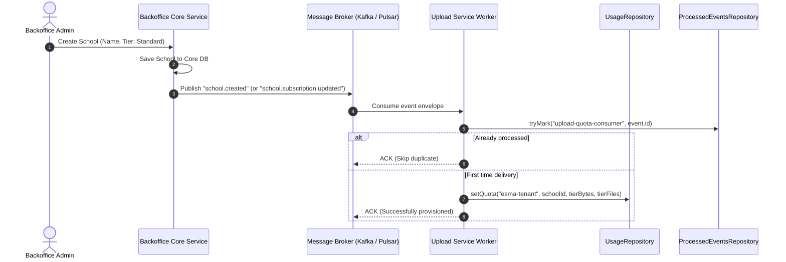

# ESMA Backoffice Integration & Architecture Upgrades

This document specifies the integration contract between the **ESMA Backoffice** (admin portal & backend services) and the **ESMA Upload Service v2**, capturing upcoming system changes, authentication structures, administrative permissions, and event-driven tenant provisioning.

---

## 1. Authentication & Identity Architecture

### 1.1 Zero Local Login Endpoints
`esma-upload-service-v2` contains **no user database or authentication/login endpoints**. 
All authentication is stateless and federated via:
1. **OIDC Bearer JWTs:** Issued by `esma-identity-service:7071/identity` (verified using JWKS RS256 public keys).
2. **Internal/Partner API Keys:** Issued for server-to-server microservices (`gus_<prefix>_<secret>`).

### 1.2 Backoffice Token Contract

Below is the canonical token payload format issued by `esma-identity-service` for Backoffice users (including Platform Admins). The `platformAdmin` boolean field is **not present** in tokens — admin authority is derived entirely from roles in `access.global.roles` and permissions in `access.global.permissions`.

```json
{
  "iss": "<identity issuer URL>",
  "sub": "<subject UUID>",
  "aud": "<audience>",
  "exp": 1789662167,
  "iat": 1789658567,
  "jti": "<JWT ID>",
  "azp": "backoffice-portal",
  "organizationId": "<org publicId>",
  "membershipId": "<membership publicId>",
  "branchId": "<branch publicId>",
  "branches": ["<branch publicId>"],
  "email": "admin@example.com",
  "phone_number": "+234...",
  "loginId": "<login ID>",
  "name": "First Last",
  "permissionVersion": "9f3a1c2b",
  "groups": ["<client role names>"],
  "access": {
    "global": {
      "roles": ["PLATFORM_ADMIN"],
      "permissions": ["STORAGE_QUOTA_VIEW", "STORAGE_QUOTA_EDIT", "STORAGE_FILES_VIEW"]
    },
    "organization": {
      "roles": ["BURSAR"],
      "permissions": []
    },
    "client": {
      "roles": [],
      "permissions": []
    }
  }
}
```

> **Note:** `access.global.permissions` is the **sole authority** for endpoint-level permissions in the upload service. `access.organization.permissions` and `access.client.permissions` are for other services and are **not used** here for authorization.

### 1.3 Administrative Scope Resolution Rules (No Hardcoded Logic)

To prevent security vulnerabilities and fragile role coupling:
1. **`platformAdmin` boolean claim is ABSENT from tokens.** It is not emitted by the identity service and must never be relied upon. Any legacy code or documentation referencing `token.platformAdmin = true` as an authorization mechanism is incorrect and has been removed.
2. **`access.global.permissions` is the endpoint permission source.** All API endpoint authorization for the upload service reads exclusively from `access.global.permissions`. Org-level and client-level permissions in the token are for other services.
3. **Zero Hardcoded Role Strings in Business Logic:** The application never hardcodes checks like `role === "PLATFORM_ADMIN"` directly in business services or controllers.
4. **Data-Driven Permission Extraction:** The Context Resolver ([P1-08](file:///c:/Users/PC/Documents/React%20and%20js/esma-upload-services/docs/BACKEND_TASKS.md#L478-L497)) parses and normalizes the verified token into `RequestContext`:
   ```typescript
   // Permissions come exclusively from access.global.permissions
   const globalPerms = token.access?.global?.permissions ?? [];
   const permissions = normalizePermissions(globalPerms); // snake_case canonical form

   // Roles collected from all access scopes and groups
   const globalRoles = token.access?.global?.roles ?? [];
   const orgRoles = token.access?.organization?.roles ?? [];
   const groupRoles = token.groups ?? [];
   const roles = Array.from(new Set([...globalRoles, ...orgRoles, ...groupRoles]));

   // isPlatformAdmin is DERIVED from roles/permissions — never from a boolean claim
   const isPlatformAdmin = roles.some(r => adminAllowedRoles.includes(r))
     || permissions.some(p => adminPermissionSet.has(p));
   ```
5. **Configurable Admin Role Evaluation:**
   Whether an incoming token qualifies for administrative / cross-tenant scope (`namespace: "esma-admin"`, `tenantId: "system"`) is evaluated against:
   - **Environment Configuration:** `ADMIN_ALLOWED_ROLES` (configured in typed config via `AppConfigService`, e.g. `ADMIN_ALLOWED_ROLES=PLATFORM_ADMIN,SUPER ADMIN`), **OR**
   - **Capability/Permission Check:** Possessing explicit administrative permissions in `access.global.permissions` such as `STORAGE_QUOTA_EDIT`, `STORAGE_AUDIT_VIEW`, `quotas_manage`, etc.
6. **Enforcement via Authorization Engine (P1-10):**
   Controllers use declarative decorators (`@RequirePermission(...)` or `@RequireAction(...)`), and the authorization engine evaluates the caller's `actor.permissions` (sourced from `access.global.permissions`) against the required capability table.

---

## 2. Recommended Backoffice Permission Extensions

As part of the upcoming Backoffice upgrade, the permission catalog in `esma-identity-service` will add dedicated storage and quota permissions so granular access can be delegated (e.g. allowing support staff or billing admins to inspect usage without full SuperAdmin privileges):

| Proposed Permission | Category | Description |
| :--- | :--- | :--- |
| `STORAGE_QUOTA_VIEW` | Storage / Quota | View tenant storage usage (`bytes_used`), file counts, and active limits. |
| `STORAGE_QUOTA_EDIT` | Storage / Quota | Update `max_bytes` and `max_files` for a school or tenant. |
| `STORAGE_FILES_VIEW` | Asset Management | Browse and inspect file manifests and metadata across schools. |
| `STORAGE_FILES_MANAGE`| Asset Management | Quarantine infected files, mark files for deletion, trigger re-replication. |
| `STORAGE_AUDIT_VIEW` | Security / Audit | Search and inspect file audit trails, downloads, and upload history. |

---

## 3. Backoffice Admin API Endpoints (Synchronous Interface)

These endpoints will be served by `esma-upload-service-v2` under the `esma-admin` namespace:

### 3.1 Get Tenant Quota & Usage
- **Route:** `GET /api/v1/admin/tenants/:tenantId/usage`
- **Guards:** `@UseGuards(ContextGuard, RolesGuard)` requiring `STORAGE_QUOTA_VIEW` or `SUPER ADMIN`.
- **Response:**
  ```json
  {
    "namespace": "esma-tenant",
    "tenantId": "d4530b09-703e-4759-bac9-f2aa192f1beb",
    "bytesUsed": "524288000",
    "fileCount": "1250",
    "maxBytes": "10737418240",
    "maxFiles": "10000",
    "percentUsed": 4.88,
    "updatedAt": "2026-09-25T21:40:00.000Z"
  }
  ```

### 3.2 Update Tenant Quota
- **Route:** `PATCH /api/v1/admin/tenants/:tenantId/quota`
- **Guards:** `@UseGuards(ContextGuard, RolesGuard)` requiring `STORAGE_QUOTA_EDIT` or `SUPER ADMIN`.
- **Payload:**
  ```json
  {
    "maxBytes": "53687091200", 
    "maxFiles": "25000"
  }
  ```
- **Handler:** Calls `UsageRepository.setQuota(namespace, tenantId, maxBytes, maxFiles)` which updates live limits immediately.

### 3.3 Reconcile Tenant Storage
- **Route:** `POST /api/v1/admin/tenants/:tenantId/reconcile`
- **Purpose:** Manually re-computes `bytes_used` and `file_count` directly from active rows in `files` table and repairs any counter drift.

---

## 4. Event-Driven Tenant Provisioning (Asynchronous Messaging)

When schools or tenants are onboarded in the Backoffice, the Backoffice does not need to block on an HTTP call to the upload service. Instead, it publishes domain events to the message broker (Kafka / Pulsar).

### 4.1 Architecture & Workflow



### 4.2 Message Envelope Contract: `school.created`

```json
{
  "eventId": "9b1deb4d-3b7d-4bad-9bdd-2b0d7b3dcb6d",
  "eventType": "school.created",
  "timestamp": "2026-09-25T22:15:00.000Z",
  "partitionKey": "school-d4530b09-703e-4759-bac9-f2aa192f1beb",
  "payload": {
    "schoolId": "d4530b09-703e-4759-bac9-f2aa192f1beb",
    "name": "Springfield Academy",
    "subscriptionTier": "STANDARD",
    "quotaOverrides": {
      "maxBytes": "21474836480",
      "maxFiles": "10000"
    }
  }
}
```

### 4.3 Default Subscription Tiers (Recommended Defaults)

If the event does not specify exact override numbers, the consumer maps tiers to defaults:

| Subscription Tier | Default `maxBytes` | Default `maxFiles` | Notes |
| :--- | :--- | :--- | :--- |
| `FREE_TRIAL` | 2 GiB (`2147483648`) | 500 | Default for test and trial schools |
| `STANDARD` | 20 GiB (`21474836480`) | 10,000 | Standard school subscription |
| `PREMIUM` | 100 GiB (`107374182400`)| 50,000 | High-volume school with rich media |
| `ENTERPRISE` | `NULL` (Unlimited) | `NULL` (Unlimited) | Custom contracted capacity |

### 4.4 Message Envelope Contract: `school.subscription.updated`
When a school upgrades or downgrades their subscription plan in the Backoffice:
```json
{
  "eventId": "f78d9102-aa11-4091-bf99-8899aabbccdd",
  "eventType": "school.subscription.updated",
  "timestamp": "2026-09-25T22:16:00.000Z",
  "partitionKey": "school-d4530b09-703e-4759-bac9-f2aa192f1beb",
  "payload": {
    "schoolId": "d4530b09-703e-4759-bac9-f2aa192f1beb",
    "previousTier": "STANDARD",
    "newTier": "PREMIUM",
    "maxBytes": "107374182400",
    "maxFiles": "50000"
  }
}
```
The consumer processes this idempotently via `UsageRepository.setQuota(...)`, immediately unlocking additional upload headroom for that school without restarting any service.

---

## 5. Summary of Key Implementation Touchpoints

- **[P1-08 (RequestContext Resolver)](file:///c:/Users/PC/Documents/React%20and%20js/esma-upload-services/docs/BACKEND_TASKS.md#L478-L497):** Populates roles from `access.global.roles` + `groups` and permissions from `access.global.permissions` (normalized to snake_case). `isPlatformAdmin` is derived from those values — not from any boolean JWT claim.
- **[P1-10 (Authorization Engine)](file:///c:/Users/PC/Documents/React%20and%20js/esma-upload-services/docs/BACKEND_TASKS.md#L519-L537):** Matches permissions like `quotas_manage` / `STORAGE_QUOTA_EDIT` sourced from `access.global.permissions` against MATRIX_RULES in `src/authz/matrix-rules.ts`.
- **[P6-02 (Rate Limiting & Quotas)](file:///c:/Users/PC/Documents/React%20and%20js/esma-upload-services/docs/BACKEND_TASKS.md#L1320-L1330):** Implements the Admin HTTP endpoints and the event consumer for asynchronous school creation.

---

## 6. Permission Normalization Reference

Permissions arriving in `access.global.permissions` may use any casing or separator style (e.g. `STORAGE_QUOTA_VIEW`, `storage.quota.view`, `upload.quotas.view`). The `normalizePermission()` function in `src/authz/permissions.ts` canonicalizes them to lowercase snake_case and resolves aliases and typo variants before any authorization check:

| Raw permission (from token) | Canonical form |
| :--- | :--- |
| `STORAGE_QUOTA_VIEW` | `quotas_view` |
| `STORAGE_QUOTA_EDIT` | `quotas_manage` |
| `upload.quotas.view` | `quotas_view` |
| `upload.quoatas.view` | `quotas_view` |
| `SYSTEM_FILES_UPLOAD` | `system_files_upload` |
| `TENANTS_USAGE_VIEW` | `tenants_usage_view` |
| `AUDIT_VIEW` | `audit_view` |

The service never rejects a permission due to case or minor spelling variation — normalization is transparent to callers.
