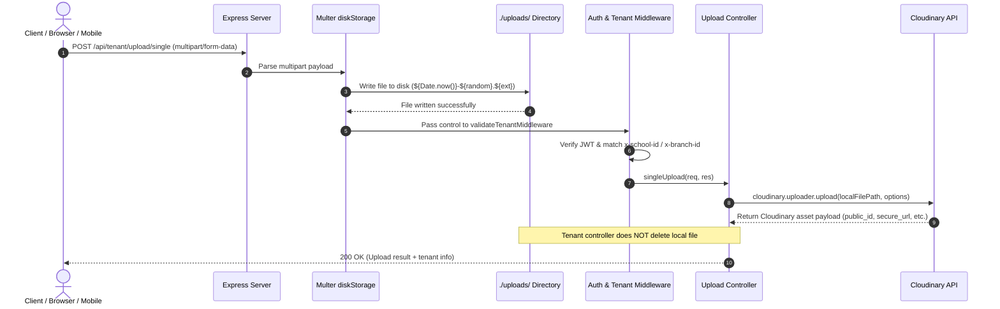

# ESMA Upload Service: Current Architecture & Implementation Deep-Dive

> [!WARNING]
> **HISTORICAL ARCHIVE (DECOMMISSIONED V1 EXPRESS SERVICE)**
> This document records the historical as-is architecture of the legacy Express v1 implementation (`esma-upload-service/`). The legacy service has been **decommissioned and frozen**.
> The active production system is **ESMA Upload Service v2** (`esma-upload-service-v2/`), built on NestJS 10. For current architecture, refer to [`docs/ARCHITECTURE_AND_ROADMAP.md`](./ARCHITECTURE_AND_ROADMAP.md) and [`esma-upload-service-v2/README.md`](../README.md).

## 1. Executive Summary

This document provides a comprehensive, exhaustive technical reference of the **historical state (as-is)** of the original Express v1 **ESMA Upload Service** codebase. It covers the legacy architecture, runtime configuration, directory layout, multi-tenancy model, file ingestion pipeline, Cloudinary integration, API route specifications, and code-level limitations and bugs as identified during the initial architectural review.

---

## 2. Technology Stack & Runtime Specifications

| Dimension | Specification | Details |
| :--- | :--- | :--- |
| **Runtime** | Node.js v20 (ES Modules) | `"type": "module"` in `package.json` |
| **Framework** | Express v5.2.1 | Using modern Express 5 router and middleware primitives |
| **Language** | TypeScript v7.0.2 | Compiled via `tsc` or executed directly in dev with `tsx watch` |
| **File Parsing** | Multer v2.2.0 | `multer.diskStorage` buffering directly into `./uploads/` |
| **Cloud Storage** | Cloudinary v2.10.1 (`cloudinary`) | Direct SDK integration for uploads, search, resource details, and deletion |
| **Security / Auth** | `jsonwebtoken` v9.0.3 | HMAC-SHA256 JWT decoding and claim verification |
| **API Documentation** | `swagger-jsdoc` + `swagger-ui-express` | OpenAPI 3.1.0 specification exposed at `/` and `/docs.json` |
| **Containerization** | Docker + Docker Compose | Multi-stage Dockerfile (`node:20-bullseye`), exposing port `7030` |
| **CI / CD** | GitLab CI (`.gitlab-ci.yml`) | Multi-arch Docker buildx (`linux/arm64`) deployed over SSH |

---

## 3. Directory Layout & Code Inventory

```
esma-upload-service/
├── .env                          # Local environment variables
├── .dockerignore                 # Docker build exclusions
├── .gitignore                    # Git exclusions (node_modules, uploads, dist)
├── .gitlab-ci.yml                # GitLab CI/CD build & deploy pipeline
├── Dockerfile                    # Multi-stage production build (build -> runner)
├── docker-compose.yml            # Local container composition
├── package.json                  # Dependencies, scripts, and module settings
├── tsconfig.json                 # TypeScript compiler configuration
├── README.md                     # High-level developer setup documentation
├── index.ts                      # Main HTTP server entrypoint, middleware, Swagger
├── config/
│   ├── cloudinary.ts             # Cloudinary v2 SDK configuration singleton
│   └── multer.ts                 # Multer diskStorage and file filter configuration
├── controller/
│   ├── AdminUploadController.ts  # SuperAdmin file upload, list, detail, and delete handlers
│   └── TenantUploadController.ts # School/Branch multi-tenant upload, list, and delete handlers
├── docs/
│   ├── ARCHITECTURE_AND_ROADMAP.md # Target architecture & evolution roadmap
│   └── CURRENT_ARCHITECTURE_AND_IMPLEMENTATION.md # This document
├── routes/
│   ├── superAdmin.ts             # Routes mounted at /api/admin/upload
│   └── tenants.ts                # Routes mounted at /api/tenant/upload
├── types/
│   └── index.ts                  # Shared TypeScript interfaces (TokenPayload, AuthenticatedRequest)
├── uploads/                      # Local scratch directory for Multer disk buffer
└── utils/
    └── index.ts                  # Auth middleware, path generators, cleanup, and helper functions
```

---

## 4. Current Architecture Overview

```mermaid
flowchart TD
    subgraph Clients["Clients"]
        TClient["Tenant Client (School Admin / Staff)"]
        AClient["SuperAdmin Client / Dashboard"]
    end

    subgraph EntryPoint["Express HTTP Server (index.ts)"]
        CORS["CORS Middleware"]
        BodyParsers["express.json() & express.urlencoded()"]
        StaticServe["Static File Serving: /uploads -> ./uploads"]
        Swagger["Swagger UI (/) & OpenAPI JSON (/docs.json)"]
    end

    subgraph RouteMounts["Routing Layer"]
        TRoute["/api/tenant/upload (routes/tenants.ts)"]
        ARoute["/api/admin/upload (routes/superAdmin.ts)"]
    end

    subgraph MiddlewareLayer["Middleware Pipeline"]
        MulterDisk["Multer diskStorage (./uploads/)"]
        VToken["validateTokenMiddleware (JWT verify)"]
        VSchool["validateSchoolHeadersMiddleware (x-school-id, x-branch-id)"]
    end

    subgraph Controllers["Controller Logic"]
        TCtrl["TenantUploadController.ts"]
        ACtrl["AdminUploadController.ts"]
    end

    subgraph StorageTargets["Storage & Local Disk"]
        CloudinaryAPI[("Cloudinary Cloud Storage (v2 API)")]
        LocalUploads[("Local Scratch Disk (./uploads/)")]
    end

    TClient -->|Bearer Token + Headers| CORS
    AClient -->|Bearer Token (optional in routes)| CORS

    CORS --> BodyParsers --> StaticServe --> Swagger

    StaticServe --> TRoute
    StaticServe --> ARoute

    TRoute --> MulterDisk
    MulterDisk --> VToken --> VSchool --> TCtrl

    ARoute --> MulterDisk
    MulterDisk --> ACtrl

    TCtrl -->|uploadToCloudinary()| CloudinaryAPI
    ACtrl -->|cloudinary.uploader.upload()| CloudinaryAPI

    ACtrl -.->|cleanupLocalFile()| LocalUploads
    TCtrl -.->|LEAKS FILE: No cleanup called| LocalUploads
```

---

## 5. Ingestion Pipeline & File Flow

The service processes uploads using a two-stage synchronous pipeline: **Local Scratch Ingestion** followed by **Cloudinary Upstream Upload**.



### 5.1 Multer Configuration (`config/multer.ts`)
* **Storage Engine**: `multer.diskStorage`.
* **Destination**: Absolute path resolving to `path.join(process.cwd(), "uploads")`.
* **Filename Generation**: `${Date.now()}-${Math.round(Math.random() * 1e9)}${path.extname(file.originalname)}`.
* **Size Limit**: `20 * 1024 * 1024` bytes (**20 MB**).
* **Allowed MIME Types**:
  * Images: `image/jpeg`, `image/png`, `image/gif`, `image/jpg`
  * Documents: `docx`, `pdf`, `xlsx`
* **Static Exposure**: In `index.ts`, `app.use("/uploads", express.static(path.resolve(__dirname, "uploads")))` serves all files saved in `./uploads/` directly to the public web without authentication.

---

## 6. Authentication, Multi-Tenancy & Access Control

### 6.1 Token Payload Structure (`types/index.ts`)
The service relies on JWTs signed with `process.env.JWT_SECRET`:
```typescript
export interface TokenPayload {
  schoolId: string;
  branchId?: string;
  schoolName: string;
  userId?: string;
  role?: string;
  exp?: number;
  iat?: number;
  [key: string]: any;
}
```

### 6.2 Middleware Execution Chain (`utils/index.ts`)

```
Incoming Request
      │
      ▼
validateTokenMiddleware
  ├── Extracts Authorization: Bearer <token>
  ├── jwt.verify(token, JWT_SECRET)
  ├── Checks token expiration (exp < Date.now() / 1000)
  ├── Validates mandatory schoolId and schoolName presence
  └── Populates req.user = decoded
      │
      ▼
validateSchoolHeadersMiddleware
  ├── Reads x-school-id header (Mandatory)
  ├── Reads x-branch-id header (Optional)
  ├── Enforces req.headers["x-school-id"] === req.user.schoolId
  ├── Enforces req.headers["x-branch-id"] === req.user.branchId (if present in token/headers)
  ├── Overrides req.body.schoolId, req.body.branchId, req.body.schoolName with token claims
  └── Passes to Controller
```

---

## 7. Cloudinary Folder Hierarchy & Asset Organization

Files uploaded to Cloudinary are segregated by actor and tenant:

### 7.1 Tenant Assets (`utils/index.ts -> generateTenantFolderPath`)
* **School Root Folder**: `uploads/schools/${schoolId}`
* **Branch Folder**: `uploads/schools/${schoolId}/branches/${branchId}`
* **Metadata Tags**: Automatically attaches tags: `["school_${schoolId}", "branch_${branchId}"]`.
* **Context**: Injects `context: { school_id, branch_id, upload_timestamp }`.

### 7.2 Admin Assets (`utils/index.ts -> generateAdminFolderPath`)
* **Base Admin Folder**: `admin`
* **Subfolder**: `admin/${folder}` (e.g. `admin/banners`, `admin/logos`)
* **Field-Specific Subfolder**: `admin/${folder}/${fieldname}` (for multi-field uploads)

---

## 8. Complete API Endpoint Catalog

The service exposes 16 routes across Tenant, Admin, and System namespaces:

### 8.1 Tenant Routes (`/api/tenant/upload`)

| Method | Endpoint | Description | Middleware Chain | Request Body / Params | Expected Response |
| :--- | :--- | :--- | :--- | :--- | :--- |
| `POST` | `/single` | Upload 1 file for school/branch | `upload.single("file")`<br>`validateTenantMiddleware` | Multipart: `file` | `{ message, data: { public_id, secure_url, tenant } }` |
| `POST` | `/multiple` | Upload up to 10 files in `files` field | `upload.array("files", 10)`<br>`validateTenantMiddleware` | Multipart: `files[]` | `{ message, files: [...], tenant }` |
| `POST` | `/multiple-fields` | Upload across `avatar` (1), `gallery` (5), `documents` (10) | `upload.fields(...)`<br>`validateTenantMiddleware` | Multipart: `avatar`, `gallery`, `documents` | `{ message, files: { avatar: [...], ... }, tenant }` |
| `GET` | `/files/:schoolId` | List up to 100 files for school | `validateTenantMiddleware` | Path: `schoolId`<br>Header: `x-school-id` | `{ message, files: [...], tenant, total }` |
| `GET` | `/files/:schoolId/:branchId` | List up to 100 files for branch | `validateTenantMiddleware` | Path: `schoolId`, `branchId`<br>Headers: `x-school-id`, `x-branch-id` | `{ message, files: [...], tenant, total }` |
| `DELETE` | `/files/:publicId` | Delete specific tenant asset | `validateTenantMiddleware` | Path: `publicId` (URL encoded) | `{ message, result: { result: "ok" }, tenant }` |

### 8.2 Super Admin Routes (`/api/admin/upload`)

| Method | Endpoint | Description | Middleware Chain | Request Body / Params | Expected Response |
| :--- | :--- | :--- | :--- | :--- | :--- |
| `POST` | `/single` | Upload 1 file to admin folder | `upload.single("file")` | Multipart: `file`<br>Query: `folder` (optional) | `{ message, data, folder }` |
| `POST` | `/multiple` | Upload up to 10 files to admin folder | `upload.array("files", 10)` | Multipart: `files[]`<br>Query: `folder` (optional) | `{ message, files, folder, total }` |
| `POST` | `/fields` | Upload across `profile_image` (1), `gallery_images` (5), `documents` (3) | `upload.fields(...)` | Multipart fields<br>Query: `folder` (optional) | `{ message, files, folder }` |
| `GET` | `/files` | List admin files with pagination | Direct controller | Query: `folder`, `limit` (default 100), `nextCursor` | `{ message, files, total, next_cursor, rate_limit_allowed }` |
| `GET` | `/file/:publicId` | Inspect resource details | Direct controller | Path: `publicId` (URL encoded) | `{ message, file: { ... } }` |
| `DELETE` | `/file/:publicId` | Delete single admin file | Direct controller | Path: `publicId` (URL encoded) | `{ message, result, publicId }` |
| `DELETE` | `/files` | Bulk delete files by public IDs | Direct controller | JSON Body: `{ publicIds: string[] }` | `{ message, successful: [...], failed: [...], total }` |

### 8.3 System & Documentation Endpoints

| Method | Endpoint | Description | Auth Required |
| :--- | :--- | :--- | :--- |
| `GET` | `/api/test` | Healthcheck returning `{ message: "Hello World" }` | None |
| `GET` | `/docs.json` | Returns raw OpenAPI 3.1.0 JSON specification | None |
| `GET` | `/` | Serves interactive Swagger UI | None |
| `GET` | `/uploads/*` | Static file server reading directly from `./uploads/` | None |

---

## 9. Controller Implementation Analysis

### 9.1 TenantUploadController (`controller/TenantUploadController.ts`)
1. **`singleUpload`**:
   - Extracts `schoolId`, `branchId`, and `schoolName` from `req.user`.
   - Validates format via `validateTenantInfo`.
   - Calls `uploadToCloudinary(imagePath, schoolId, branchId)`.
   - Returns Cloudinary metadata and tenant descriptor.
2. **`multipleUploads`**:
   - Maps over `req.files` using `Promise.all`.
3. **`multipleFields`**:
   - Iterates over each field array in `req.files` (`avatar`, `gallery`, `documents`) and uploads to Cloudinary.
4. **`getTenantFiles`**:
   - Validates that path `schoolId` and `branchId` match the token claims (`userSchoolId`, `userBranchId`).
   - Executes `cloudinary.search.expression("folder:uploads/schools/.../*").sort_by("created_at", "desc").max_results(100).execute()`.
5. **`deleteTenantFile`**:
   - Enforces prefix validation: verifies `publicId.startsWith("uploads/schools/" + schoolId)`.
   - Calls `cloudinary.uploader.destroy(publicId)`.

### 9.2 AdminUploadController (`controller/AdminUploadController.ts`)
1. **`adminSingleUpload` / `adminMultipleUploads` / `adminMultipleFields`**:
   - Supports dynamic subfolder routing via `?folder=subfolderName`.
   - Passes `resource_type: "auto"`, `use_filename: true`, `unique_filename: true`.
   - Calls `cleanupLocalFile(imagePath)` to delete the temporary file after Cloudinary finishes.
2. **`getAdminFiles`**:
   - Queries Cloudinary Admin folders with cursor-based pagination (`next_cursor`).
3. **`getAdminFileDetails`**:
   - Iterates through resource types (`image`, `video`, `raw`) using `tryGetResource()` to resolve the correct Cloudinary resource type.
4. **`deleteAdminFiles` (Bulk Delete)**:
   - Uses `Promise.allSettled` across `publicIds` array to safely delete multiple files and return segregated `successful` and `failed` lists.

---

## 10. Code-Level Bugs & Security Vulnerabilities in Current Implementation

During the deep architectural review of the existing code, several critical discrepancies and bugs were identified:

### 10.1 Bug: `req.file.filename` inside `req.files.map` in Tenant Multi-Upload
In `controller/TenantUploadController.ts` (lines 212–221):
```typescript
// BUG IN CODE:
const uploadedFiles = await Promise.all(
  req.files.map(async (file: Express.Multer.File) => {
    const imagePath = path.join(
      process.cwd(),
      "uploads",
      req.file.filename // <--- BUG: References `req.file` instead of `file.filename`!
    );
    const result = await uploadToCloudinary(imagePath, schoolId, branchId);
    ...
  })
);
```
* **Impact**: If `req.file` is undefined (which is normal for `upload.array`), this line throws an unhandled TypeError (`Cannot read properties of undefined (reading 'filename')`) causing an HTTP 500 failure during multi-file uploads.

### 10.2 Security Gap: Unprotected Admin Endpoints
In `routes/superAdmin.ts`:
* The Swagger annotations declare `security: - bearerAuth: []`.
* **However**, none of the admin routes actually apply `validateTokenMiddleware` or check for SuperAdmin role authorization.
* **Impact**: Anyone with network access can upload, retrieve, or delete files from the `/api/admin/upload/*` endpoints without providing a JWT.

### 10.3 Disk Storage Leak in Tenant Uploads
* In `AdminUploadController.ts`, every upload invokes `await cleanupLocalFile(imagePath)`.
* In `TenantUploadController.ts`, `cleanupLocalFile` is **never called**.
* **Impact**: Every tenant file uploaded remains permanently saved on the server's local disk in `./uploads/`, causing unbounded disk usage over time.

### 10.4 Public Exposure of Local Uploads Directory
In `index.ts` (line 62):
```typescript
app.use("/uploads", express.static(path.resolve(__dirname, "uploads")));
```
* **Impact**: Any file stored on local disk is accessible via `GET /uploads/<filename>` without authentication, bypassing school tenant isolation.

### 10.5 Inconsistent MIME Filtering in `config/multer.ts`
* The error message says `"Only JPEG, PNG and GIF are allowed"`, but the filter allows `docx`, `pdf`, and `xlsx`.
* The filter checks string extensions/MIME headers provided by the client rather than inspecting magic bytes (file signature), allowing malicious executable files disguised as `.pdf`.

---

## 11. Configuration & Deployment

### 11.1 Environment Variables (`.env`)
```env
PORT=7030
NODE_ENV=Development
JWT_SECRET=ahdjshdkfsdjhfgysdfhasdgfyudfuhsdfvjasdfiausdfk
CLOUDINARY_CLOUD_NAME=ddbtedc49
CLOUDINARY_API_KEY=495564918312834
CLOUDINARY_API_SECRET=8lH7epf3A6amhrOh5DPlywJM7w4
```

### 11.2 Docker Containerization (`Dockerfile`)
* **Stage 1 (Build)**:
  - Base: `node:20-bullseye`
  - Installs dependencies (`npm i`)
  - Compiles TypeScript to JavaScript (`npx tsc` outputting to `/app/dist`)
* **Stage 2 (Runtime)**:
  - Base: `node:20-bullseye`
  - Copies `/app/dist` and `package*.json`
  - Installs production dependencies
  - Exposes port `7030`
  - Command: `npm start` (`node dist/index.js`)

### 11.3 CI / CD Pipeline (`.gitlab-ci.yml`)
* **Stage: `build-and-push`**:
  - Uses Docker-in-Docker (`docker:24.0.5-dind`) with QEMU and Docker Buildx.
  - Builds target platform `linux/arm64`.
  - Pushes images tagged `:latest` and `:${CI_COMMIT_SHORT_SHA}` to Docker Hub.
* **Stage: `deploy-to-server`**:
  - Connects via SSH to remote server `$SSH_HOST`.
  - Executes `./restart` script in `~/server-setup/esma`.

---

## 12. Architectural Summary & Baseline for Evolution

| Area | Current Implementation | Status |
| :--- | :--- | :--- |
| **Multi-Tenancy** | Coupled to `schoolId` / `branchId` | Needs domain profile abstraction for generic usage |
| **Storage Driver** | Hardcoded directly to Cloudinary v2 SDK | Needs `IStorageDriver` interface (Local, SeaweedFS, Cloudinary, Hybrid) |
| **Processing** | Synchronous upload inside HTTP request thread | Needs asynchronous broker pipeline (Kafka & Pulsar) |
| **File Cataloging** | Queried dynamically via Cloudinary search API | Needs dedicated metadata and manifest datastore |
| **Security & Auth** | Enforced on tenants; missing on admin routes | Needs unified Zero-Trust context resolver middleware |
