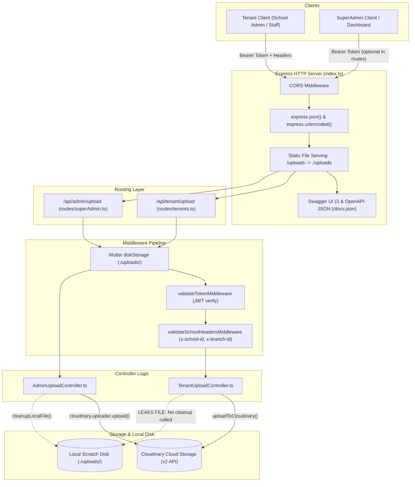
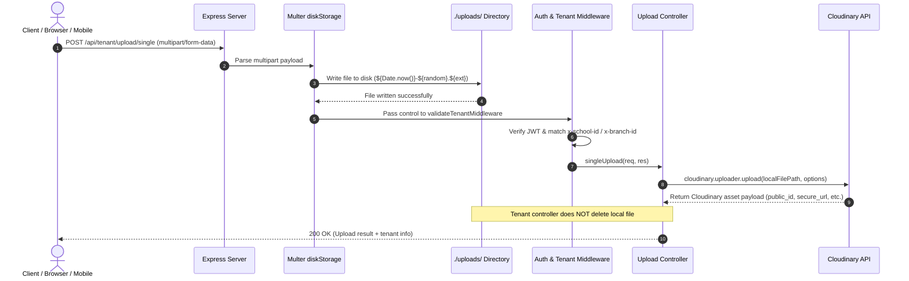

# ESMA Upload Service: Current Architecture & Implementation Deep-Dive

> **Revision 2.0 (2026-09-22).** The plan changed from "patch this app, then migrate it" to a ground-up rewrite. This document describes the **legacy Express v1 app** as a frozen historical reference only — it receives no further changes and is never read as a source to copy or port from. The old Express service lives at `esma-upload-services/esma-upload-service/`. The `docs/` folder has been moved to `esma-upload-services/docs/` (no longer inside the service folder). The new NestJS v2 service, built from scratch from the functional requirements in `ARCHITECTURE_AND_ROADMAP.md`, is under construction at `esma-upload-services/esma-upload-service-v2/`. Every finding and defect recorded below is now a day-one design requirement of the v2 rewrite (Phase 1), not something patched here first.
> **Revision 1.1 (2026-09-21).** Corrections from the cross-document review (`REVIEW_FINDINGS_AND_DECISIONS.md`): plaintext secrets removed (F-40), route count fixed (F-06), defects 10.6 to 10.14 added, runtime support notes added, and a list of statements that must be verified against the code (section 13).
> Statements about behavior are taken from the original write-up of the code. Items tagged **Verify** were not confirmed against the source.

## 1. Executive Summary

This document provides a comprehensive, exhaustive technical reference of the **current state (as-is)** of the **ESMA Upload Service** codebase. It covers the current architecture, runtime configuration, directory layout, multi-tenancy model, file ingestion pipeline, Cloudinary integration, API route specifications, and code-level limitations and bugs. Target design is in `ARCHITECTURE_AND_ROADMAP.md`. Fixes are scheduled in `BACKEND_TASKS.md`.

---

## 2. Technology Stack & Runtime Specifications

| Dimension | Specification | Details |
| :--- | :--- | :--- |
| **Runtime** | Node.js v20 (ES Modules) | `"type": "module"` in `package.json`. **Note:** Node 20 reached its scheduled end of life in April 2026 (Verify). v2 targets Node 22 LTS or newer from the start (P1-15). |
| **Framework** | Express v5.2.1 | Using modern Express 5 router and middleware primitives |
| **Language** | TypeScript v7.0.2 (as reported; Verify against `package.json`) | Compiled via `tsc` or executed directly in dev with `tsx watch` |
| **File Parsing** | Multer v2.2.0 | `multer.diskStorage` buffering directly into `./uploads/` |
| **Cloud Storage** | Cloudinary v2.10.1 (`cloudinary`) | Direct SDK integration for uploads, search, resource details, and deletion |
| **Security / Auth** | `jsonwebtoken` v9.0.3 | HMAC-SHA256 JWT decoding and claim verification |
| **API Documentation** | `swagger-jsdoc` + `swagger-ui-express` | OpenAPI 3.1.0 specification exposed at `/` and `/docs.json` |
| **Containerization** | Docker + Docker Compose | Multi-stage Dockerfile (`node:20-bullseye`), exposing port `7030`. Debian 11 (bullseye) standard LTS support was scheduled to end in August 2026 (Verify). |
| **CI / CD** | GitLab CI (`.gitlab-ci.yml`) | Multi-arch Docker buildx (`linux/arm64`) deployed over SSH |

---

## 3. Directory Layout & Code Inventory

### 3.0 Workspace Layout (actual on-disk structure)

The project now lives in a parent workspace folder (`esma-upload-services/`) containing three children:

```
esma-upload-services/                   ← workspace root
├── docs/                               ← documentation (moved out of the service folder)
│   ├── ARCHITECTURE_AND_ROADMAP.md
│   ├── CURRENT_ARCHITECTURE_AND_IMPLEMENTATION.md
│   ├── CURRENT_ARCHITECTURE_AND_IMPLEMENTATION (1).md
│   ├── REVIEW_FINDINGS_AND_DECISIONS.md
│   └── BACKEND_TASKS.md
├── esma-upload-service/                ← legacy Express v1 app (frozen; reference only, never edited)
│   └── (see section 3.1 below)
└── esma-upload-service-v2/             ← new NestJS v2 app (active development target; Phase 1+)
    └── (see section 3.2 below)
```

### 3.1 Legacy Service Layout (`esma-upload-service/`)

> **Status:** Frozen legacy reference. Never edited, patched, or used as a source for the v2 rewrite. Read-only, to confirm expected behavior.

```
esma-upload-service/
├── .env                          # Local environment variables (DO NOT COMMIT — v2 handles this from the start, see P1-02)
├── .dockerignore                 # Docker build exclusions
├── .gitignore                    # Git exclusions (node_modules, uploads, dist)
├── .gitlab-ci.yml                # GitLab CI/CD build & deploy pipeline
├── Dockerfile                    # Multi-stage production build (build -> runner)
├── docker-compose.yml            # Local container composition
├── package.json                  # Dependencies, scripts, and module settings
├── pnpm-lock.yaml                # Lock file (pnpm is the package manager in use)
├── tsconfig.json                 # TypeScript compiler configuration
├── README.md                     # High-level developer setup documentation
├── index.ts                      # Main HTTP server entrypoint, middleware, Swagger
├── config/
│   ├── cloudinary.ts             # Cloudinary v2 SDK configuration singleton
│   └── multer.ts                 # Multer diskStorage and file filter configuration
├── controller/
│   ├── AdminUploadController.ts  # SuperAdmin file upload, list, detail, and delete handlers
│   └── TenantUploadController.ts # School/Branch multi-tenant upload, list, and delete handlers
├── routes/
│   ├── superAdmin.ts             # Routes mounted at /api/admin/upload
│   └── tenants.ts                # Routes mounted at /api/tenant/upload
├── types/
│   └── index.ts                  # Shared TypeScript interfaces (TokenPayload, AuthenticatedRequest)
├── uploads/                      # Local scratch directory for Multer disk buffer (see bug 10.3, 10.4)
└── utils/
    └── index.ts                  # Auth middleware, path generators, cleanup, and helper functions
```

> **Note:** `docs/` is no longer inside this folder. It was moved to the workspace root `esma-upload-services/docs/`.

### 3.2 New NestJS Service Scaffold (`esma-upload-service-v2/`)

> **Status:** Active development target. Phase 1 and beyond are built here on NestJS.

```
esma-upload-service-v2/
├── .prettierrc                   # Prettier formatting config (generated by NestJS CLI)
├── eslint.config.mjs             # ESLint config (generated by NestJS CLI)
├── nest-cli.json                 # NestJS CLI configuration
├── package.json                  # NestJS dependencies and scripts
├── tsconfig.json                 # TypeScript configuration
├── tsconfig.build.json           # Build-specific TypeScript configuration
├── README.md                     # NestJS scaffold readme (to be replaced with project docs)
├── src/                          # Application source (expand as phases are implemented)
│   ├── app.controller.ts         # Scaffold: root controller (to be replaced in P1-01)
│   ├── app.controller.spec.ts    # Scaffold: root controller test
│   ├── app.module.ts             # Scaffold: root module (to be expanded per phase)
│   ├── app.service.ts            # Scaffold: root service (to be replaced in P1-01)
│   └── main.ts                   # Entry point: bootstraps NestFactory.create(AppModule)
└── test/
    ├── app.e2e-spec.ts           # Scaffold: end-to-end test
    └── jest-e2e.json             # Jest e2e configuration
```

---

## 4. Current Architecture Overview



---

## 5. Ingestion Pipeline & File Flow

The service processes uploads using a two-stage synchronous pipeline: **Local Scratch Ingestion** followed by **Cloudinary Upstream Upload**.



### 5.1 Multer Configuration (`config/multer.ts`)
* **Storage Engine**: `multer.diskStorage`.
* **Destination**: Absolute path resolving to `path.join(process.cwd(), "uploads")`.
* **Filename Generation**: `${Date.now()}-${Math.round(Math.random() * 1e9)}${path.extname(file.originalname)}`.
* **Size Limit**: `20 * 1024 * 1024` bytes (**20 MB**).
* **Allowed MIME Types**:
  * Images: `image/jpeg`, `image/png`, `image/gif`, `image/jpg`
  * Documents: `docx`, `pdf`, `xlsx`
* **Static Exposure**: In `index.ts`, `app.use("/uploads", express.static(path.resolve(__dirname, "uploads")))` serves all files saved in `./uploads/` directly to the public web without authentication.

---

## 6. Authentication, Multi-Tenancy & Access Control

### 6.1 Token Payload Structure (`types/index.ts`)
The service relies on JWTs signed with `process.env.JWT_SECRET`:
```typescript
export interface TokenPayload {
  schoolId: string;
  branchId?: string;
  schoolName: string;
  userId?: string;
  role?: string;
  exp?: number;
  iat?: number;
  [key: string]: any;
}
```

### 6.2 Middleware Execution Chain (`utils/index.ts`)

```
Incoming Request
      │
      ▼
validateTokenMiddleware
  ├── Extracts Authorization: Bearer <token>
  ├── jwt.verify(token, JWT_SECRET)
  ├── Checks token expiration (exp < Date.now() / 1000)
  ├── Validates mandatory schoolId and schoolName presence
  └── Populates req.user = decoded
      │
      ▼
validateSchoolHeadersMiddleware
  ├── Reads x-school-id header (Mandatory)
  ├── Reads x-branch-id header (Optional)
  ├── Enforces req.headers["x-school-id"] === req.user.schoolId
  ├── Enforces req.headers["x-branch-id"] === req.user.branchId (if present in token/headers)
  ├── Overrides req.body.schoolId, req.body.branchId, req.body.schoolName with token claims
  └── Passes to Controller
```

---

## 7. Cloudinary Folder Hierarchy & Asset Organization

Files uploaded to Cloudinary are segregated by actor and tenant:

### 7.1 Tenant Assets (`utils/index.ts -> generateTenantFolderPath`)
* **School Root Folder**: `uploads/schools/${schoolId}`
* **Branch Folder**: `uploads/schools/${schoolId}/branches/${branchId}`
* **Metadata Tags**: Automatically attaches tags: `["school_${schoolId}", "branch_${branchId}"]`.
* **Context**: Injects `context: { school_id, branch_id, upload_timestamp }`.

### 7.2 Admin Assets (`utils/index.ts -> generateAdminFolderPath`)
* **Base Admin Folder**: `admin`
* **Subfolder**: `admin/${folder}` (e.g. `admin/banners`, `admin/logos`)
* **Field-Specific Subfolder**: `admin/${folder}/${fieldname}` (for multi-field uploads)

---

## 8. Complete API Endpoint Catalog

The service exposes 17 route entries across Tenant (6), Admin (7), and System (4) namespaces. Naming differs by actor and is kept for backward compatibility: tenant `/multiple-fields` vs admin `/fields`, and tenant `/files/:publicId` vs admin `/file/:publicId`.

### 8.1 Tenant Routes (`/api/tenant/upload`)

| Method | Endpoint | Description | Middleware Chain | Request Body / Params | Expected Response |
| :--- | :--- | :--- | :--- | :--- | :--- |
| `POST` | `/single` | Upload 1 file for school/branch | `upload.single("file")`<br>`validateTenantMiddleware` | Multipart: `file` | `{ message, data: { public_id, secure_url, tenant } }` |
| `POST` | `/multiple` | Upload up to 10 files in `files` field | `upload.array("files", 10)`<br>`validateTenantMiddleware` | Multipart: `files[]` | `{ message, files: [...], tenant }` |
| `POST` | `/multiple-fields` | Upload across `avatar` (1), `gallery` (5), `documents` (10) | `upload.fields(...)`<br>`validateTenantMiddleware` | Multipart: `avatar`, `gallery`, `documents` | `{ message, files: { avatar: [...], ... }, tenant }` |
| `GET` | `/files/:schoolId` | List up to 100 files for school | `validateTenantMiddleware` | Path: `schoolId`<br>Header: `x-school-id` | `{ message, files: [...], tenant, total }` |
| `GET` | `/files/:schoolId/:branchId` | List up to 100 files for branch | `validateTenantMiddleware` | Path: `schoolId`, `branchId`<br>Headers: `x-school-id`, `x-branch-id` | `{ message, files: [...], tenant, total }` |
| `DELETE` | `/files/:publicId` | Delete specific tenant asset | `validateTenantMiddleware` | Path: `publicId` (URL encoded) | `{ message, result: { result: "ok" }, tenant }` |

### 8.2 Super Admin Routes (`/api/admin/upload`)

| Method | Endpoint | Description | Middleware Chain | Request Body / Params | Expected Response |
| :--- | :--- | :--- | :--- | :--- | :--- |
| `POST` | `/single` | Upload 1 file to admin folder | `upload.single("file")` | Multipart: `file`<br>Query: `folder` (optional) | `{ message, data, folder }` |
| `POST` | `/multiple` | Upload up to 10 files to admin folder | `upload.array("files", 10)` | Multipart: `files[]`<br>Query: `folder` (optional) | `{ message, files, folder, total }` |
| `POST` | `/fields` | Upload across `profile_image` (1), `gallery_images` (5), `documents` (3) | `upload.fields(...)` | Multipart fields<br>Query: `folder` (optional) | `{ message, files, folder }` |
| `GET` | `/files` | List admin files with pagination | Direct controller | Query: `folder`, `limit` (default 100), `nextCursor` | `{ message, files, total, next_cursor, rate_limit_allowed }` |
| `GET` | `/file/:publicId` | Inspect resource details | Direct controller | Path: `publicId` (URL encoded) | `{ message, file: { ... } }` |
| `DELETE` | `/file/:publicId` | Delete single admin file | Direct controller | Path: `publicId` (URL encoded) | `{ message, result, publicId }` |
| `DELETE` | `/files` | Bulk delete files by public IDs | Direct controller | JSON Body: `{ publicIds: string[] }` | `{ message, successful: [...], failed: [...], total }` |

### 8.3 System & Documentation Endpoints

| Method | Endpoint | Description | Auth Required |
| :--- | :--- | :--- | :--- |
| `GET` | `/api/test` | Healthcheck returning `{ message: "Hello World" }` | None |
| `GET` | `/docs.json` | Returns raw OpenAPI 3.1.0 JSON specification | None |
| `GET` | `/` | Serves interactive Swagger UI | None |
| `GET` | `/uploads/*` | Static file server reading directly from `./uploads/` | None |

---

## 9. Controller Implementation Analysis

### 9.1 TenantUploadController (`controller/TenantUploadController.ts`)
1. **`singleUpload`**:
   - Extracts `schoolId`, `branchId`, and `schoolName` from `req.user`.
   - Validates format via `validateTenantInfo`.
   - Calls `uploadToCloudinary(imagePath, schoolId, branchId)`.
   - Returns Cloudinary metadata and tenant descriptor.
2. **`multipleUploads`**:
   - Maps over `req.files` using `Promise.all`.
3. **`multipleFields`**:
   - Iterates over each field array in `req.files` (`avatar`, `gallery`, `documents`) and uploads to Cloudinary.
4. **`getTenantFiles`**:
   - Validates that path `schoolId` and `branchId` match the token claims (`userSchoolId`, `userBranchId`).
   - Executes `cloudinary.search.expression("folder:uploads/schools/.../*").sort_by("created_at", "desc").max_results(100).execute()`.
5. **`deleteTenantFile`**:
   - Enforces prefix validation: verifies `publicId.startsWith("uploads/schools/" + schoolId)`.
   - Calls `cloudinary.uploader.destroy(publicId)`.

### 9.2 AdminUploadController (`controller/AdminUploadController.ts`)
1. **`adminSingleUpload` / `adminMultipleUploads` / `adminMultipleFields`**:
   - Supports dynamic subfolder routing via `?folder=subfolderName`.
   - Passes `resource_type: "auto"`, `use_filename: true`, `unique_filename: true`.
   - Calls `cleanupLocalFile(imagePath)` to delete the temporary file after Cloudinary finishes.
2. **`getAdminFiles`**:
   - Queries Cloudinary Admin folders with cursor-based pagination (`next_cursor`).
3. **`getAdminFileDetails`**:
   - Iterates through resource types (`image`, `video`, `raw`) using `tryGetResource()` to resolve the correct Cloudinary resource type.
4. **`deleteAdminFiles` (Bulk Delete)**:
   - Uses `Promise.allSettled` across `publicIds` array to safely delete multiple files and return segregated `successful` and `failed` lists.

---

## 10. Code-Level Bugs & Security Vulnerabilities in Current Implementation

During the deep architectural review of the existing code, several critical discrepancies and bugs were identified:

### 10.1 Bug: `req.file.filename` inside `req.files.map` in Tenant Multi-Upload (not reproduced in v2, ingestion module P1-12)
In `controller/TenantUploadController.ts` (lines 212–221):
```typescript
// BUG IN CODE:
const uploadedFiles = await Promise.all(
  req.files.map(async (file: Express.Multer.File) => {
    const imagePath = path.join(
      process.cwd(),
      "uploads",
      req.file.filename // <--- BUG: References `req.file` instead of `file.filename`!
    );
    const result = await uploadToCloudinary(imagePath, schoolId, branchId);
    ...
  })
);
```
* **Impact**: If `req.file` is undefined (which is normal for `upload.array`), this line throws an unhandled TypeError (`Cannot read properties of undefined (reading 'filename')`) causing an HTTP 500 failure during multi-file uploads.

### 10.2 Security Gap: Unprotected Admin Endpoints (not reproduced in v2: auth required by construction, P1-09)
In `routes/superAdmin.ts`:
* The Swagger annotations declare `security: - bearerAuth: []`.
* **However**, none of the admin routes actually apply `validateTokenMiddleware` or check for SuperAdmin role authorization.
* **Impact**: Anyone with network access can upload, retrieve, or delete files from the `/api/admin/upload/*` endpoints without providing a JWT.

### 10.3 Disk Storage Leak in Tenant Uploads (not reproduced in v2: guaranteed disposal, P1-12)
* In `AdminUploadController.ts`, every upload invokes `await cleanupLocalFile(imagePath)`.
* In `TenantUploadController.ts`, `cleanupLocalFile` is **never called**.
* **Impact**: Every tenant file uploaded remains permanently saved on the server's local disk in `./uploads/`, causing unbounded disk usage over time.

### 10.4 Public Exposure of Local Uploads Directory (not reproduced in v2: no static storage route, P1-01)
In `index.ts` (line 62):
```typescript
app.use("/uploads", express.static(path.resolve(__dirname, "uploads")));
```
* **Impact**: Any file stored on local disk is accessible via `GET /uploads/<filename>` without authentication, bypassing school tenant isolation.

### 10.5 Inconsistent MIME Filtering in `config/multer.ts` (F-51)
* The error message says `"Only JPEG, PNG and GIF are allowed"`, but the filter allows `docx`, `pdf`, and `xlsx`.
* The filter checks string extensions/MIME headers provided by the client rather than inspecting magic bytes (file signature), allowing malicious executable files disguised as `.pdf`.
* `image/jpg` is not a registered MIME type (`image/jpeg` is). `docx`, `pdf` and `xlsx` are described by short names rather than full MIME strings (`application/vnd.openxmlformats-officedocument.wordprocessingml.document` and so on). Verify the exact list in the code. v2 defines its own full-MIME-string allowlist from the start (P1-12).

### 10.6 Multer Runs Before Authentication on Tenant Routes (F-41)
Both the flow diagram and the sequence diagram show `upload.*()` executing before `validateTenantMiddleware`. An unauthenticated caller can therefore stream up to the size limit per request onto the server disk. Combined with 10.3 (no cleanup), it is a disk-exhaustion vector. v2's ingestion module runs auth before the file interceptor by construction (P1-12).

### 10.7 Prefix Match Bug in Tenant Delete (F-42)
`publicId.startsWith("uploads/schools/" + schoolId)` has no trailing separator. School `SCH_1` therefore matches `uploads/schools/SCH_10/...` and can delete another school's files. Branch-level tokens can also delete files in sibling branches because only the school prefix is checked. v2 authorizes with a DB-backed tenant/sub-tenant check from the start, never a string-prefix match (P1-10).

### 10.8 Unsanitized `folder` Query Parameter on Admin Routes (F-43)
`?folder=` is used to build the Cloudinary folder path. No validation is described, so path-like values (`../`, nested paths, very long strings) can create arbitrary folders. v2 validates every path segment from the start (P1-12).

### 10.9 JWT Verification Gaps (F-44)
No algorithm allowlist is described for `jwt.verify`. Expiry is checked manually, so a token without `exp` may be accepted (**Verify**). Tenant and admin credentials share one secret with no audience or role separation. v2's JWT verification is hardened from the start (P1-09).

### 10.10 Unbounded Bulk Delete (F-45)
`DELETE /api/admin/upload/files` accepts any number of `publicIds`. v2 caps bulk operations at 100 from the start (P1-12).

### 10.11 Weak Health, Docs and CORS Posture (F-46)
`/api/test` returns a static string and checks nothing. Swagger UI and `/docs.json` are public. CORS configuration is not described. v2 has real `/health/*` endpoints and an explicit CORS allowlist from the start (P1-15).

### 10.12 Static Path Ambiguity (F-47)
`path.resolve(__dirname, "uploads")` is used in an ES module (`__dirname` must be derived from `import.meta.url`) and, when compiled, resolves under `dist/`, while Multer writes to `process.cwd()/uploads`. The public static route and the scratch directory may point at different directories in the container. **Verify.** Moot for v2: it is an ESM NestJS project from the start with no static storage route (P1-01).

### 10.13 Container and Runtime Hygiene (F-31, F-49)
`npm i` instead of `npm ci`, both stages on the full `node:20-bullseye` image, no `HEALTHCHECK`, no evidence of a non-root user. Node 20 and Debian 11 are past or at end of support. v2's Dockerfile is written fresh on Node 22/bookworm from the start (P1-15).

### 10.14 CI Has No Quality Gates (F-50)
The pipeline builds and deploys. It does not run tests, lint, type checks, dependency audit or image scanning, and it builds `linux/arm64` only. v2 gets a full pipeline from the start (P1-13, P6-06).

### 10.15 Cloudinary API Coupling (F-52, F-53)
Listing uses the Search API and file inspection probes `image`, `video` and `raw` in turn. Both are rate limited, which is why the admin list response carries a `rate_limit_allowed` field. **Fix:** database-backed listing and stored `resource_type` (P2-03, P3-03).

---

## 11. Configuration & Deployment

### 11.1 Environment Variables (`.env`)
```env
PORT=7030
NODE_ENV=development
JWT_SECRET=<redacted>
CLOUDINARY_CLOUD_NAME=<redacted>
CLOUDINARY_API_KEY=<redacted>
CLOUDINARY_API_SECRET=<redacted>
```

> **Security notice (F-40).** The previous revision of this document contained the real `JWT_SECRET`, Cloudinary API key and Cloudinary API secret. Treat all three as compromised: rotate them, and check whether `.env` was ever committed (the `.gitignore` summary above does not list it). If it was, purge history and rotate again. Documentation must never contain real credentials. v2 is configured with fresh credentials, never these retired values (P1-02).
> The original file also used `NODE_ENV=Development`. Libraries compare against lowercase values, so use `development`.

### 11.2 Docker Containerization (`Dockerfile`)
* **Stage 1 (Build)**:
  - Base: `node:20-bullseye`
  - Installs dependencies (`npm i`)
  - Compiles TypeScript to JavaScript (`npx tsc` outputting to `/app/dist`)
* **Stage 2 (Runtime)**:
  - Base: `node:20-bullseye`
  - Copies `/app/dist` and `package*.json`
  - Installs production dependencies
  - Exposes port `7030`
  - Command: `npm start` (`node dist/index.js`)

### 11.3 CI / CD Pipeline (`.gitlab-ci.yml`)
* **Stage: `build-and-push`**:
  - Uses Docker-in-Docker (`docker:24.0.5-dind`) with QEMU and Docker Buildx.
  - Builds target platform `linux/arm64`.
  - Pushes images tagged `:latest` and `:${CI_COMMIT_SHORT_SHA}` to Docker Hub.
* **Stage: `deploy-to-server`**:
  - Connects via SSH to remote server `$SSH_HOST`.
  - Executes `./restart` script in `~/server-setup/esma`.

---

## 12. Architectural Summary & Baseline for Evolution

| Area | Current Implementation | Status |
| :--- | :--- | :--- |
| **Multi-Tenancy** | Coupled to `schoolId` / `branchId` | Needs domain profile abstraction for generic usage (ARCH §3) |
| **Storage Driver** | Hardcoded directly to Cloudinary v2 SDK | Needs `IStorageDriver` v2 (Local, SeaweedFS, Cloudinary) and a topology mode for replication (ARCH §6) |
| **Processing** | Synchronous upload inside HTTP request thread | Needs outbox plus broker pipeline (memory, Kafka, Pulsar) (ARCH §8) |
| **File Cataloging** | Queried dynamically via Cloudinary search API | Needs PostgreSQL metadata store (ARCH §5) |
| **Security & Auth** | Enforced on tenants; missing on admin routes; upload parsed before auth | Needs unified context resolver, authorization matrix and visibility model (ARCH §4). Built correctly from day one in the v2 rewrite (Phase 1) rather than patched here. |
| **Quality gates** | None in CI | Tests, lint, audit, scan, built for v2 from the start (P1-13, P6-06) |

---

## 13. Statements to Verify Against the Code

The implementing agent must confirm these before relying on them. Register IDs match `BACKEND_TASKS.md` section 3.

| ID | Statement in this document | What to check |
| :--- | :--- | :--- |
| A-01 | `.env` may be tracked by git | `git ls-files .env`, `git log --all -- .env`, contents of `.gitignore` |
| A-02 | Tokens without `exp` may be accepted | Read `validateTokenMiddleware`; call it with a token signed without `exp` |
| A-03 | `validateTenantMiddleware` is a composition of the two validators | Read `routes/tenants.ts` and `utils/index.ts` |
| A-04 | `__dirname` handling and the static route location | Read `index.ts` around the static mount; run the built image and request `/uploads/<file>` |
| A-05 | Exact allowed MIME list and error text | Read `config/multer.ts` |
| A-06 | Exact response bodies and error shapes for every route | Produced by the behavior-reference tests, derived from this document (P1-14) |
| A-07 | Tenant routes do not use a per-field subfolder | Read `TenantUploadController.multipleFields` and `uploadToCloudinary` |
| A-08 | Admin token claims and whether admin clients send a token | Ask the SuperAdmin owner (Q1, Q2) |
| A-09 | Versions in section 2 match `package.json` | `npm ls` |
| A-10 | Cloudinary `folder:` search semantics for school scope (direct children only, or subfolders too) | Characterization test against a scratch Cloudinary folder |
