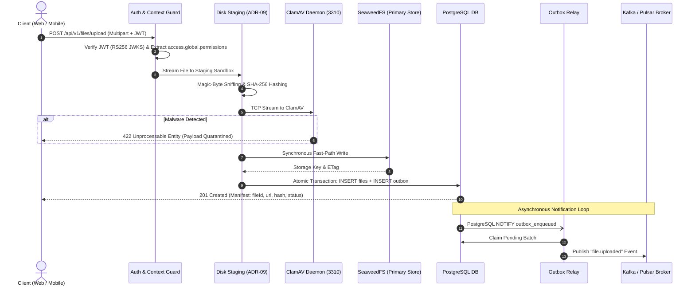
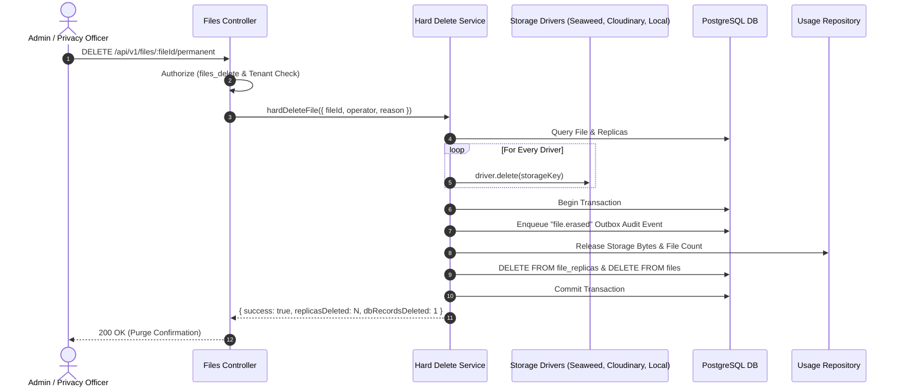

# 🏛️ ESMA Upload & Storage Services — Comprehensive Platform Guide

> **Audience:** Product Managers, DevOps Engineers, Full-Stack Developers, School Administrators, Security & Compliance Officers, and Support Teams.  
> **Service:** ESMA Generic Upload Service (GUS) / Ingestion, Security & Distributed Storage Engine  
> **Version:** 2.0 (NestJS Enterprise Architecture with Pluggable Storage & Zero-Trust Security)

---

# 📑 Table of Contents
1. [Executive Summary & Business Purpose](#1-executive-summary--business-purpose)
2. [User Roles, Actors & Authentication Architecture](#2-user-roles-actors--authentication-architecture)
   - 2.1 [Identity Provider & OIDC JWT Verification](#21-identity-provider--oidc-jwt-verification)
   - 2.2 [Permission Extraction & Normalization Engine](#22-permission-extraction--normalization-engine)
   - 2.3 [Platform Admin Authority Determination](#23-platform-admin-authority-determination)
   - 2.4 [Access Control Matrix](#24-access-control-matrix)
3. [Multi-Tenancy, Antivirus & Ingestion Pipeline](#3-multi-tenancy-antivirus--ingestion-pipeline)
   - 3.1 [Multi-Tenant Namespace & Directory Isolation](#31-multi-tenant-namespace--directory-isolation)
   - 3.2 [Zero-RAM Disk Staging & Magic-Byte Sniffing (ADR-09)](#32-zero-ram-disk-staging--magic-byte-sniffing-adr-09)
   - 3.3 [ClamAV Antivirus Daemon Integration](#33-clamav-antivirus-daemon-integration)
4. [Storage Engine, Replication & Outbox Events](#4-storage-engine-replication--outbox-events)
   - 4.1 [Multi-Driver Storage Architecture (SeaweedFS, Cloudinary, Local)](#41-multi-driver-storage-architecture-seaweedfs-cloudinary-local)
   - 4.2 [Replication State Machine & Promotion](#42-replication-state-machine--promotion)
   - 4.3 [Transactional Outbox Pattern & Pluggable Brokers](#43-transactional-outbox-pattern--pluggable-brokers)
5. [End-to-End Visual Workflow Diagrams](#5-end-to-end-visual-workflow-diagrams)
6. [Complete API Endpoint Catalog (Modern v2 API)](#6-complete-api-endpoint-catalog-modern-v2-api)
   - 6.1 [Standard Multipart File Upload (`POST /api/v1/files/upload`)](#61-standard-multipart-file-upload-post-apiv1filesupload)
   - 6.2 [Direct-to-Storage Presigned Upload Initiation (`POST /api/v1/files/presigned-upload`)](#62-direct-to-storage-presigned-upload-initiation-post-apiv1filespresigned-upload)
   - 6.3 [Complete Presigned Upload Confirmation (`POST /api/v1/files/:fileId/complete-upload`)](#63-complete-presigned-upload-confirmation-post-apiv1filesfileidcomplete-upload)
   - 6.4 [Search, Filter & List Files (`GET /api/v1/files`)](#64-search-filter--list-files-get-apiv1files)
   - 6.5 [Download / Stream File (`GET /api/v1/files/:fileId` & `HEAD`)](#65-download--stream-file-get-apiv1filesfileid--head)
   - 6.6 [Retrieve File Metadata Manifest (`GET /api/v1/files/:fileId/metadata`)](#66-retrieve-file-metadata-manifest-get-apiv1filesfileidmetadata)
   - 6.7 [Generate Temporary Signed URL (`POST /api/v1/files/:fileId/signed-url`)](#67-generate-temporary-signed-url-post-apiv1filesfileidsigned-url)
   - 6.8 [Soft Delete File (`DELETE /api/v1/files/:fileId`)](#68-soft-delete-file-delete-apiv1filesfileid)
   - 6.9 [Permanent Purge / Hard Delete (`DELETE /api/v1/files/:fileId/permanent`)](#69-permanent-purge--hard-delete-delete-apiv1filesfileidpermanent)
   - 6.10 [Bulk Delete Files (`POST /api/v1/files/bulk-delete`)](#610-bulk-delete-files-post-apiv1filesbulk-delete)
   - 6.11 [Force Cross-Storage Replication (`POST /api/v1/files/:fileId/replicate`)](#611-force-cross-storage-replication-post-apiv1filesfileidreplicate)
   - 6.12 [Admin Replication Status Overview (`GET /api/v1/admin/replication`)](#612-admin-replication-status-overview-get-apiv1adminreplication)
7. [Admin & Operational Governance API](#7-admin--operational-governance-api)
   - 7.1 [Dead-Letter Queue (DLQ) Management & Redrive (`/api/v1/admin/dlq`)](#71-dead-letter-queue-dlq-management--redrive)
   - 7.2 [Tenant Storage Quota Enforcement & Reconciliation (`/api/v1/admin/tenants/:tenantId/quota`)](#72-tenant-storage-quota-enforcement--reconciliation)
   - 7.3 [Forensic Security Audit Trail Inspection (`/api/v1/admin/audit`)](#73-forensic-security-audit-trail-inspection)
8. [Operational CLI Tools & Maintenance Scripts](#8-operational-cli-tools--maintenance-scripts)
9. [Observability, Healthchecks & Incident Runbooks](#9-observability-healthchecks--incident-runbooks)
10. [Local Development, Docker Compose & Testing Suites](#10-local-development-docker-compose--testing-suites)

---

# 1. Executive Summary & Business Purpose

### What is the ESMA Upload Service?
The **ESMA Upload Service (v2 / Generic Upload Service - GUS)** is the centralized, mission-critical digital asset backbone for the entire educational, administrative, and enterprise ecosystem (serving ESMA SIS, LMS, Communications). 

Whenever a teacher uploads an assignment, a student submits homework, an administrator uploads a school logo, or the system generates automated report cards and invoices, **this service is responsible for receiving, validating, virus-scanning, persisting, replicating, and delivering those files.**

### Core Capabilities & Problem Solutions
1. **Zero-Vendor Lock-in Distributed Storage:** Files are stored primarily on high-performance, self-hosted object storage (**SeaweedFS**) with automated, asynchronous background replication to secondary providers (**Cloudinary CDN**, **AWS S3**, or **Local Disk**).
2. **Ironclad Multi-Tenant Data Isolation:** Enforces strict boundary verification across namespaces (`esma-tenant`, `esma-admin`, `generic`), tenants (`tenantId` / `schoolId`), and sub-tenants (`branchId`).
3. **Zero-RAM Disk Staging (ADR-09):** Large incoming multipart streams are buffered directly to a controlled private disk staging sandbox. This enables rewindable MIME sniffing, parallel SHA-256 chunked hashing, and size validation with zero Node event loop blocking or memory starvation.
4. **Antivirus & Anti-Exploit Security:** Every file is inspected via **Magic-Byte binary header analysis** and scanned via the **ClamAV daemon** (port 3310). Disguised malware (such as `.exe` or `.sh` files renamed to `.pdf` or `.png`) is blocked and quarantined immediately.
5. **Transactional Outbox & Event Streaming:** Database records and domain events (`file.uploaded`, `file.deleted`, `file.erased`, `file.quarantined`) are committed atomically. PostgreSQL `LISTEN/NOTIFY` dispatches batches instantly to pluggable message brokers (**Apache Kafka**, **Apache Pulsar**, or **In-Memory**).
6. **Complete Lifecycle Governance & Permanent Purge:** Includes automated soft deletes with retention windows as well as an explicit permanent hard delete endpoint that physically purges binaries across all storage drivers, deletes database records, emits `file.erased` events, and releases tenant quotas.

---

# 2. User Roles, Actors & Authentication Architecture

## 2.1 Identity Provider & OIDC JWT Verification
The service authenticates callers using **OIDC RSA-256 (RS256) JWTs** issued by the ESMA Identity Service (`https://api.esma.elsoft.ng/identity`). Public keys are fetched dynamically and cached via JWKS (`/.well-known/jwks.json`). Machine-to-machine integrations are also supported via hashed **API Keys** (`x-api-key`).

### Verified JWT Claims Model
```typescript
interface TokenPayload {
  iss: string;                // "https://api.esma.elsoft.ng/identity"
  sub: string;                // Actor UUID
  aud: string;                // "esma-upload-service"
  organizationId?: string;    // Tenant identifier (school)
  branchId?: string;          // Sub-tenant identifier (branch)
  email?: string;
  name?: string;
  groups?: string[];          // User group memberships
  access?: {
    global?: {
      roles?: string[];       // Global roles (e.g. ["PLATFORM_ADMIN"])
      permissions?: string[]; // Global permissions (e.g. ["storage.quota.view"])
    };
    organization?: {
      roles?: string[];       // Org-scoped roles (e.g. ["admin", "teacher"])
      permissions?: string[]; // Org-scoped permissions
    };
  };
}
```

## 2.2 Permission Extraction & Normalization Engine
Authorization for upload service endpoints reads exclusively from `access.global.permissions`. To support different client calling conventions, the service features an automated **Permission Normalization Engine** (`src/authz/permissions.ts`).

Any arriving permission is sanitized and canonicalized to lowercase `snake_case`. Common typographical errors (such as `quoata`) and domain prefixes (such as `upload.` or `storage.`) are automatically mapped to canonical constants:

| Arriving Token Permission (Examples) | Canonical Permission (`UploadPermissions`) | Capabilities Granted |
| :--- | :--- | :--- |
| `upload.quotas.view`, `upload.quoatas.view`, `STORAGE_QUOTA_VIEW` | `quotas_view` | View tenant storage quotas and usage |
| `upload.quotas.manage`, `upload.quoatas.edit`, `STORAGE_QUOTA_EDIT` | `quotas_manage` | Modify tenant storage limits & reconcile drift |
| `upload.files.upload`, `upload.file.upload`, `FILES_UPLOAD` | `files_upload` | Ingest files into tenant scope |
| `upload.files.read`, `upload.files.view`, `FILES_READ` | `files_read` | Stream and download files |
| `upload.files.list`, `upload.file.list`, `FILES_LIST` | `files_list` | Search, filter, and paginate files |
| `upload.files.delete`, `upload.file.delete`, `FILES_DELETE` | `files_delete` | Soft-delete and permanently purge files |
| `upload.branches.manage`, `BRANCHES_MANAGE` | `branches_manage` | Manage branch-level assets |
| `SYSTEM_FILES_UPLOAD`, `upload_system_files_upload` | `system_files_upload` | Upload system-wide / global assets |
| `SYSTEM_FILES_DELETE`, `upload_system_files_delete` | `system_files_delete` | Delete system-level assets |
| `TENANTS_USAGE_VIEW`, `upload_usage_view` | `tenants_usage_view` | View multi-tenant usage metrics |
| `AUDIT_VIEW`, `upload_audit_view` | `audit_view` | Inspect forensic security audit logs |
| `FILES_BULK_DELETE`, `upload_files_bulk_delete` | `files_bulk_delete` | Execute multi-file batch deletions |

## 2.3 Platform Admin Authority Determination
> [!IMPORTANT]
> **Absence of `platformAdmin` Boolean Claim:**  
> The identity service does **NOT** emit arbitrary boolean flags like `token.platformAdmin = true`. Any legacy assumption relying on a boolean token claim has been eliminated.

In GUS v2, `isPlatformAdmin` authority is derived exclusively from verified roles and capabilities:
1. **Configured Admin Roles:** Matches roles against `ADMIN_ALLOWED_ROLES` environment configuration (defaulting to `PLATFORM_ADMIN`, `platform_admin`, `superadmin`, `super admin`, `esma_admin`).
2. **Canonical Administrative Capabilities:** Possession of platform permissions such as `quotas_manage`, `quotas_view`, `storage_quota_view`, `storage_quota_edit`, `system_files_upload`, `system_files_delete`, `tenants_usage_view`, or `audit_view`.
3. **Administrative Namespace:** Direct requests scoped to `namespace: "esma-admin"` authenticated with an approved admin credential.

## 2.4 Access Control Matrix

| Endpoint Group | Primary Consumer | Authentication Required | Headers Required | Permissions & Constraints |
| :--- | :--- | :--- | :--- | :--- |
| **`/api/v1/files/upload`** | Frontend, Mobile, SIS/LMS | `Bearer JWT` or `API-Key` | `x-tenant-id` (or `x-school-id`), (opt) `x-sub-tenant-id` | `files_upload`; scoped strictly to caller's tenant. |
| **`/api/v1/files` (List/Search)** | School Portals, File Managers | `Bearer JWT` or `API-Key` | `x-tenant-id` | `files_list`; restricted to tenant files. |
| **`/api/v1/files/:id` (Download)** | Browsers, Apps, PDF Viewers | Public or Signed Token | None (if public) or `?signature=...` | `files_read`; private files require signature token. |
| **`/api/v1/files/:id` (Soft Delete)** | School Admins, Owners | `Bearer JWT` | `x-tenant-id` | `files_delete`; marks record as `DELETED`. |
| **`/api/v1/files/:id/permanent`** | Admins, Privacy / GDPR Purge | `Bearer JWT` | `x-tenant-id` | `files_delete` / `files_admin`; destroys physical blobs & DB records. |
| **`/api/v1/files/bulk-delete`** | School Admins | `Bearer JWT` | `x-tenant-id` | `files_bulk_delete` or `files_delete`; max 100 items per call. |
| **`/api/v1/files/:id/replicate`** | DevOps, Integrators | `Bearer JWT` or `API-Key` | `x-tenant-id` | `files_admin` or Platform Admin; enqueues replication jobs. |
| **`/api/v1/admin/dlq/*`** | DevOps, Platform Admins | Admin JWT / API-Key | `Authorization: Bearer <token>` | `quotas_manage` or `PLATFORM_ADMIN` role. |
| **`/api/v1/admin/tenants/*`** | Billing, Platform Admins | Admin JWT / API-Key | `Authorization: Bearer <token>` | `quotas_view` (read) / `quotas_manage` (update/reconcile). |
| **`/api/v1/admin/audit`** | Security & Compliance | Admin JWT / API-Key | `Authorization: Bearer <token>` | `audit_view` permission. |
| **`/metrics` & `/health/*`** | Prometheus, K8s Probes | Network Restricted / Public | None | Infrastructure health and Prometheus metrics. |

---

# 3. Multi-Tenancy, Antivirus & Ingestion Pipeline

## 3.1 Multi-Tenant Namespace & Directory Isolation
GUS v2 organizes file storage logically and physically into isolated namespaces and directory trees:
* **Tenant File:** `uploads/schools/{tenantId}/{folder}/{fileUUID}.ext`
* **Branch-Level File:** `uploads/schools/{tenantId}/branches/{branchId}/{folder}/{fileUUID}.ext`
* **Global / System File:** `uploads/public/{folder}/{fileUUID}.ext`
* **Staging Sandbox:** `/tmp/eus2-staging/{fileUUID}.tmp`

### Header Resolution Flexibility
Callers may use either canonical v2 headers or backward-compatible legacy headers:
* `x-tenant-id` (canonical) or `x-school-id` (legacy alias)
* `x-sub-tenant-id` (canonical) or `x-branch-id` (legacy alias)
* `x-namespace`: Explicit namespace selection (`esma-tenant`, `generic`, `esma-admin`). Defaults to `generic` or `esma-tenant`.

## 3.2 Zero-RAM Disk Staging & Magic-Byte Sniffing (ADR-09)
To handle concurrent high-volume file uploads without memory leaks or event-loop starvation:
1. Multipart file streams are piped directly to disk files in `STAGING_DIR`.
2. Binary headers (magic bytes) are inspected using `file-type`. The true binary payload is checked against allowed MIME types. An executable renamed from `trojan.exe` to `homework.pdf` is detected as `application/x-msdownload` and rejected immediately (`HTTP 415`).
3. SHA-256 chunked checksums are calculated while streaming to disk.
4. If validation passes, the file is streamed to primary storage and the temp file is unlinked.

## 3.3 ClamAV Antivirus Daemon Integration
Every file uploaded can be scanned via TCP socket against the ClamAV daemon (`clamav:3310`):
* **Synchronous / Asynchronous Scanner:** Configured via `SCAN_MODE` (`sync`, `async`, or `off`).
* **Quarantine Protocol:** If a malware signature is found, the file is purged from disk/storage, a `file.quarantined` event is written to outbox, `gus_quarantined_files_total` metric is incremented, and HTTP `422 Unprocessable Entity` is returned.

---

# 4. Storage Engine, Replication & Outbox Events

## 4.1 Multi-Driver Storage Architecture
* **Primary Storage (`seaweedfs`):** High-throughput, distributed S3-compatible object store. Fast-path synchronous writes ensure low response latency.
* **Secondary Storage (`cloudinary` / `s3`):** Background replication for offsite backup, geo-redundancy, and image optimization (thumbnails/derivatives).
* **Local Storage (`local`):** Local filesystem driver used in isolated environments and CI/CD tests.

## 4.2 Replication State Machine & Promotion
Each file can have multiple physical replicas tracked in `file_replicas`:
* Statuses: `PENDING` ➔ `SYNCED` | `FAILED` | `ORPHANED`
* Automatic Fallback: If primary storage is unavailable, the read service automatically falls back to an active synced replica.
* Primary Promotion: DevOps can promote any synced replica to primary using `pnpm run storage:promote`.

## 4.3 Transactional Outbox Pattern & Pluggable Brokers
Every mutation (file creation, metadata update, soft delete, permanent erasure) writes an outbox envelope inside the same database transaction:
* **Instant Dispatch:** PostgreSQL `LISTEN/NOTIFY` wakes up the outbox worker immediately on commit.
* **Supported Brokers:** Apache Kafka (`kafka`), Apache Pulsar (`pulsar`), or In-Memory (`memory`).
* **Guaranteed Delivery & DLQ:** Retries with exponential backoff up to 5 attempts. Poisoned messages route to `dead_letters` table.

---

# 5. End-to-End Visual Workflow Diagrams

### Complete File Ingestion Pipeline



### Permanent Hard Delete Lifecycle



---

# 6. Complete API Endpoint Catalog (Modern v2 API)

---

## 6.1 Standard Multipart File Upload

* **Method & Path:** `POST /api/v1/files/upload`
* **Business Purpose:** Upload single or multiple files (PDFs, images, videos, spreadsheets).
* **Authentication:** `Bearer JWT` or `x-api-key`
* **Required Headers:**
  * `Authorization: Bearer <token>`
  * `x-tenant-id: <tenantId>` (or `x-school-id: <schoolId>`)
  * `x-sub-tenant-id: <branchId>` *(optional, if scoped to branch)*
  * `Idempotency-Key: <UUID>` *(optional, prevents duplicate uploads on retries)*

#### Request Body (`multipart/form-data`)
| Field Name | Type | Required | Description |
| :--- | :--- | :--- | :--- |
| `file` or `files` | Binary File(s) | **Yes** | Single file or array up to 10 files. |
| `folder` | String | No | Target folder (e.g. `assignments`, `documents`, `avatars`). |
| `visibility` | String | No | `"public"`, `"internal"`, `"tenant"`, `"restricted"`. Default: `"tenant"`. |
| `tags` | Array / JSON | No | Categorization tags (e.g. `["annual", "report", "2026"]`). |
| `atomic` | Boolean | No | If `true` during multi-file uploads, all must succeed or transaction rolls back. Default: `false`. |

#### Example curl Request
```bash
curl -X POST https://api.esma.example.com/api/v1/files/upload \
  -H "Authorization: Bearer <jwt-token>" \
  -H "x-tenant-id: school-royal-academy" \
  -H "Idempotency-Key: 9b1deb4d-3b7d-4bad-9bdd-2b0d7b3dcb6d" \
  -F "file=@/path/to/annual_report.pdf" \
  -F "folder=documents" \
  -F "visibility=tenant" \
  -F "tags=annual,report,2026"
```

#### Success Response — `201 Created`
```json
{
  "message": "File(s) uploaded successfully",
  "files": [
    {
      "id": "01925b3e-7a4f-7000-8000-000000000001",
      "originalName": "annual_report.pdf",
      "mimeType": "application/pdf",
      "sizeBytes": 2458120,
      "sha256": "5e884898da28047151d0e56f8dc6292773603d0d6aabbdd62a11ef721d1542d8",
      "visibility": "tenant",
      "folder": "documents",
      "publicUrl": "https://storage.esma.example.com/uploads/schools/school-royal-academy/documents/annual_report.pdf",
      "createdAt": "2026-10-05T16:30:00.000Z"
    }
  ]
}
```

---

## 6.2 Direct-to-Storage Presigned Upload Initiation

* **Method & Path:** `POST /api/v1/files/presigned-upload`
* **Business Purpose:** For large files (> 100 MB). Returns a signed S3 upload URL so clients send bytes directly to SeaweedFS without burdening the NestJS API server.

#### Request Body (`application/json`)
```json
{
  "fileName": "lecture_recording.mp4",
  "mimeType": "video/mp4",
  "sizeBytes": 450000000,
  "folder": "lectures",
  "visibility": "tenant"
}
```

#### Success Response — `200 OK`
```json
{
  "fileId": "01925b3e-7a4f-7000-8000-000000000002",
  "uploadUrl": "https://storage-direct.esma.example.com/buckets/esma-files/upload?token=exp1759510000_sig99281a",
  "method": "PUT",
  "expiresAt": "2026-10-05T17:30:00.000Z",
  "instructions": "Send binary PUT directly to uploadUrl before expiresAt, then call /complete-upload."
}
```

---

## 6.3 Complete Presigned Upload Confirmation

* **Method & Path:** `POST /api/v1/files/:fileId/complete-upload`
* **Business Purpose:** Called after direct-to-storage upload succeeds to verify ETag and trigger domain outbox events.

#### Request Body (`application/json`)
```json
{
  "etag": "\"73829104aefc9281b920194837261524\"",
  "sha256": "b94d27b9934d3e08a52e52d7da7dabfac484efe37a5380ee9088f7ace2efcde9"
}
```

#### Success Response — `200 OK`
```json
{
  "status": "COMPLETED",
  "fileId": "01925b3e-7a4f-7000-8000-000000000002",
  "publicUrl": "https://storage.esma.example.com/uploads/schools/school-royal-academy/lectures/lecture_recording.mp4"
}
```

---

## 6.4 Search, Filter & List Files

* **Method & Path:** `GET /api/v1/files`
* **Business Purpose:** Search, filter, and paginate files in the tenant library.
* **Query Parameters:**
  * `folder` (string, optional): Filter by subfolder.
  * `visibility` (string, optional): Filter by `public`, `internal`, `tenant`, or `restricted`.
  * `tag` (string, optional): Filter by tag.
  * `search` (string, optional): Substring match against original filename.
  * `mimetype` (string, optional): Filter by MIME type (e.g. `application/pdf`).
  * `subTenantId` (string, optional): Filter by branch.
  * `status` (string, optional): Filter by status (`ACTIVE`, `DELETED`, `DELETING`, `PENDING_UPLOAD`, `QUARANTINED`).
  * `createdFrom` / `createdTo` (ISO date string, optional): Date range filter.
  * `limit` (integer, default: 20, max: 100): Page size.
  * `cursor` (string, optional): Keyset pagination cursor.

#### Success Response — `200 OK`
```json
{
  "files": [
    {
      "id": "01925b3e-7a4f-7000-8000-000000000001",
      "originalName": "annual_report.pdf",
      "mimeType": "application/pdf",
      "sizeBytes": 2458120,
      "folder": "documents",
      "tags": ["annual", "report"],
      "visibility": "tenant",
      "status": "ACTIVE",
      "createdAt": "2026-10-05T16:30:00.000Z"
    }
  ],
  "total": 1,
  "count": 1,
  "nextCursor": null,
  "hasMore": false
}
```

---

## 6.5 Download / Stream File

* **Method & Path:** `GET /api/v1/files/:fileId` (and `HEAD /api/v1/files/:fileId`)
* **Business Purpose:** Streams binary payload directly to browser or media player. Supports byte-range seeking (`206 Partial Content`), `ETag`, and conditional `304 Not Modified`.

---

## 6.6 Retrieve File Metadata Manifest

* **Method & Path:** `GET /api/v1/files/:fileId/metadata`
* **Business Purpose:** Inspect technical file details (checksum, replica synchronization states, primary driver, scan status) without fetching the heavy binary.

#### Success Response — `200 OK`
```json
{
  "id": "01925b3e-7a4f-7000-8000-000000000001",
  "originalName": "annual_report.pdf",
  "mimeType": "application/pdf",
  "sizeBytes": 2458120,
  "sha256": "5e884898da28047151d0e56f8dc6292773603d0d6aabbdd62a11ef721d1542d8",
  "visibility": "tenant",
  "tenantId": "school-royal-academy",
  "subTenantId": null,
  "status": "ACTIVE",
  "primaryDriver": "seaweedfs",
  "storageKey": "uploads/schools/school-royal-academy/documents/annual_report.pdf",
  "replicas": [
    { "driver": "seaweedfs", "status": "SYNCED", "isPrimary": true },
    { "driver": "cloudinary", "status": "SYNCED", "isPrimary": false }
  ],
  "createdAt": "2026-10-05T16:30:00.000Z"
}
```

---

## 6.7 Generate Temporary Signed URL

* **Method & Path:** `POST /api/v1/files/:fileId/signed-url`
* **Business Purpose:** Create secure, time-limited download links for private files.
* **Request Body:** `{ "expiresInSeconds": 900 }`
* **Success Response (`200 OK`):**
  ```json
  {
    "signedUrl": "https://api.esma.example.com/api/v1/files/01925b3e?expires=1759510900&signature=a9f8b7c6d5e4f3a2b1c0",
    "expiresAt": "2026-10-05T16:45:00.000Z"
  }
  ```

---

## 6.8 Soft Delete File

* **Method & Path:** `DELETE /api/v1/files/:fileId`
* **Business Purpose:** Marks the file status as `DELETED` and emits a `file.deleted` outbox event. The file remains in storage until the retention purge lifecycle expires.
* **Success Response (`200 OK`):**
  ```json
  {
    "message": "File deleted successfully",
    "fileId": "01925b3e-7a4f-7000-8000-000000000001"
  }
  ```

---

## 6.9 Permanent Purge / Hard Delete

* **Method & Path:** `DELETE /api/v1/files/:fileId/permanent`
* **Business Purpose:** Immediate irreversible erasure. Physically purges the binary object across all storage drivers (SeaweedFS, Cloudinary, Local), deletes database records, emits a `file.erased` forensic event, and releases tenant quota.
* **Required Permission:** `files_delete` or `files_admin`.

#### Success Response — `200 OK`
```json
{
  "success": true,
  "message": "File and all replicas permanently deleted",
  "fileId": "01925b3e-7a4f-7000-8000-000000000001",
  "replicasDeleted": 2,
  "dbRecordsDeleted": 3
}
```

---

## 6.10 Bulk Delete Files

* **Method & Path:** `POST /api/v1/files/bulk-delete`
* **Business Purpose:** Delete up to 100 files in a single atomic request.
* **Request Body:** `{ "fileIds": ["01925b3e...", "01925b3f..."] }`
* **Success Response (`200 OK`):**
  ```json
  {
    "deleted": ["01925b3e...", "01925b3f..."],
    "failed": []
  }
  ```

---

## 6.11 Force Cross-Storage Replication

* **Method & Path:** `POST /api/v1/files/:fileId/replicate`
* **Business Purpose:** Manually enqueue replication jobs for a file to specific secondary drivers.
* **Request Body (`application/json`, optional):**
  ```json
  {
    "targetProviders": ["cloudinary", "seaweedfs"]
  }
  ```
* **Success Response (`202 Accepted`):**
  ```json
  {
    "status": "QUEUED",
    "fileId": "01925b3e-7a4f-7000-8000-000000000001",
    "targetProviders": ["cloudinary", "seaweedfs"]
  }
  ```

---

## 6.12 Admin Replication Status Overview

* **Method & Path:** `GET /api/v1/admin/replication`
* **Business Purpose:** Operational summary of cross-driver replication health and pending sync queues.

---

# 7. Admin & Operational Governance API

> **Authorization:** All endpoints under `/api/v1/admin/*` require **Platform Admin** authority (`PLATFORM_ADMIN` role or administrative permissions in `access.global.permissions`).

---

## 7.1 Dead-Letter Queue (DLQ) Management & Redrive

* **`GET /api/v1/admin/dlq`**: List dead letters with filters (`status`: `OPEN`, `REDRIVEN`, `DISCARDED`, `limit`, `cursor`).
* **`GET /api/v1/admin/dlq/stats`**: Returns DLQ metrics summary: `{ "metric": "gus_dlq_depth", "openCount": 0 }`.
* **`POST /api/v1/admin/dlq/:id/redrive`**: Re-enqueues the failed event into the outbox for immediate retry.
* **`POST /api/v1/admin/dlq/:id/discard`**: Marks the poisoned event as `DISCARDED`.

---

## 7.2 Tenant Storage Quota Enforcement & Reconciliation

### Get Tenant Quota & Storage Usage
* **`GET /api/v1/admin/tenants/:tenantId/quota?namespace=generic`**
* **Success Response (`200 OK`):**
  ```json
  {
    "tenantId": "school-royal-academy",
    "namespace": "generic",
    "bytesUsed": 14208471000,
    "fileCount": 3840,
    "maxBytes": 107374182400,
    "maxFiles": 5000,
    "usagePercentage": 13.23,
    "updatedAt": "2026-10-05T16:00:00.000Z"
  }
  ```

### Update Tenant Storage Plan Limits
* **`PATCH /api/v1/admin/tenants/:tenantId/quota`**
* **Request Body:**
  ```json
  {
    "namespace": "generic",
    "maxBytes": 214748364800,
    "maxFiles": 10000
  }
  ```

### Reconcile Storage Usage Drift
* **`POST /api/v1/admin/tenants/:tenantId/reconcile?namespace=generic`**
* Scans physical database records and recalculates exact byte usage and file counts.

---

## 7.3 Forensic Security Audit Trail Inspection

* **`GET /api/v1/admin/audit`**
* **Query Parameters:** `tenantId`, `actorId`, `action` (`file.uploaded`, `file.deleted`, `file.erased`, `file.quarantined`), `from`, `to`, `limit`, `cursor`.
* Returns forensic logs including IP addresses, correlation IDs, timestamps, and target resources.

---

# 8. Operational CLI Tools & Maintenance Scripts

GUS v2 includes production-ready CLI tools for administrative tasks:

```bash
# 1. Permanently hard-delete a file via CLI
pnpm run file:hard-delete -- --fileId 01925b3e-7a4f-7000-8000-000000000001 --reason "GDPR Right-to-be-Forgotten"

# 2. Manage API Keys
pnpm run apikey:create -- --tenantId school-royal-academy --roles files_upload,files_read
pnpm run apikey:list -- --tenantId school-royal-academy
pnpm run apikey:revoke -- --keyId <id>

# 3. DLQ Operations
pnpm run dlq:list -- --status OPEN
pnpm run dlq:redrive -- --id <dlqId>
pnpm run dlq:discard -- --id <dlqId>

# 4. Storage Driver Promotion & Rebalancing
pnpm run storage:promote -- --fileId <fileId> --provider seaweedfs
pnpm run reconcile:orphans -- --dryRun true
```

---

# 9. Observability, Healthchecks & Incident Runbooks

### Prometheus Metrics Glossary

| Metric Name | Type | Purpose | Healthy Baseline |
| :--- | :--- | :--- | :--- |
| `gus_http_requests_total` | Counter | Total HTTP requests handled | Incrementing |
| `gus_upload_failures_total` | Counter | Failed uploads (network, validation) | Near 0 |
| `gus_quarantined_files_total` | Counter | Malware payloads blocked by ClamAV | 0 |
| `gus_dlq_depth` | Gauge | Poisoned events in Dead-Letter Queue | 0 |
| `gus_outbox_pending` | Gauge | Outbox events waiting for broker dispatch | $< 50$ |
| `gus_driver_health` | Gauge | Storage driver connectivity status ($1=\text{up}, 0=\text{down}$) | 1 |
| `gus_sha256_mismatches_total` | Counter | Checksum drift detected between upload & disk | 0 |

---

### Incident Response Runbooks

#### 🚨 Incident 1: Storage Driver Unhealthy (`gus_driver_health == 0`)
1. Verify container status: `docker compose ps | grep seaweedfs`
2. Check SeaweedFS logs: `docker compose logs seaweedfs`
3. Check host disk space: `df -h`
4. If primary driver is impaired, fallback reads automatically serve from secondary synced replicas.

#### 🚨 Incident 2: Malware Quarantined (`gus_quarantined_files_total > 0`)
1. Query audit trail: `GET /api/v1/admin/audit?action=file.quarantined`
2. Extract `actorId`, `tenantId`, and client IP.
3. Alert tenant security officer that an infected binary was intercepted.

#### 🚨 Incident 3: DLQ Messages Accumulated (`gus_dlq_depth > 0`)
1. View failed messages: `GET /api/v1/admin/dlq?status=OPEN`
2. Check `failureReason` (e.g. downstream service timeout).
3. Once consumer microservice is restored, redrive via `POST /api/v1/admin/dlq/:id/redrive`.

---

# 10. Local Development, Docker Compose & Testing Suites

### Running with Docker Compose Profiles
```bash
# Core stack with SeaweedFS, Kafka, and ClamAV
docker compose --profile seaweedfs --profile kafka --profile scan up -d

# Check service health
docker compose ps
```

### Running Test Suites
GUS v2 employs a comprehensive dual-framework test structure:
* **Jest (`test/`):** Runs end-to-end and guard verification suites:
  ```bash
  npx jest test/auth-guard.spec.ts test/global-permissions-and-platform-admin.spec.ts
  ```
* **Vitest (`tests/`):** Multi-tier project test runner:
  ```bash
  pnpm run test:unit         # Unit tests (drivers, brokers, services)
  pnpm run test:integration  # Outbox, postgres, and storage integration
  pnpm run test:contract     # Storage driver contract compliance
  pnpm run test:reference    # Specification behavior tests
  pnpm run test:perf         # High-throughput benchmarks
  ```
